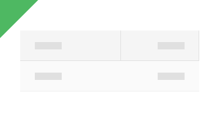

# Skeleton Hierarchical Grid (スケルトン階層グリッド)

Skeleton Hierarchical Grid を使用して、標準の情報と同じタイプの情報をレイアウトしますが、現時点でデータが存在しない場合のアプリケーションの状態も示します。 たとえば、データがリモート データ ソースから読み込まれる際、接続が不足しているか、時間がかかる場合などです。Skeleton Hierarchical Grid は、既知のレイアウトの [Hierarchical Grid](hierarchical-grid.md) を視覚的に表したものですが、表示するデータはありません。

## Skeleton Hierarchical Grid のデモ

## セル タイプ

Skeleton Hierarchical Grid は、Header (ヘッダー)、Body (本文)、Summary (集計) の 3 種類のスケルトン セルを拡張し、標準の [Hierarchical Grid](hierarchical-grid.md) として 2 つの追加のセル、CollapseAll (すべて縮小) と Expand (展開) を追加します。

## セル表示密度

Skeleton Collapse Allセルと Expand セルは、標準の [Hierarchical Grid](hierarchical-grid.md) と同じ 3 つの表示密度のバリエーション (comfortable、cosy、compact) をサポートします。

## Grid タイプ

Skeleton Hierarchical Grid は、3 つの表示密度をサポートし、データの読み込み状態に関してそれぞれのバリエーションを提供します: Hierarchical Grid がデータを読み込むとき、ネストされたグリッドを持つ展開された行がない場合に表示される Initial と、ネストされたグリッドのみがデータを読み込んでいるときに表示される Expand。

## 使用方法

階層グリッドを作成するときは、同じ階層レベル内で標準セルとスケルトン セルを組み合わせないでください。データは、特定のレベルのすべてのセルとグリッドに存在するか、いずれにも存在しません。標準セルとスケルトン セルの組み合わせは、上記で説明したプリセットなど、非常に限られたユース ケースのセットでのみ適切です。

| 良い例                                                                                                | 悪い例                                                                                                 |
| ------------------------------------------------------------------------------------------------- | ----------------------------------------------------------------------------------------------------- |
|  |  |

## その他のリソース

関連トピック:

- [Hierarchical Grid](hierarchical-grid.md)
  

コミュニティに参加して新しいアイデアをご提案ください。
