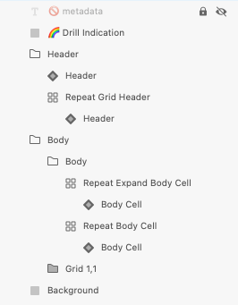

# Hierarchical Grid (階層グリッド)

Hierarchical Grid コンポーネントを使用して、ユーザーが個別のテーブルに編成された大量の複雑なデータ (階層的に関連する) をブラウスおよびインタラクションできるようにします。階層内の各グリッドは、データを表形式で表示し、[Grid](grid.md) と同じ機能を提供します。Hierarchical Grid は、[Ignite UI for Angular Hierarchical Grid コンポーネント](https://jp.infragistics.com/products/ignite-ui-angular/angular/components/hierarchicalgrid/hierarchical_grid.html)と視覚的に同じものです。

## Hierarchical Grid のデモ

## Figma で Hierarchical Grid を使用
Grid と同様に、Hierarchical Grid は基本的に、視覚的な階層を形成する列、行、ネストされたグリッドのリピーターです。Hierarchical Grid コンポーネントを使用するには、[Resources] パネルで検索してインスタンスを挿入するだけです。必要に応じて、プロパティ パネルの `Size` プロパティを使用して、サイズを変更できます。レイヤー パネルには、次の構造が表示されます。 

| レイヤー                                | 使用                                                                                                                                                  |
| ------------------------------------ | ---------------------------------------------------------------------------------------------------------------------------------------------------- |
| 🚫 componentVersion  &nbsp;  | 禁止されたアイコンで開始する特定のロックされたレイヤー。このレイヤーにはコンポーネントの現在のバージョンに関する情報が含まれているため、削除または変更しないでください。  |
| 🚫 metadata | 禁止されたアイコンで開始する特定のロックされたレイヤー。このレイヤーはコード生成に必要なため、削除または変更しないでください。 |
| Drill Indication                 | 	アクティブなセル/フォーカスされているセルを示すために使用されるシンボル。                                                                                                       |
| Grid 2                               | 下部グリッド ヘッダーのすべての列とセルを含みます。                                                                                                                 |
| Background                                 | 	2 番目のグリッドの背景色を定義します。                                                                            |
| Grid 1              | 	上部グリッドのすべての列とセルを含みます。                                                                                      |

列またはセルの数を変更したい場合は、レイヤー パネルから不要なものを非表示にするだけです。さらに追加したい場合は、Hierarchical Grid コンポーネントを選択して右クリックし、コンテキスト メニューから [Detach instance] を選択する必要があります。その後、必要な Grid の外観が得られるまで、既存の列の一部を複製できます。階層をさらに表示したい場合は、2 つの Grid フレームのいずれかを複製することもできます。

## Sketch で Hierarchical Grid を使用

Sketch で Hierarchical Grid を使用する最も簡単な方法は、事前定義されたグリッドの 1 つをアートボードにドラッグすることです。サポートされる 3 つの[表示密度](grid-sizes.md)に 3 つのプリセットがあります。アートボードを開いた後、その上を右-クリックし、コンテキスト メニューの下部にある `Detach from Symbol` オプションを選択すると、新しく表示されたグループの下のレイヤー パネルに次のように表示されます:

| レイヤー                                | 使用                                                                                                                                                 |
| ------------------------------------ | ---------------------------------------------------------------------------------------------------------------------------------------------------- |
| 🚫 metadata | 禁止されたアイコンで開始する特定のロックされたレイヤー。このレイヤーはコード生成に必要なため、削除または変更しないでください。 |
| 🌈 Drill Indication                 | アクティブ セル / フォーカスされるセルを示すために使用されるシンボル                                                                                                     |
| Header                               | ヘッダーのすべてのセルを取得します                                                                                                           |
| Body                                 | 本体のすべてのセルと、基本構造のネストされたグリッドを含みます                                                                       |
| 🌈 Background                        | Hierarchical Grid の背景色を定義します                                                                                         |

デタッチ後、既存の各グリッド内にすでに作成したデータの最初の行を複製し、デザインに表示したいレコード (数に制限がない) およびヘッダーの数を変更してデータのすべてのディメンションを表示できます。より多くの階層を表示する必要がある場合は、追加のグリッドを、それらが属する親グリッドの本体内にネストすることもできます。

## Adobe XD で Hierarchical Grid を使用

Adobe XD では、3 つの[プリセット表示密度階層グリッド コンポーネント](grid-sizes.md)のいずれかを選択してアートボードにドラッグすると、レイヤー パネルで、Header と Body の両方に `Repeat Grid` を使用して構成を高速化していることがわかります。Sketch とは異なり、Adobe XD ではシンボルを破棄する必要はありません。レイヤー パネルに次のように表示されます:

| レイヤー                                | 使用                                                                                                                                                  |
| ------------------------------------ | ---------------------------------------------------------------------------------------------------------------------------------------------------- |
| 🚫 metadata | 禁止されたアイコンで開始する特定のロックされたレイヤー。このレイヤーはコード生成に必要なため、削除または変更しないでください。 |
| 🌈 Drill Indication                  | アクティブ セルを示し、グリッドの階層を介してその所属を追跡するために使用されるシンボル。             |
| Header                               | すべてのヘッダー セルが含まれます: CollapseAll セルと Repeat Grid Header にグループ化された残りのセル。                                                                                                 |
| Body                                 | すべての本文セルが含まれます: Repeat Grid にグループ化された  Expand (展開) セルと別の Repeat Grid にグループ化された残りのセル、および基本構造を持つネストされた Grid。                                                                            |
| 🌈 Background                        | ネストされたグリッドの背景色を定義します。                                                                                                |

Repeat Grid レイヤーを選択すると、必要な繰り返すセルの数を変更できます。これは、各グリッド内で実行できます。右端または下端にある緑色のハンドルをドラッグするだけで、データのすべてのディメンションが表示され、デザインに表示する必要のある数の表示可能なレコードが挿入されます。特定のセル タイプまたは列幅を変更するには、Repeat Grid レイヤーを選択し、右側のパネルで `Ungroup Grid` をクリックする必要があります。これにより、それらを個別に処理して、目的のデザインを実現できます。より多くの階層を表示する必要がある場合は、完全なグリッドを複製して、それらを所属させたい親グリッドの本体内にネストすることもできます。

## セル タイプ

Hierarchical Grid は、3種類の通常のグリッド セル Header、Body および Summary を、階層を整理するために使用される 2 つの追加で拡張します。CollapseAll セルは常に最初の Header Cell として使用され、Header が表示されるグリッドのすべての所属レコードを折りたたむ/展開するための定義済みのアイコンとアクションが付属しています。Expand セルは常にすべての行の最初の Body Cell として使用され、行を折りたたむ/展開するための定義済みのアイコンとアクションが付属しています。

通常の Header、Body、Summary セルをさまざまなタイプのデータに使用し、さまざまな Hierarchical Grid 機能を有効にするように構成する方法を理解するには、[Grid](grid.md) トピックを参照してください。

## セル サイズ

CollapseAll セルと Expand セルは、Hierarchical Grid の 3 つのサイズ バリアント (Large、Medium、Small) をサポートします。以下の CollapseAll Header セルに見られるように、それぞれに個別のシンボルが付いています:

## スタイル設定

Hierarchical Grid は、さまざま状態の各セル テキスト、アイコン、背景色のスタイル設定や水平および垂直の境界線の非表示など柔軟に変更できます。Drill Indication とグリッドの背景をスタイル設定することもできます。

## 使用方法

グリッドと同様に、Hierarchical Grid の最も重要な点は、Header および Body セル内のデータの配置です。テキストは常に左揃えにして変数空スペースを右に残し、数値は常に右揃えにして変数空スペースを左に残します。

| 良い例                                                                                                | 悪い例                                                                                                |
| ------------------------------------------------------------------------------------------------- | ----------------------------------------------------------------------------------------------------- |
|  |  |

## その他のリソース

関連トピック:

- [Grid](grid.md)
- [Grid ツールバー](grid-toolbar.md)
- [Grid エクスポート](grid-export.md)
- [Grid グループ化](grid-grouping.md)
- [Grid 列ピン固定](grid-column-pinning.md)
- [Grid 列非表示](grid-column-hiding.md)
- [Grid 列移動](grid-column-moving.md)
- [Grid 列サイズ変更](grid-column-resizing.md)
- [Grid 並べ替え](grid-sorting.md)
- [Grid 行フィルター](grid-row-filter.md)
- [Grid Excel スタイル フィルター](grid-excel-style-filter.md)
- [Grid 行選択](grid-row-selection.md)
- [Grid 編集](grid-editing.md)
- [Grid サイズ](grid-sizes.md)
- [Grid ページング](grid-paging.md)
- [Grid 集計](grid-summaries.md)
- [Tree Grid](tree-grid.md)
- [Skeleton Hierarchical Grid](hierarchical-grid-skeleton.md)
  

コミュニティに参加して新しいアイデアをご提案ください。
