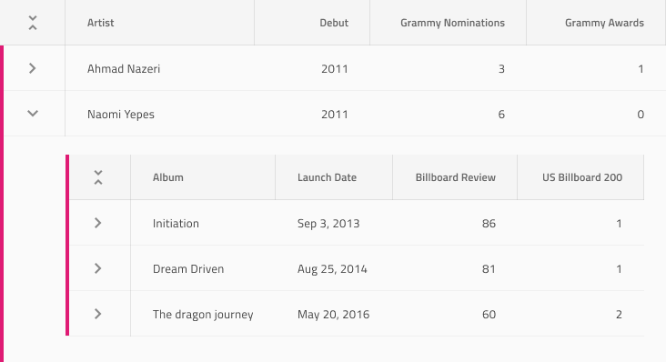
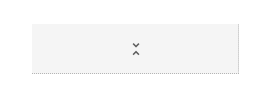
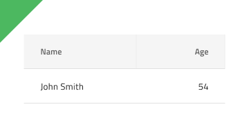

# Hierarchical Grid (階層グリッド)

階層グリッド コンポーネントを使用して、ユーザーが個別のテーブルに編成された大量の複雑なデータ (階層的に関連する) をブラウスおよびインタラクションできるようにします。階層内の各グリッドは、データを表形式で表示し、[Grid](grid.md) と同じ機能を提供します。階層グリッドは、[Ignite UI for Angular 階層グリッド コンポーネント](https://jp.infragistics.com/products/ignite-ui-angular/angular/components/hierarchicalgrid/hierarchical_grid.html)と視覚的に同じものです。

## 階層グリッドのデモ

## Detach from Symbol (シンボルからデタッチ)

グリッドと同様に、階層グリッドは基本的に、視覚的な階層を形成する列、行、ネストされたグリッドのリピーターです。したがって、最も簡単な使用方法は、`Hierarchical Grid/Comfortable` をアートボードにドラッグして一番上を右クリックし、コンテキスト メニューの下にある `Detach from Symbol` オプションを選択します。新しく表示されるグループの下のレイヤー パネルには以下があります。

| レイヤー                                | 使用                                                                                                                                                 |
| ------------------------------------ | ---------------------------------------------------------------------------------------------------------------------------------------------------- |
| 🚫 igx-hierarchical-grid/comfortable | 禁止されたアイコンで開始する特定のロックされたレイヤー。このレイヤーはコード生成に必要なため、削除または変更しないでください。 |
| 🌈 Drill Indication                 | 選択を示すために使用されるシンボル                                                                                                     |
| Header                               | ヘッダーのすべてのセルを取得します                                                                                                           |
| Body                                 | 本体のすべてのセルと、基本構造のネストされたグリッドを含みます                                                                       |
| 🌈 Background                        | 階層グリッドの背景色を定義します                                                                                         |
| 🕹️PrimaryKey                         | 一部のグリッド機能で必要であり、コード生成エンジンで使用されるレコードの主キーを持つ列の参照       |
| 🕹️DataSource                         | コード生成エンジンによって使用され、グリッドにバインドされるデータ ソースの参照                                           |

デタッチ後、既存の各グリッド内にすでに作成したデータの最初の行を複製し、デザインに表示したいレコード (数に制限がない) および多数のヘッダーを必要なだけ追加してデータのすべてのディメンションを表示できます。より多くの階層を表示する必要がある場合は、追加のグリッドを、それらが属する親グリッドの本体内にネストすることもできます。

## セル タイプ

階層グリッドは、3種類の通常のグリッド セル Header (ヘッダー)、Body (本体) および Summary (集計) を、階層を整理するために使用される 2 つの追加で拡張します。CollapseAll (すべてを折りたたむ) セルは常に最初のヘッダー セルとして使用され、ヘッダーが表示されるグリッドのすべての所属レコードを折りたたむ/展開するための定義済みのアイコンとアクションが付属しています。Expand (展開) セルは常にすべての行の最初の本体/ セルとして使用され、行を折りたたむ/展開するための定義済みのアイコンとアクションが付属しています。

通常の Header、Body 、Summary セルをさまざまなタイプのデータに使用し、さまざまな階層グリッド機能を有効にするように構成する方法を理解するには、[Grid]（grid.md）トピックを参照してください。

## ネストされたグリッド

階層グリッドには、あらゆる種類の階層順序で多数のネストされたグリッドを含めることができるため、各子グリッド (ルート レベルの親グリッド以外) は、ルート レベルの特別なレイヤー `🚫 igx-hierarchical-grid ...` の代わりに `🚫 igx-hierarchical-grid/island`という特別なレイヤーを使用する必要があります。プリセットには、ルート レベル グリッドの本体に 1 つのネストされたグリッドが付属しており、レイアウトおよび階層を作成するためのソースとして使用できます。

## スタイル設定

階層グリッドは、さまざま状態の各セル テキスト、アイコン、背景色のスタイル設定や水平および垂直の境界線の非表示など柔軟に変更できます。ドリル インジケーターとグリッドの背景をスタイル設定することもできます。

## 使用方法

グリッドと同様に、階層グリッドの最も重要な点は、ヘッダーおよび本体セル内のデータの配置です。テキストは常に左揃えにして変数空スペースを右に残し、数値は常に右揃えにして変数空スペースを左に残します。

| 良い例                                                                                                | 悪い例                                                                                                |
| ------------------------------------------------------------------------------------------------- | ----------------------------------------------------------------------------------------------------- |
|  |  |

## コードの生成

このセクションは、オーバーライドとコード生成にどのような影響があるかについて説明します。

> [!WARNING]
> 階層グリッドを使用するためにデタッチ シンボルに設定する**必要**があります。

> [!NOTE]
> 階層グリッドの高さはデフォルトで `100％` に設定されています。

### データソース プロパティ

提供された場合、`🕹️DataSource` 値はグリッドのデータ ソースを構成するために使用されます。各列名がオブジェクトのプロパティであるオブジェクトの配列に設定する必要があります。データ ソースが設定されない場合、グリッドは列ヘッダーのみを描画します。

### プライマリ キー

提供された場合、`🕹️PrimaryKey` 値は グリッドの `primaryKey` プロパティを設定するために使用されます。このプロパティの値は、一意の値を含むデータ ソース内のプロパティ名にする必要があります。このプロパティは、グリッドで[行編集バナー](https://jp.infragistics.com/products/ignite-ui-angular/angular/components/grid/row_editing.html)を使用する場合に特に重要です。

### ヘッダー

提供された場合、ヘッダーは描画する列数を決定します。ヘッダーを下にある本体 (セル) と一致させるために列を作成します。一致する本体が見つからない場合、列はヘッダーの情報に基づいて作成されます。一致が見つかった場合、情報がヘッダーから取得され、次に 本体/セルから取得されます。

ヘッダーには、いくつかのサイズ変更オプションがあります。Sketch で各ヘッダーセ ルを左右にピン固定すると、HTML で列 (パーセント幅) が生成されます。これにより、グリッドのサイズに応じて列を拡大または縮小できます。あるいは、ヘッダー セルの幅を固定すると、そのサイズの固定列を生成します。

#### タイプ

設定された場合、列の型 (string、number、Boolean) を決定するために使用されます。

#### テキスト

ヘッダーの Text プロパティにテキスト、[テキストのバインディング](../codegen/data-binding.md)、または両方を含むことができます。例:

- 設定
- {settingsLabel}
- 重要な {labelText}

#### Feature Left および Feature Right

これらのオーバーライドは、個々の列で有効にする機能を制御します。以下の値を使用できます。

- None (デフォルト)
- フィルタリング ([Excel スタイル フィルタリング](https://jp.infragistics.com/products/ignite-ui-angular/angular/components/hierarchicalgrid/excel_style_filtering.html))
- ピン固定
- 並べ替え

#### Column Moving (列移動)

このオーバーライドは、ユーザーが列を移動できるかどうかを決定します。

#### Column Resizing (列サイズ変更)

このオーバーライドは、ユーザーが列のサイズを変更できるかどうかを決定します。

#### Column Hiding (列非表示)

このオーバーライドは、列が非表示かどうかを決定します。

### Body/Cell (本体/セル)

提供された場合、本体 (セル) は描画する列の数を決定します。ヘッダーを本体 (セル) と一致しようとします。一致するヘッダーが見つからない場合、列は本体/セルの情報に基づいて作成されます。一致が見つかった場合、情報がヘッダーから取得され、次に本体/セルから取得されます。

#### データ プロパティ

提供された場合、`🕹️DataProperty` は列のフィールドを構成するために使用されます。列のフィールドは `🕹️DataSource` のフィールドに相対します。

#### タイプ

設定された場合、列の型 (string、number、Boolean) を決定するために使用されます。

## その他のリソース

関連トピック:

- [Grid](grid.md)
- [Grid ツールバー](grid-toolbar.md)
- [Grid エクスポート](grid-export.md)
- [Grid グループ化](grid-grouping.md)
- [Grid 列ピン固定](grid-column-pinning.md)
- [Grid 列非表示](grid-column-hiding.md)
- [Grid 列移動](grid-column-moving.md)
- [Grid 列サイズ変更](grid-column-resizing.md)
- [Grid 並べ替え](grid-sorting.md)
- [Grid 行フィルター](grid-row-filter.md)
- [Grid Excel スタイル フィルター](grid-excel-style-filter.md)
- [Grid 行選択](grid-row-selection.md)
- [Grid 編集](grid-editing.md)
- [Grid 表示密度](grid-display-density.md)
- [Grid ページング](grid-paging.md)
- [Grid 集計](grid-summaries.md)
- [Hierarchical Grid](hierarchical-grid.md)
- [データ バインディング](../codegen/data-binding.md)
  

コミュニティに参加して新しいアイデアをご提案ください。
