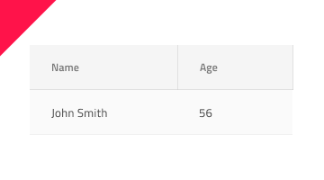

# Hierarchical Grid (階層グリッド)

階層グリッド コンポーネントを使用して、ユーザーが個別のテーブルに編成された大量の複雑なデータ (階層的に関連する) をブラウスおよびインタラクションできるようにします。階層内の各グリッドは、データを表形式で表示し、[Grid](grid.md) と同じ機能を提供します。階層グリッドは、[Ignite UI for Angular 階層グリッド コンポーネント](https://jp.infragistics.com/products/ignite-ui-angular/angular/components/hierarchicalgrid/hierarchical_grid.html)と視覚的に同じものです。

## 階層グリッドのデモ

## Detach from Symbol (シンボルからデタッチ)

グリッドと同様に、階層グリッドは基本的に、視覚的な階層を形成する列、行、ネストされたグリッドのリピーターです。Therefore, the easiest way to use it is by dragging one of the predefined grids to your artboard - there are three presets available for the three [display densities](grid-display-density.md) supported. Once in your artboard, by right-clicking on top of it, and selecting the `Detach from Symbol` option near the bottom of the contextual menu you should see the following in your layers panel under the newly appeared group:

| レイヤー                                | 使用                                                                                                                                                 |
| ------------------------------------ | ---------------------------------------------------------------------------------------------------------------------------------------------------- |
| 🚫 metadata | 禁止されたアイコンで開始する特定のロックされたレイヤー。このレイヤーはコード生成に必要なため、削除または変更しないでください。 |
| 🌈 Drill Indication                 | アクティブ セル / フォーカスされるセルを示すために使用されるシンボル                                                                                                     |
| Header                               | ヘッダーのすべてのセルを取得します                                                                                                           |
| Body                                 | 本体のすべてのセルと、基本構造のネストされたグリッドを含みます                                                                       |
| 🌈 Background                        | 階層グリッドの背景色を定義します                                                                                         |

デタッチ後、既存の各グリッド内にすでに作成したデータの最初の行を複製し、デザインに表示したいレコード (数に制限がない) および多数のヘッダーを必要なだけ追加してデータのすべてのディメンションを表示できます。より多くの階層を表示する必要がある場合は、追加のグリッドを、それらが属する親グリッドの本体内にネストすることもできます。

## セル タイプ

階層グリッドは、3種類の通常のグリッド セル Header (ヘッダー)、Body (本体) および Summary (集計) を、階層を整理するために使用される 2 つの追加で拡張します。CollapseAll (すべてを折りたたむ) セルは常に最初のヘッダー セルとして使用され、ヘッダーが表示されるグリッドのすべての所属レコードを折りたたむ/展開するための定義済みのアイコンとアクションが付属しています。Expand (展開) セルは常にすべての行の最初の本体/ セルとして使用され、行を折りたたむ/展開するための定義済みのアイコンとアクションが付属しています。

通常の Header、Body 、Summary セルをさまざまなタイプのデータに使用し、さまざまな階層グリッド機能を有効にするように構成する方法を理解するには、[Grid]（grid.md）トピックを参照してください。

## セル 表示密度

The CollapseAll and Expand cells support three display density variants of the Hierarchical Grid: comfortable, cosy, and compact. Each of them come with distinct symbols as can be seen for the CollapseAll Header cells below:

## スタイル設定

階層グリッドは、さまざま状態の各セル テキスト、アイコン、背景色のスタイル設定や水平および垂直の境界線の非表示など柔軟に変更できます。ドリル インジケーターとグリッドの背景をスタイル設定することもできます。

## 使用方法

グリッドと同様に、階層グリッドの最も重要な点は、ヘッダーおよび本体セル内のデータの配置です。テキストは常に左揃えにして変数空スペースを右に残し、数値は常に右揃えにして変数空スペースを左に残します。

| 良い例                                                                                                | 悪い例                                                                                                |
| ------------------------------------------------------------------------------------------------- | ----------------------------------------------------------------------------------------------------- |
|  |  |

## その他のリソース

関連トピック:

- [Grid](grid.md)
- [Grid ツールバー](grid-toolbar.md)
- [Grid エクスポート](grid-export.md)
- [Grid グループ化](grid-grouping.md)
- [Grid 列ピン固定](grid-column-pinning.md)
- [Grid 列非表示](grid-column-hiding.md)
- [Grid 列移動](grid-column-moving.md)
- [Grid 列サイズ変更](grid-column-resizing.md)
- [Grid 並べ替え](grid-sorting.md)
- [Grid 行フィルター](grid-row-filter.md)
- [Grid Excel スタイル フィルター](grid-excel-style-filter.md)
- [Grid 行選択](grid-row-selection.md)
- [Grid 編集](grid-editing.md)
- [Grid 表示密度](grid-display-density.md)
- [Grid ページング](grid-paging.md)
- [Grid 集計](grid-summaries.md)
- [Tree Grid](tree-grid.md)
- [Skeleton Hierarchical Grid](hierarchical-grid-skeleton.md)
  

コミュニティに参加して新しいアイデアをご提案ください。
