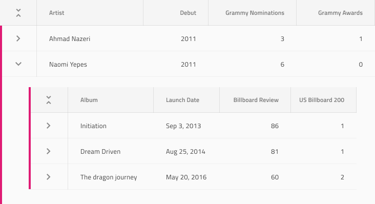

# Hierarchical Grid (階層グリッド)

Hierarchical Grid コンポーネントを使用して、ユーザーが個別のテーブルに編成された大量の複雑なデータ (階層的に関連する) をブラウスおよびインタラクションできるようにします。階層内の各グリッドは、データを表形式で表示し、[Grid](grid.md) と同じ機能を提供します。Hierarchical Grid は、[Ignite UI for Angular Hierarchical Grid コンポーネント](https://jp.infragistics.com/products/ignite-ui-angular/angular/components/hierarchicalgrid/hierarchical_grid.html)と視覚的に同じものです。

## Hierarchical Grid のデモ

## Figma で Hierarchical Grid を使用
Grid と同様に、Hierarchical Grid は基本的に、視覚的な階層を形成する列、行、ネストされたグリッドのリピーターです。Hierarchical Grid コンポーネントを使用するには、[Resources] パネルで検索してインスタンスを挿入するだけです。必要に応じて、プロパティ パネルの `Size` プロパティを使用して、サイズを変更できます。レイヤー パネルには、次の構造が表示されます。 

| レイヤー                                | 使用                                                                                                                                                  |
| ------------------------------------ | ---------------------------------------------------------------------------------------------------------------------------------------------------- |
| 🚫 componentVersion  &nbsp;  | 禁止されたアイコンで開始する特定のロックされたレイヤー。このレイヤーにはコンポーネントの現在のバージョンに関する情報が含まれているため、削除または変更しないでください。  |
| 🚫 metadata | 禁止されたアイコンで開始する特定のロックされたレイヤー。このレイヤーはコード生成に必要なため、削除または変更しないでください。 |
| Drill Indication                 | 	アクティブなセル/フォーカスされているセルを示すために使用されるシンボル。                                                                                                       |
| Grid 2                               | 下部グリッドのすべての列とセルを含みます。                                                                                                                 |
| Background                                 | 	2 番目のグリッドの背景色を定義します。                                                                            |
| Grid 1              | 	上部グリッドのすべての列とセルを含みます。                                                                                      |

列またはセルの数を変更したい場合は、レイヤー パネルから不要なものを非表示にするだけです。さらに追加したい場合は、Hierarchical Grid コンポーネントを選択して右クリックし、コンテキスト メニューから [Detach instance] を選択する必要があります。その後、必要な Grid の外観が得られるまで、既存の列の一部を複製できます。階層をさらに表示したい場合は、2 つの Grid フレームのいずれかを複製することもできます。

## セル タイプ

Hierarchical Grid は、3種類の通常のグリッド セル Header、Body および Summary を、階層を整理するために使用される 2 つの追加で拡張します。CollapseAll セルは常に最初の Header Cell として使用され、Header が表示されるグリッドのすべての所属レコードを折りたたむ/展開するための定義済みのアイコンとアクションが付属しています。Expand セルは常にすべての行の最初の Body Cell として使用され、行を折りたたむ/展開するための定義済みのアイコンとアクションが付属しています。

通常の Header、Body、Summary セルをさまざまなタイプのデータに使用し、さまざまな Hierarchical Grid 機能を有効にするように構成する方法を理解するには、[Grid](grid.md) トピックを参照してください。

## セル サイズ

CollapseAll セルと Expand セルは、Hierarchical Grid の 3 つのサイズ バリアント (Large、Medium、Small) をサポートします。これらは、サイド プロパティ パネルの `Size` プロパティから変更できます。

## スタイル設定

Hierarchical Grid は、さまざま状態の各セル テキスト、アイコン、背景色のスタイル設定や水平および垂直の境界線の非表示など柔軟に変更できます。Drill Indication とグリッドの背景をスタイル設定することもできます。

## 使用方法

グリッドと同様に、Hierarchical Grid の最も重要な点は、Header および Body セル内のデータの配置です。テキストは常に左揃えにして変数空スペースを右に残し、数値は常に右揃えにして変数空スペースを左に残します。

| 良い例                                                                                                | 悪い例                                                                                                |
| ------------------------------------------------------------------------------------------------- | ----------------------------------------------------------------------------------------------------- |
|  |  |

## その他のリソース

関連トピック:

- [Grid](grid.md)
- [Grid ツールバー](grid-toolbar.md)
- [Grid エクスポート](grid-export.md)
- [Grid グループ化](grid-grouping.md)
- [Grid 列ピン固定](grid-column-pinning.md)
- [Grid 列非表示](grid-column-hiding.md)
- [Grid 列移動](grid-column-moving.md)
- [Grid 列サイズ変更](grid-column-resizing.md)
- [Grid ソート](grid-sorting.md)
- [Grid 行フィルター](grid-row-filter.md)
- [Grid Excel スタイル フィルター](grid-excel-style-filter.md)
- [Grid 行選択](grid-row-selection.md)
- [Grid 編集](grid-editing.md)
- [Grid サイズ](grid-sizes.md)
- [Grid ページング](grid-paging.md)
- [Grid 集計](grid-summaries.md)
- [Tree Grid](tree-grid.md)
- [Skeleton Hierarchical Grid](hierarchical-grid-skeleton.md)
  

コミュニティに参加して新しいアイデアをご提案ください。
