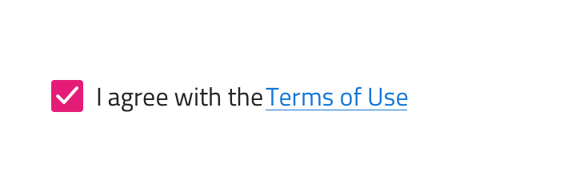
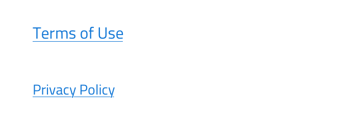
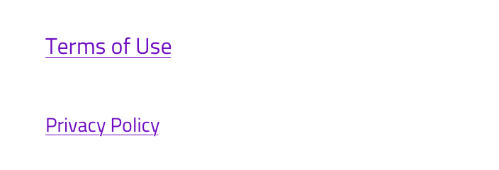
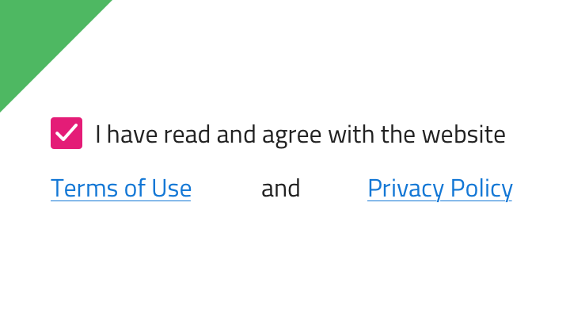
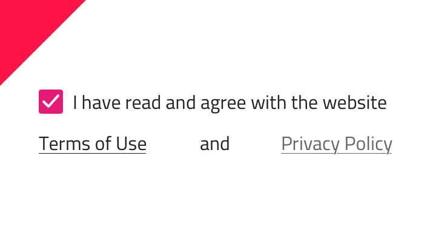

---
title: Hyperlink - デザイン システム コンポーネント
_description: Hyperlink コンポーネントは、テキスト段落で参照を使用できます。
_keywords: デザイン システム, デザイン システム UX, UI キット, Figma, Figma to Angular, Figma からコードをエクスポート, Figma to HTML, Figma HTML, Figma UI キット, Ignite UI for Angular, Angular, Angular デザイン システム, Angular 用のデザイン キット
_language: ja
---

# Hyperlink (ハイパーリンク)

Hyperlink コンポーネントは、利用規約やプライバシー ポリシーなど段落のテキスト部分のスタイルに関する追加情報へのアクセスを提供します。

## Hyperlink のデモ

## サイズ

Hyperlink には段落のテキストに合わせて 3 サイズ (Body 1、Body 2 および Detail 1) あります。

## Url

ハイパーリンクを設定するには、「Create link」 オプションで開くリンクを指定してください。これはデザインに表示されませんが、コード生成サービスによって考慮されます。

## スタイル設定

ハイパーリンクは、**Figma** Indigo.Design UI キットのハイパーリンク メイン コンポーネントからテキストのデフォルトの青色を変更することでスタイルを設定できます。

## 使用方法

Hyperlink テキスト色には段落で目立つ色を選択します。同じ色や似たような色を使用しないようにして、全体的にデザインの色を統一します。

| 良い例                                                                               | 悪い例                                                                                   |
| ------------------------------------------------------------------------------------ | ---------------------------------------------------------------------------------------- |
|  |  |

## その他のリソース

関連トピック:

- [Form パターン](../patterns/form.md)
  

コミュニティに参加して新しいアイデアをご提案ください。
