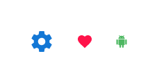

# Icon (アイコン)

Icon コンポーネント シンボルは、製品に「いいね」などのシンプルなインタラクションをトリガーしてユーザーに情報をグラフィックで表示します。すでに提供されている[マテリアル アイコン](../style/material-icons.md)から選択するか、**Indigo.Design System** の `🎨 Material Icons` ページに必要なものを追加することができます。Icon は、[Ignite UI for Angular Icon コンポーネント](https://jp.infragistics.com/products/ignite-ui-angular/angular/components/icon.html)と視覚的に同じです。

## Icon デモ

## サイズ

Icon のサイズは 4 つあります。

- ExtraLarge
- Large
- Medium
- Small

## スタイル設定

Icon は、さまざまなオーバーライドで選択可能なグラフィックとそれに適用される色を制御することにより柔軟にスタイル設定できます。

## 使用方法

Icon の色は、背景とのコントラストが高い色を選択し、同色の似たような色合いや色収差を生じる組み合わせは避けるようにします。

| 良い例                      | 悪い例                        |
| --------------------------- | ----------------------------- |
|  |  |

## その他のリソース

関連トピック:

- [マテリアル アイコン](../style/material-icons.md)
- [Bottom Navigation](bottom-nav.md)
- [Card](card.md)
- [Navbar](navbar.md)
- [Navigation Drawer](nav-drawer.md)
- [Tabs](tabs.md)
  

コミュニティに参加して新しいアイデアをご提案ください。

