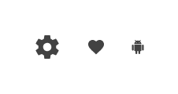

## Icon

Icon コンポーネント シンボルは、製品に「いいね」などのシンプルなインタラクションをトリガーしてユーザーに情報をグラフィックで表示します。すでに提供されている [Material アイコン](https://material.io/tools/icons/)または Styling ライブラリで使用可能なアイコンをリストに追加します。Icon は、[Ignite UI for Angular Icon コンポーネント](https://jp.infragistics.com/products/ignite-ui-angular/angular/components/icon.html)と視覚的に同じものです。

### Icon デモ

### サイズ

Icon のサイズは 4 つあります。

- ExtraLarge
- Large
- Medium
- Small

### スタイル設定

Icon は、さまざまなオーバーライドで選択可能なグラフィックや塗りつぶしの色を制御することにより柔軟にスタイル設定できます。

## 使用方法

Icon の色は、背景とのコントラストが高い色を選択し、同色の似たような色合いや色収差を生じる組み合わせは避けるようにします。

| いい例                          | 悪い例                         |
| --------------------------- | ----------------------------- |
|  |  |

## コードの生成

Icon の色を指定した場合、Icon HTML 要素は div でラップされます。これはネスト コンポーネント (他のコンポーネント内のコンポーネント) をスタイル設定する際にブラウザーによって要求されます。

> [!INFO]
> 重要: NBL コンポーネント ライブラリおよび NBL スタイル ライブラリに Icon コンポーネントがあります。NBL コンポーネント ライブラリのみの Icon が描画されます。

> [!WARNING]
> デザインの Icon のインスタンスで`シンボルからデタッチ`をトリガーすると、ほとんどの場合で Icon のためのコード生成機能が失われます。

### Event プロパティ

このプロパティはコンポーネント TypeScript のメソッドを作成するために使用し、HTML に Angular クリック シグネチャーを追加します。イベントが波括弧構文 ({onEventName}) を使用して指定する必要があります。

## その他のリソース

関連トピック:

- [Bottom Navigation](bottom-nav.md)
- [Card](card.md)
- [Navbar](navbar.md)
- [Navigation Drawer](nav-drawer.md)
- [Tabs](tabs.md)
  

コミュニティに参加して新しいアイデアをご提案ください。

- [Indigo Design **GitHub** (英語)](https://github.com/IgniteUI/design-system-docfx)
