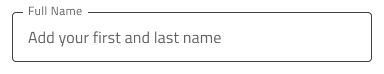

# Input (入力)

Input コンポーネントを使用して、文字列、さまざまなコンテキストに適した数値、日付、その他の値 (メールやパスワードなど) のユーザー データを収集します。Input は、[Ignite UI for Angular Input Group コンポーネント](https://jp.infragistics.com/products/ignite-ui-angular/angular/components/input_group.html)と視覚的に同じものです。

## Input のデモ

## タイプ

Sketch と Adobe XD の Input コンポーネントは、simple、ヘルパー テキスト付きの hint、searchbar、の 3 つのオプションからプリセットを選択できます。Figma では、hint (ブール値プロパティ) の有無にかかわらず単純な入力と、searchbar のどちらかを選択できます。

`simple`

`hint`

`searchbar`

Sketch と Adobe XD の hint と simple プリセットでは、3 つの異なるタイプから選択できます: より風通しの良い外観の line スタイル、無地の背景でより構造化された認識の border スタイル、および入力を鮮やかな画像の上に配置して、コンテンツの読みやすさを向上させる場合に最も適した boxed スタイルです。Line スタイルは非推奨であるため、Figma では border と box のタイプのみを使用できます。

## 操作状態

Sketch と Adobe XD では、これらの各プリセットを Enabled (有効) または Disabled (無効) の状態で挿入できます。Figma では、Input はデフォルトで Enabled 状態にあり、右側のプロパティ パネルから Disabled 状態に切り替えることができます。

`enabled`

`disabled`

## 状態

Input コンポーネントは、ユーザーの操作にあわせてさまざまな状態を経ます。**Idle** (アイドル状態): コンテンツの代わりにプレースホルダーを表示します。**Hover** (ホーバー状態) は、ユーザーがカーソルを合わせたときに入力がアクティブであることを示します。**Filled** (塗りつぶし状態): ユーザーがコンテンツを入力し、入力から移動した後に表示されます。**Focused** (フォーカス状態) は、ユーザーがアクティブに入力を行っていることを視覚的に示します。

`idle`

`hover`

`filled`

`focused`

経験豊富なデザイナーは、ユーザー入力を制限して無効な状態を防止するために、検証スタイルを使用します。検証スタイルは、Input で Success (成功)、Warn (警告)、Error (エラー) を表示する洗練されたデザインを提供します。

`success`

`warn`

`error`

Sketch では、状態と検証状態は `Symbol Overrides` で達成されますが、Figma では、右側のプロパティ パネルの 「State」 プロパティを使用してそれらを切り替えることができます。Adobe XD では `Component States` パラダイムを使用して簡単に状態を切り替えることができます。

## レイアウト

Input には特定の場合に入力 (@email.com サフィックス) を軽減するテキストの Prefix/Suffix やアイコンをサポートします。これによりキーストロークを減らし、予期されるコンテンツを明確にすることができます。Figma では、Prefix または Suffix を削除するには、プロパティ パネルでオンまたはオフに切り替えます。Sketch で Prefix または Suffix を削除するには、オーバーライドを ~No Symbol に設定するだけで、スマート レイアウト ルールがそれに応じて入力を調整します。Adobe XD では、不要な Prefix または Suffix レイヤーを削除しても同じことができ、Stack はそれに応じてレイアウトを調整します。

## コンテンツ タイプ

各 Input コンポーネントには、テキスト、電子メール、パスワード、電話番号、日付など、挿入される情報のタイプを指定する `Content Type` レイヤーが含まれています。入力フィールドにデータを入力後、対応する `Content Type` を設定して、デザインが正しく App Builder に解析されるようにすることが重要です。

## スタイル設定

Input には、背景と境界線/下線の色、およびコンテンツのプレフィックス、サフィックス、およびメイン領域のアイコンの色とテキスト スタイルによるスタイリングの柔軟性が備わっています。検証スタイルを変更するには、Indigo.Design ライブラリの各色変数を更新することをお勧めします。 

## 使用方法

Input のボックス タイプを使用して画像上にフォームを配置して読みやすくします。デザインの警告やエラー状態で Input を使用する際にヘルパー テキストを使用してユーザーにガイダンスを提供します。

| 良い例                                                                           | 悪い例                                                                            |
| ---------------------------------------------------------------------------- | -------------------------------------------------------------------------------- |
|  |  |
|  |  |

## その他のリソース

関連トピック:

- [Combo](combo.md)
- [Select](select.md)
- [Form パターン](../patterns/form.md)
- [User Profile パターン](../patterns/user-profile.md)
  

コミュニティに参加して新しいアイデアをご提案ください。
