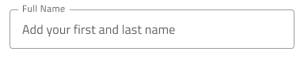

# Input (入力)

Use the Input component to collect user data such as strings, numbers fitting various contexts, dates, and other values, such as emails and passwords. 複数入力は、簡単に使用できるフォームに組み合わせることができます。Input は、[Ignite UI for Angular Input Group](https://jp.infragistics.com/products/ignite-ui-angular/angular/components/input_group.html) コンポーネントと視覚的に同じものです。

## Input デモ

## タイプ

The Input lets you choose a preset from three options: simple, hint which comes with a helper text, and searchbar.

The hint and simple presets offer choice between three distinct types: line style for a more airy look, border style for a more structured perception on solid color backgrounds, and boxed style which is most appropriate when the Input is placed on top of a vivid image to improve the readability of its content.

## 操作状態

各プリセットは、有効または無効の状態で挿入できます。

## バリアント

Input は、明暗バリアント (デフォルトは**暗い**) で分かりやすく、背景に明暗のコントラストを付けてスタイル設定できます。

## 状態

ユーザーが Input とインタラクティブに操作する際にさまざまな状態を経由します。コンテンツの代わりにプレースホルダーがある**アイドル状態**、ユーザーが入力中のフォーカス状態、ユーザーがコンテンツの追加を完了して次に進むときの塗りつぶし状態。柔軟性が向上したことにより、Hi-Fi プロトタイプへシームレスにフローする動的なインタラクション デザインの作成が可能です。

`idle`

`focused`

`filled`

経験豊富なデザイナーは、ユーザー入力を制限して無効な状態を防止するために、検証スタイルを使用します。検証スタイルは、Input で成功、警告、エラーを表示する洗練されたデザインを提供します。

## レイアウト

The Input has rich support for prefix and suffix through a combination of text and icons that can, in certain cases, reduce the input effort for the user: e.g. an @email.com suffix means both fewer keystrokes and more clarity of expected content. You can remove the prefix or suffix by setting the respective container to ~No Symbol from the overrides.

## スタイル設定

The Input comes with styling flexibility through the colors of its background and bottom line, as well as icon color and text styles of its prefix, suffix, and main areas of content. To change the validation styles, it is recommended to update the respective color variables in the Indigo.Design library. 

## 使用方法

Input のボックス タイプを使用して画像上にフォームを配置して読みやすくします。デザインの警告やエラー状態で Input を使用する際にヘルパー テキストを使用してユーザーにガイダンスを提供します。

| 良い例                                                                           | 悪い例                                                                            |
| ---------------------------------------------------------------------------- | -------------------------------------------------------------------------------- |
|  |  |
|  |  |

## その他のリソース

関連トピック:

- [Form パターン](../patterns/form.md)
- [User Profile パターン](../patterns/user-profile.md)
  

コミュニティに参加して新しいアイデアをご提案ください。
