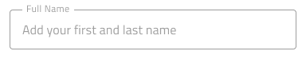
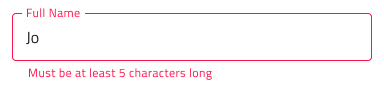

# Input (入力)

Input コンポーネントを使用して、文字列、さまざまなコンテキストに適した数値、日付、その他の値 (メールやパスワードなど) のユーザー データを収集します。Input は、[Ignite UI for Angular Input Group コンポーネント](https://jp.infragistics.com/products/ignite-ui-angular/angular/components/input_group.html)と視覚的に同じものです。

## Input のデモ

## タイプ

Figma では、hint (ブール値プロパティ) の有無にかかわらず単純な入力と、searchbar のどちらかを選択できます。

`simple`

`hint`

`searchbar`

Figma では、3 つの異なるタイプから選択できます: 無地の背景でより構造化された認識の border スタイル、および入力を鮮やかな画像の上に配置して、コンテンツの読みやすさを向上させる場合に最も適した boxed スタイルです。

## 操作状態

Figma では、Input はデフォルトで Enabled 状態にあり、右側のプロパティ パネルから Disabled 状態に切り替えることができます。

`enabled`

`disabled`

## 状態

Input コンポーネントは、ユーザーの操作にあわせてさまざまな状態を経ます。**Idle (アイドル)**: コンテンツの代わりにプレースホルダーを表示します。**Idle & Hover (アイドルおよびホバー)** は、ユーザーがカーソルを合わせたときに入力がアクティブであることを示します。**Filled (塗りつぶし済み)**: ユーザーがコンテンツを入力し、入力から移動した後に表示されます。**Filled & Hover (塗りつぶし済みおよびホバー)** - コンテンツが入力された後、ユーザーが入力の上にマウスを置いたときに入力がアクティブであることを示します。**Focused (フォーカス済み)** は、ユーザーがアクティブに入力を行っていることを視覚的に示します。

`idle`

`idle & hover`

`filled`

`filled & hover`

`focused`

経験豊富なデザイナーは、ユーザー入力を制限して無効な状態を防止するために、検証スタイルを使用します。検証スタイルは、Input で Success (成功)、Warn (警告)、Error (エラー) を表示する洗練されたデザインを提供します。

`success`

`warn`

`error`

Figma では、右側のプロパティ パネルの 「State」 プロパティを使用して、状態とバリデーション状態を切り替えることができます。

## レイアウト

Input には特定の場合に入力 (@email.com サフィックス) を軽減するテキストの Prefix/Suffix やアイコンをサポートします。これによりキーストロークを減らし、予期されるコンテンツを明確にすることができます。Figma では、Prefix または Suffix を削除するには、プロパティ パネルでオンまたはオフに切り替えます。

## コンテンツ タイプ

各 Input コンポーネントには、テキスト、電子メール、パスワード、電話番号、数値、日付など、挿入される情報のタイプを指定する `Content Type` レイヤーが含まれています。入力フィールドにデータを入力後、対応する `Content Type` を設定して、デザインが正しく App Builder に解析されるようにすることが重要です。

## スタイル設定

Input には、背景と境界線/下線の色、およびコンテンツのプレフィックス、サフィックス、およびメイン領域のアイコンの色とテキスト スタイルによるスタイリングの柔軟性が備わっています。検証スタイルを変更するには、Indigo.Design ライブラリの各色変数を更新することをお勧めします。 

## 使用方法

Input のボックス タイプを使用して画像上にフォームを配置して読みやすくします。デザインの警告やエラー状態で Input を使用する際にヘルパー テキストを使用してユーザーにガイダンスを提供します。

| 良い例                                                                           | 悪い例                                                                            |
| ---------------------------------------------------------------------------- | -------------------------------------------------------------------------------- |
|  |  |
|  |  |

## その他のリソース

関連トピック:

- [Combo](combo.md)
- [Select](select.md)
- [Form パターン](../patterns/form.md)
- [User Profile パターン](../patterns/user-profile.md)
  

コミュニティに参加して新しいアイデアをご提案ください。
