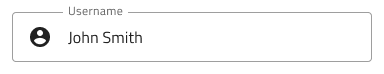

## Input

Input コンポーネント シンボルは、さまざまなコンテキスト、日付、その他の値に合わせて使用する文字列や数値などのユーザー データを収集します。複数入力は、簡単に使用できるフォームに組み合わせることができます。Input は、[Ignite UI for Angular Input Group コンポーネント](https://jp.infragistics.com/products/ignite-ui-angular/angular/components/input_group.html)と視覚的に同じものです。

### Input デモ


### タイプ

Input はヘルパー テキスト (あり/なし) で 4 つの異なるタイプから選択します。より軽い印象となる線スタイルまたは単色背景ではっきり認識される境界線スタイルなど。Boxed スタイルは、コンテンツを読みやすくするために Input をビビッドなイメージの上に配置したときに使用するのが最も適しています。


`line`

`box`

`border`

`search`

### バリアント

Input は、明暗バリアントで分かりやすく、背景に明暗のコントラストを付けてスタイル設定できます。


### 状態

ユーザーが Input とインタラクティブに操作する際にさまざまな状態を経由します。コンテンツの代わりにプレースホルダーがある**アイドル**状態、ユーザーが入力中のフォーカス状態、ユーザーがコンテンツの追加を完了して次に進むときの塗りつぶし状態、入力がインタラクションをサポートしない無効状態。柔軟性が向上したことにより、Hi-Fi プロトタイプへシームレスにフローする動的なインタラクション デザインの作成が可能です。


`focused`

`filled`

`disabled`

経験豊富なデザイナーは、ユーザー入力を制限して無効な状態を防止するために、検証スタイルを使用します。検証スタイルは、Input で成功、警告、エラーを表示する洗練されたデザインを提供します。


### レイアウト

Input には特定の場合に入力 (@email.com サフィックス) を軽減するテキスト文字列のプレフィックス/サフィックスやアイコンをサポートします。これによりキーストロークを減らし、予期されるコンテンツを明確にすることができます。カレンダーのプレフィックスでは、Input が日付や時間のコンテンツとして適しているかを示すことができます。




> [!Note]
> ↳ Layout
>
> - .../OnlyText/...
> - .../Prefix + Suffix/Icons/...
> - .../Prefix + Suffix/String/...
> - .../Suffix/Icons/...
> - .../Suffix/String/...

### Date Picker および Time Picker 入力

日付および時間選択のためにカスタマイズされた Input の 2 種類です。その他の Input コンポーネントと構造が統一されますが、レイアウトはそれぞれの状態に固定されます。プレフィックス位置に表示されるアイコンはマテリアル アイコンの `calendar-today` および `access-time` に設定され、オーバーライド パネルに変更できません。


### スタイル設定

Input は、Styling ライブラリのテーマでプライマリ、成功、警告、エラーの色を変更できます。


## 使用方法

Input のボックス タイプを使用して画像上にフォームを配置して読みやすくします。デザインの警告やエラー状態で Input を使用する際にヘルパーテキストを使用してユーザーにガイダンスを提供します。

| 良い例                                                                       | 悪い例                                                                           |
| ---------------------------------------------------------------------------- | -------------------------------------------------------------------------------- |
|  |  |
|  |  |

## コードの生成

Input Group の色やフォントを指定した場合、Input Group HTML 要素は div でラップされます。ブラウザーによってネスト コンポーネント (他のコンポーネント内のコンポーネント) のスタイル設定が要求されます。

> [!WARNING]
> デザインの Input のインスタンスで`シンボルからデタッチ`をトリガーすると、ほとんどの場合で Input のためのコード生成機能が失われます。

データ バインディングは波括弧構文によって指定されます。例: {isAdmin}。テキスト フィールド (`🕹️DataProperty` および `🕹️DataSource` 以外) も文字列補間構文をサポートします。例: 管理者: {isAdmin}。データ バインディングはネストまたはネストなしが可能です。ターゲット プロパティがネストされたプロパティの場合、ネストされたプロパティ チェーンを含みますがモデル オブジェクト名は含みません。実例:

#### ネストなし

```typescript
Customer {
  imageName: String;
}
```

DataProperty: `{imageName}`

#### ネストあり

```typescript
Profile {
  imageName: String;
}

Customer {
  profile: Profile;
}
```

DataProperty: `{profile.imageName}`

### Event プロパティ

`🕹️Event` プロパティはコンポーネント TypeScript のメソッドを作成するために使用し、HTML に入力アイコンのために Angular クリック シグネチャを追加します。波括弧構文 ({onEventName}) を使用してイベントを指定する必要があります。

このプロパティは現在 Searchbar コンポーネントのみにサポートされます。Searchbar に 2 つのアイコンを設定できます。各アイコンに設定可能な `🕹️Event` プロパティがあります。

### データ プロパティ

`🕹️DataProperty` 値は [Angular Reactive Forms](https://angular.io/guide/reactive-forms) を使用して入力の value プロパティへの 2-way データ バインディングを設定するために使用されます。`🕹️DataProperty` はオプションですが、指定される場合、コード生成で提供されるモデル オブジェクト名で指定されたデータ オブジェクトでプロパティ名になります。そのため、`🕹️DataProperty` が使用される場合、開発者がモデル オブジェクト名を指定する必要があります。指定されない場合、無視されます。

### 日付と時刻の入力

Sketch で割り当てるテーマおよび色値は生成されたコードに含まれません。現在 Ignite UI for Angular は、このような入力タイプのテーマをサポートしていません。

### 入力 (検索バー、日付、および時刻以外)

#### レイアウト

Input Group のレイアウトを決定します。Prefix または Suffix を表示に設定した場合、テキストまたはアイコンを入力の開始または終了に表示できます。

#### ラベル

Label に表示するテキストを決定します。

#### 入力テキスト

入力値に表示するテキストを決定します。`🕹️DataProperty` が設定される場合、このプロパティは無視されます。Line、Box、または Border 入力でこのフィールドが `*` 文字のみを含む場合、入力のタイプが password に設定されます。

#### ヘルプ テキスト

Input Group の Hint に表示するテキストを決定します。Date Picker および Time Picker はこれをサポートしません。

### 検索バー

Searchbar に Left および Right Icons があり、アイコンを有効または無効にできます。各アイコンに Event を割り当てることができます。Searchbar のラベルに表示する Search Hint があります。

### テキスト値

上記の Label、Input、Help Text、および Search Hint プロパティにテキスト、バインディング、または両方を含むことができます。例:

- 設定
- {settingsLabel}
- 重要な {labelText}

## その他のリソース

関連トピック:

- [Form Pattern](../patterns/form.md)
- [User Profile Pattern](../patterns/user-profile.md)
  <div class="divider--half"></div>

コミュニティに参加して新しいアイデアをご提案ください。

- [Indigo Design **GitHub** (英語)](https://github.com/IgniteUI/design-system-docfx)
