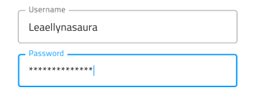
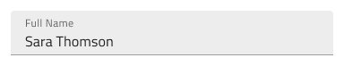
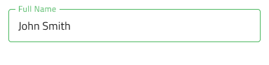

# Input (入力)

Input コンポーネントを使用して、文字列、さまざまなコンテキストに適した数値、日付、その他の値 (メールやパスワードなど) のユーザー データを収集します。Input は、[Ignite UI for Angular Input Group](https://jp.infragistics.com/products/ignite-ui-angular/angular/components/input_group.html) コンポーネントと視覚的に同じものです。

## Input のデモ

## タイプ

Input では、3 つのオプション (プリセット) からプリセットを選択できます: 単純、ヘルパー テキストを含むヒント、および検索バー。

ヒントとシンプルなプリセットは、3 つの異なるタイプから選択できます: 軽快な印象の外観を実現する線スタイル、単色背景でよりはっきりと表示する境界線スタイル、より読みやすくするために鮮明な画像の上に配置する際に最適なボックス スタイルです。

## 操作状態

各プリセットは、有効または無効の状態で挿入できます。

## バリアント

Input は、明暗バリアント (デフォルトは**暗い**) で分かりやすく、背景に明暗のコントラストを付けてスタイル設定できます。

## 状態

ユーザーが Input とインタラクティブに操作する際にさまざまな状態を経由します。コンテンツの代わりにプレースホルダーがある**アイドル**状態、ユーザーが入力中のフォーカス状態、ユーザーがコンテンツの追加を完了して次に進むときの塗りつぶし状態。柔軟性が向上したことにより、Hi-Fi プロトタイプへシームレスにフローする動的なインタラクション デザインの作成が可能です。

`idle`

`focused`

`filled`

経験豊富なデザイナーは、ユーザー入力を制限して無効な状態を防止するために、検証スタイルを使用します。検証スタイルは、Input で成功、警告、エラーを表示する洗練されたデザインを提供します。

Sketch では状態と検証状態を `Symbol Overrides` で実現していますが、Adobe XD では `Component States` パラダイムを使用して簡単に状態を切り替えることができます。
## レイアウト

Input には特定の場合に入力 (@email.com サフィックス) を軽減するテキストのプレフィックス/サフィックスやアイコンをサポートします。これによりキーストロークを減らし、予期されるコンテンツを明確にすることができます。Sketch でプレフィックスまたはサフィックスを削除するには、オーバーライドを ~No Symbol に設定し、スマート レイアウト ルールはそれに応じて入力を調整します。Adobe XD では、不要なプレフィックスまたはサフィックス レイヤーを削除しても同じことができ、Stack はそれに応じてレイアウトを調整します。

## スタイル設定

Input は、背景色や最終行の色、プレフィックス、サフィックス、コンテンツのメイン領域のアイコンの色やテキストのスタイルなど、スタイル設定に柔軟性があります。検証スタイルを変更するには、Indigo.Design ライブラリの各色変数を更新することをお勧めします。 

## 使用方法

Input のボックス タイプを使用して画像上にフォームを配置して読みやすくします。デザインの警告やエラー状態で Input を使用する際にヘルパー テキストを使用してユーザーにガイダンスを提供します。

| 良い例                                                                           | 悪い例                                                                            |
| ---------------------------------------------------------------------------- | -------------------------------------------------------------------------------- |
|  |  |
|  |  |

## その他のリソース

関連トピック:

- [Combo](combo.md)
- [Select](select.md)
- [Form パターン](../patterns/form.md)
- [User Profile パターン](../patterns/user-profile.md)
  

コミュニティに参加して新しいアイデアをご提案ください。
