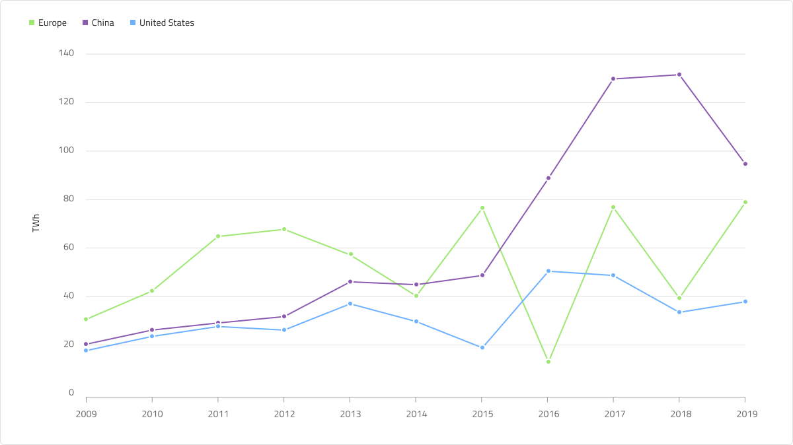
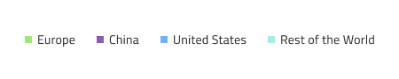

# Line Chart (折れ線チャート)

 Line Chart は、カテゴリ折れ線グラフの一種で、一定期間にわたる 1 つ以上の数量の直線セグメントで接続されたポイントで表される連続データ値を示します。トレンドの表示や比較分析によく使用されます。Y 軸 (左側のラベル) は数値を示し、X 軸 (下側のラベル) は時系列または比較カテゴリを示します。比較する 1 つ以上のデータセットを含めることができます。これはチャートで複数の線として描画されます。Line Chart は、データ ポイントをつなぐ線にスプライン補間とデータの表示を改善するスムージングがないこと以外は、[Spline Chart](spline-chart.md) と同じです。Line Chart は、[Ignite UI for Angular Line Chart コンポーネント](https://jp.infragistics.com/products/ignite-ui-angular/angular/components/charts/types/line-chart.html)と視覚的に同じものです。

## Line Chart のデモ

Line Chart には、Title、Legend、Chart Area があり、Idle 状態と Hover 状態を選択できます。また、Line と Area は複数の Series Amount 構成を持つチャート タイプをサポートし、それに応じて Legend を調整できます。

## Title (タイトル)

Line Chart のタイトルは、必要に応じて変更または非表示にできます。Sketch では、スマート レイアウトは ~No Symbol に設定してタイトルを非表示にしたときにチャートを調整します。Figma では、`Title` ブール値プロパティをオフに切り替えることでタイトルを非表示にすることができます。

## Legend (凡例)

Line Chart には、シリーズの数とそれらが表すものを示す Legend があります。Figma の Legend は自動レイアウトを使用して構築されています。つまり、レイヤー パネルからシリーズ項目を表示 / 非表示にすることができ、それに応じてコンテンツが自動的に調整されます。`Legend` ブール値プロパティをオフにすると、完全に非表示にすることもできます。凡例項目の形状も Series の `Icon Type` プロパティで設定でき、Square、Circle、または Line に設定できます。

## Chart Type (チャート タイプ)

チャート タイプでは、`Area Fill` ブール値プロパティから **Line** と **Area** を切り替えることができます。Area は、X 軸と線の間の領域がシリーズの色で塗りつぶされています。Area Chart は、変化の大きさとそのトレンドを示します。

## 状態

Line Chart には、Idle と Hover の 2 つの状態があります。Figma では、レイヤー パネルからネストされた Chart Type コンポーネントを選択し、プロパティ パネルから `Hover Tooltip` ブール値プロパティのオン/オフを切り替えることで、2 つの状態を切り替えることができます。Hover 状態では、データ ポイントにホバーすると、このポイントでのシリーズの値に関する情報を提供するツールチップが表示されます。

## Y 軸

Line Chart の Y 軸は、Title (タイトル)、Labels (ラベル)、および軸自体で構成されます。Title と Labels は構成可能であり、ラベルを非表示にするには、Figma のレイヤー パネルからラベルを非表示にします。デフォルトでは、Y 軸は非表示です。表示するには、レイヤー パネルに移動し、Y 軸の線を見つけて表示します。すべての要素を一度に非表示にする場合は、レイヤー パネルからネストされた Y 軸コンポーネントを非表示にします。

## Gridlines (グリッド線)

Line Chart には、データ ポイントを Y 軸の値に視覚的にトレースしやすくするための組み込みの Gridlines があります。Figma では、ネストされた Chart Type コンポーネントを選択し、プロパティ パネルからブール値プロパティ `Gridlines` のオン/オフを切り替えることで、それらを表示/非表示にすることができます。

## Series Amount (シリーズ量)

Line Chart はチャート領域に描画するシリーズの数を **1**、**2**、または **3** (デフォルト) から選択することができます。これは Area タイプにも当てはまります。レイヤー パネルでネストされた Chart Type コンポーネントを選択し、シリーズとシリーズ マーカー (例: `Series 3` と `Series 3 Markers`) のブール値プロパティをオン/オフに切り替えることで、必要な数のシリーズを表示/非表示にすることができます。また、レイヤー パネルからシリーズを表示/非表示にして、凡例でシリーズを適切に調整する必要があります。

## スタイル設定

Line Chart では、シリーズの色を変更できます。Series.1、series.2 などのバリアントを持つデータ可視化には、series.10 までのパレットの色のみを使用することをお勧めします。垂直軸と水平軸の色、グリッド線、チャート領域の背景色、境界線の色も変更できます。タイトル、ラベル、注釈値なども **Indigo.Design システム**の利用可能なテキスト スタイルでカスタマイズできます。

## 使用方法

Line Chart は、連続したデータセットがあり、一定期間の変化量を確認する場合に使用します。時間を使用してカテゴリの変更を表す場合、常に水平軸に設定します。データ比較が正確で、時系列データを左から右に並べ替えるため、Y 軸は常に 0 から開始します。適切なアスペクト比を使用して、劇的な傾斜の低下を最小限に抑えます。チャートに複数のシリーズがある場合は、区別できるように異なる色を使用する必要があります。凡例を使用してそれらが表すものを示すことは、ベスト プラクティスと見なされます。

 | 良い例                                                                                             | 悪い例                                                                                              |
| ---------------------------------------------------------------------------------------------- | -------------------------------------------------------------------------------------------------- |
|  |  | 

## その他のリソース

関連トピック:

- [Spline Chart](spline-chart.md)
- [Step Chart](step-chart.md)
- [Column Chart](column-chart.md)
- [Pie Chart](pie-chart.md)
- [Skeleton Charts](skeleton-charts.md)

コミュニティに参加して新しいアイデアをご提案ください。
