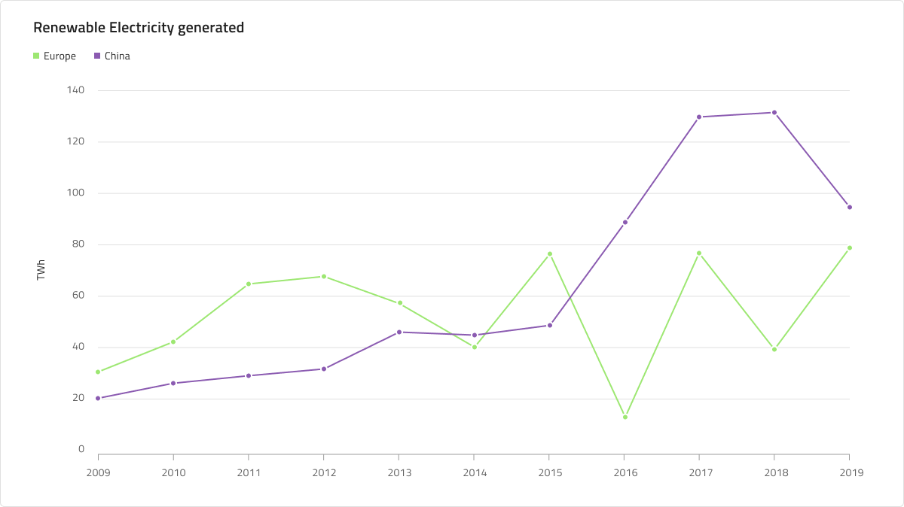
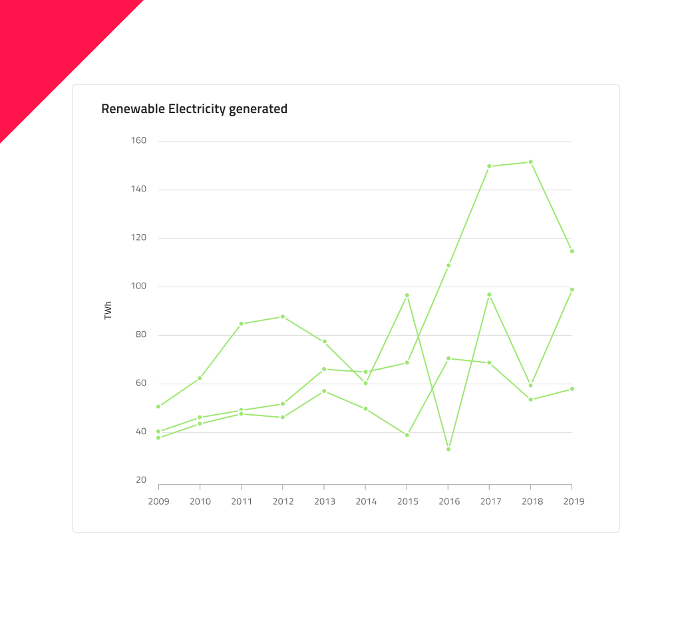

# Line Chart (折れ線チャート)

 Line Chart は、カテゴリ折れ線グラフの一種で、一定期間にわたる 1 つ以上の数量の直線セグメントで接続されたポイントで表される連続データ値を示します。トレンドの表示や比較分析によく使用されます。Y 軸 (左側のラベル) は数値を示し、X 軸 (下側のラベル) は時系列または比較カテゴリを示します。比較する 1 つ以上のデータセットを含めることができます。これはチャートで複数の線として描画されます。Line Chart は、データ ポイントをつなぐ線にスプライン補間とデータの表示を改善するスムージングがないこと以外は、Spline Chart と同じです。

## Line Chart のデモ

Line Chart には、Title、Legend、Chart Area があり、Idle 状態と Hover 状態を選択できます。また、Line と Area は複数の Series Amount 構成を持つチャート タイプをサポートし、それに応じて Legend を調整できます。

## タイトル

The Line Chart has a title that can be changed or hidden if not needed. In Sketch, the smart layout takes care to adjust the chart accordingly when you hide the title by setting it to ~No Symbol. In Adobe XD, you can achieve the same by deleting the title layer and leaving it to the Stack to update the layout accordingly.

## Legend (凡例)

Line Chart には、シリーズの数とそれらが表すものを示す Legend があります。Legend は Sketch の Smart Layout を使用して作成され、必要のない項目のオーバーライドを ~No Symbol に設定することでシリーズ項目の正確な量を含むように調整できます。In Adobe XD, the use of a Stack lets you achieve that by deleting the unnecessary legend item layers. Legend items' shape is also configurable with built-in support for rectangle, line, and dot.

## Chart Type (チャート タイプ)

Chart Type は Line と Area を切り替えます。Area は、X 軸と線の間の領域がシリーズの色で塗りつぶされています。Area Chart は、変化の大きさとそのトレンドを示します。

## 状態

Line Chart には、Idle と Hover の 2 つの状態があります。Sketch ではこれを `Symbol Overrides` で実現していますが、Adobe XD では `Component States` パラダイムを使用して簡単に状態を切り替えることができます。Hover 状態では、データ ポイントにホバーすると、このポイントでのシリーズの値に関する情報を提供するツールチップが表示されます。

## Y 軸

Line Chart の Y 軸は、Title、Labels、および軸自体で構成されます。The Title and the Labels are configurable and to hide a label simply set its override to ~No Symbol in Sketch or delete the layer in Adobe XD. You may hide the axis line by setting its color to `Transparent` and to hide all elements at once, change the Y-axis override to ~No Symbol in Sketch or delete its layer in Adobe XD.

## Gridlines (グリッド線)

Line Chart には、データ ポイントを Y 軸の値に視覚的にトレースしやすくするための組み込みの Gridlines があります。非表示にするには、色を `Transparent` に設定します。

## Series Amount (シリーズ量)

Line Chart には、Chart Area に描画される 1 つ、2 つ、および **3 つ**のシリーズの選択が付属しています。これは Area タイプにも当てはまります。

## スタイル設定

Line Chart では、シリーズの色を変更できます。Series.1、series.2 などのバリアントを持つデータ可視化には、series.10 までのパレットの色のみを使用することをお勧めします。垂直軸と水平軸の色、グリッド線、チャート領域の背景色、境界線の色も変更できます。タイトル、ラベル、注釈値なども **Indigo.Design システム**の利用可能なテキスト スタイルでカスタマイズできます。

## 使用方法

Line Chart は、連続したデータセットがあり、一定期間の変化量を確認する場合に使用します。時間を使用してカテゴリの変更を表す場合、常に水平軸に設定します。データ比較が正確で、時系列データを左から右に並べ替えるため、Y 軸は常に 0 から開始します。適切なアスペクト比を使用して、劇的な傾斜の低下を最小限に抑えます。チャートに複数のシリーズがある場合は、区別できるように異なる色を使用する必要があります。凡例を使用してそれらが表すものを示すことは、ベスト プラクティスと見なされます。 

 | 良い例                                                                                             | 悪い例                                                                                              |
| ---------------------------------------------------------------------------------------------- | -------------------------------------------------------------------------------------------------- |
|  |  | 

## その他のリソース

関連トピック:

- [Spline Chart](spline-chart.md)
- [Step Line Chart](step-line-chart.md)
- [Column Chart](column-chart.md)
- [Skeleton Charts](skeleton-charts.md)

コミュニティに参加して新しいアイデアをご提案ください。
