# Linear Gauge (リニア ゲージ)

Linear Gauge コンポーネントをデータ可視化に使用して、カラーコードされた下部の範囲で描かれたコンテキスト内の値を表示します。Linear Gauge は、[Ignite UI for Angular Linear Gauge コンポーネント](https://jp.infragistics.com/products/ignite-ui-angular/angular/components/linear-gauge.html)と視覚的に同じものです。

ターゲット値が情報の理解や解釈に非常に重要である場合、代わりに [Bullet Graph](bullet-graph.md) を使用します。

## Linear Gauge のデモ

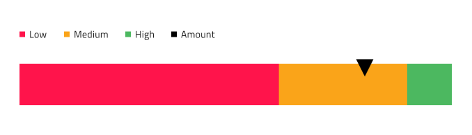

## タイトルとサブタイトル

Linear Gauge にはテキストが変更できるタイトルとサブタイトルがあります。必要がない場合は、~No Symbol に設定することで、非表示にすることもできます。

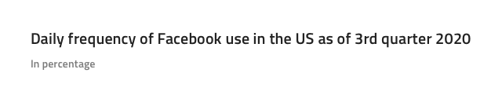

## 凡例

Linear Gauge には、表示されている範囲と現在の値に一致するように調整できる凡例が付属しています。凡例項目は、対応するシリーズを ~No Symbol に設定することで削除するか、Overrides/Charts/Legend/Series で見つけることで追加できます。また、アイコンの種類を Square (四角形)、Line (折れ線)、または Circle (円形) の間で変更できます。

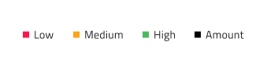

## ツールチップ

Linear Gauge には、オーバーライドを ~No Symbol に設定することで非表示にできるツールチップが付属しています。

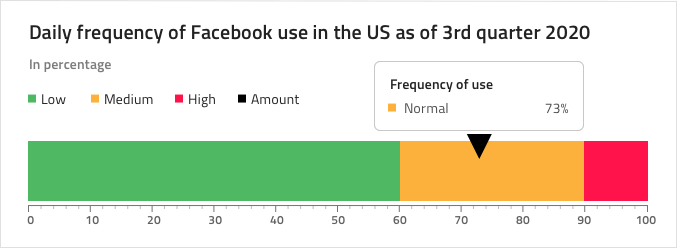

## 針のタイプ

Linear Gauge は、現在の値を示す針の形 (**wide triangle**、needle、trapezoid、および triangle) を制御するさまざまなオーバライドをサポートします。

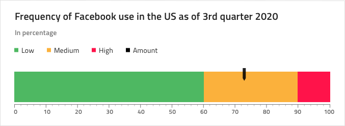

## 範囲のサイズ

Linear Gauge は、リニア済みの 3 つの範囲 (2 つ、**3 つ**、4 つ) 設定があります。

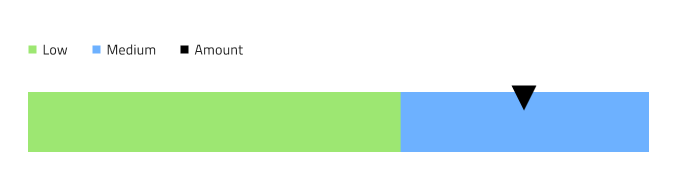

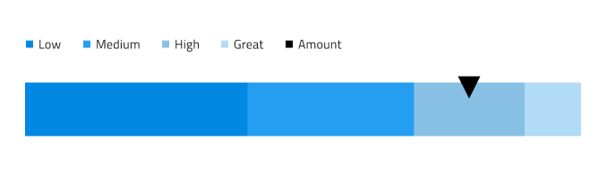

## 目盛と値

目盛と値も構成可能です。Ticks と Minor Ticks の 2 種類の目盛は、色を `Transparent` に設定することで非表示にできます。デフォルト値の 0、10、20 などから 100 までは、必要に応じて調整できます。

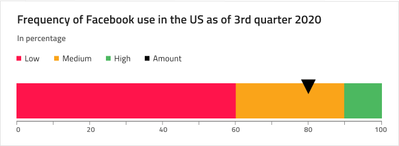

## スタイル設定

Linear Gauge には、Value Brush、Target Value Brush、Tick Brush、Minor Tick Brush、Range Brushes のコレクションなどのブラシを制御するさまざまなオーバーライドによるスタイル設定の柔軟性があります。

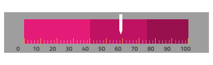

## 使用方法

データ可視化や情報ダッシュボードの作成時では、シナリオにターゲット値があるかないかに基づいて Bullet Graph と Linear Gauge のいずれかを選択し、スクリーンのスペースに基づいて Linear と Radial Gauge のいずれかを選択します。Graphs と Gauges は両方とも現在の値のみ表示し、過去の値を表示する方法はありません。アプリケーションでそのようなデータが必要な場合は Line Chart または Column Chart を検討してください。
わかりやすく、鮮明なデータ可視化を簡単に作成するために Needle の色は範囲や背景と十分なコントラストのある色にし、読みにくい、解釈しずらい結果となる同じ色のバリアントは使用しないようにします。[Radial Gauge](radial-gauge.md) とは異なり、Linear Gauge コンポーネントは周りにより多くの空スペースが必要なため、Linear Gauges のコレクションを密集して配置しないようにします。

| 良い例                                                                                 | 悪い例                                                                                  |
| ---------------------------------------------------------------------------------- | -------------------------------------------------------------------------------------- |
| 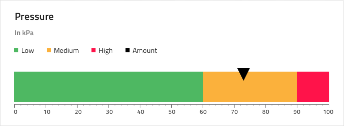 | 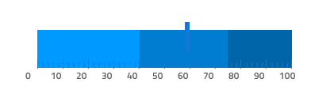 |
|  | 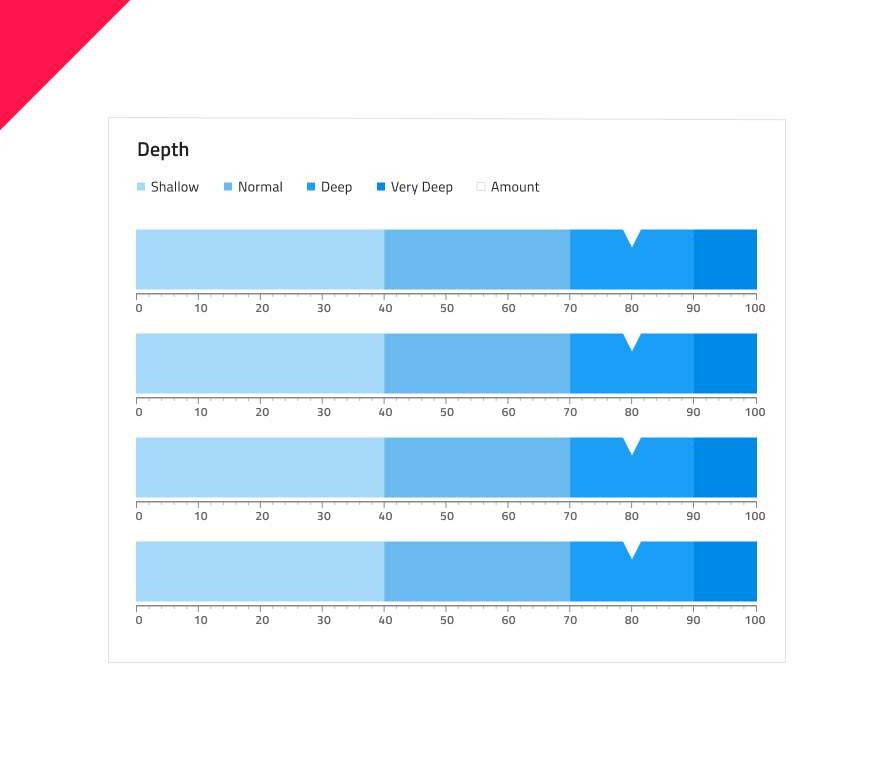 |

## その他のリソース

関連トピック:

- [Bullet Graph](bullet-graph.md)
- [Line Chart](line-chart.md)
- [Column Chart](column-chart.md)
- [Radial Gauge](radial-gauge.md)

コミュニティに参加して新しいアイデアをご提案ください。
