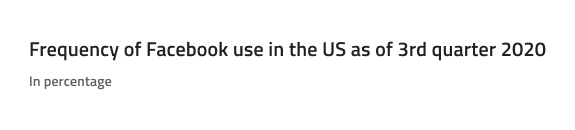
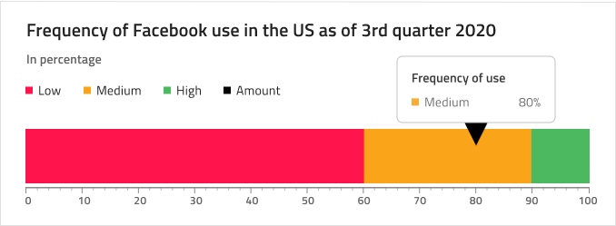
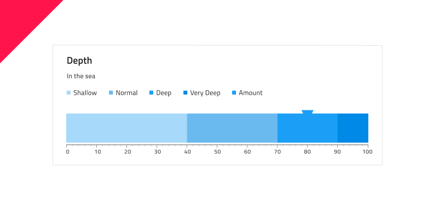

# Linear Gauge (リニア ゲージ)

Linear Gauge コンポーネントをデータ可視化に使用して、カラーコードされた下部の範囲で描かれたコンテキスト内の値を表示します。Linear Gauge は、[Ignite UI for Angular Linear Gauge コンポーネント](https://jp.infragistics.com/products/ignite-ui-angular/angular/components/linear-gauge.html)と視覚的に同じものです。

ターゲット値が情報の理解や解釈に非常に重要である場合、代わりに [Bullet Graph](bullet-graph.md) を使用します。

## Linear Gauge のデモ

## Title と Subtitle (タイトルとサブタイトル)

Linear Gauge にはテキストが変更できる Title と Subtitle があります。Figma では、レイヤー パネルで Title レイヤーと Subtitle レイヤーの表示のオンとオフを切り替えることができます。Sketch では、~No Symbol に設定して不要な場合は非表示にできますが、Adobe XD では各レイヤーを削除します。

## Legend (凡例)

Linear Gauge には、表示されている範囲と現在の値に一致するように調整できる凡例が付属しています。Figma では、レイヤー パネルで `Legend` インスタンスの表示のオンとオフを切り替えることができます。Sketch で凡例項目は、対応するシリーズを ~No Symbol に設定することで削除するか、Overrides/Charts/Legend/Series で見つけることで追加できます。Adobe XD では、未使用の Series レイヤーを削除する必要があります。また、アイコンの種類を Square、Line、または Circle の間で変更できます。

## ツールチップ

Linear Gauge のツールチップは Sketch でオーバーライドを ~No Symbol に設定するか、Adobe XD でレイヤーを削除すると非表示になります。Linear Gauge には、Figma および Adobe XD でレイヤーを削除し、Sketch でオーバーライドを ~No Symbol に設定することで非表示にできるツールチップが付属しています。

## 針のタイプ

Linear Gauge は、現在の値を示す針の形 (Wide Triangle、Needle、Trapezoid、および Triangle) を制御するさまざまなオーバライドをサポートします。Figma では、`Needle Type` インスタンスを選択し、右側のサイドバーからタイプを選択することで、針の形状を選択できます。Sketch では、これを `Symbol Overrides` で実現していますが、Adobe XD では、`Component States` パラダイムを使用して簡単にタイプを切り替えることができます。

## 範囲のサイズ

Linear Gauge は、リニア済みの 3 つの範囲 (2 つ、**3 つ**、4 つ) 設定があります。Figma では、レイヤー パネルから `Series Amount` インスタンスを選択し、右側のサイドバーのプロパティから選択することで、シリーズの量を変更できます。Sketch では、これを `Symbol Overrides` で実現していますが、Adobe XD では、`Component States` パラダイムを使用して簡単に範囲を切り替えることができます。

## Ticks と Values (目盛と値)

Ticks と Values も構成可能です。Ticks と Minor Ticks の 2 種類の目盛は、色を `Transparent` に設定することで非表示にできます。デフォルト Values の 0、10、20 などから 100 までは、必要に応じて調整できます。

## スタイル設定

Linear Gauge には、Value Brush、Target Value Brush、Tick Brush、Minor Tick Brush、Range Brushes のコレクションなどのブラシを柔軟にスタイル設定できるオプションがあります。

## 使用方法

データ可視化や情報ダッシュボードの作成時では、シナリオにターゲット値があるかないかに基づいて Bullet Graph と Linear Gauge のいずれかを選択し、スクリーンのスペースに基づいて Linear と Radial Gauge のいずれかを選択します。Graphs と Gauges は両方とも現在の値のみ表示し、過去の値を表示する方法はありません。アプリケーションでそのようなデータが必要な場合は Line Chart または Column Chart を検討してください。
わかりやすく、鮮明なデータ可視化を簡単に作成するために Needle の色は範囲や背景と十分なコントラストのある色にし、読みにくい、解釈しずらい結果となる同じ色のバリアントは使用しないようにします。[Radial Gauge](radial-gauge.md) とは異なり、Linear Gauge コンポーネントは周りにより多くの空スペースが必要なため、Linear Gauges のコレクションを密集して配置しないようにします。

| 良い例                                                                                 | 悪い例                                                                                  |
| ---------------------------------------------------------------------------------- | -------------------------------------------------------------------------------------- |
|  |  |
|  |  |

## その他のリソース

関連トピック:

- [Radial Gauge](radial-gauge.md)
- [Bullet Graph](bullet-graph.md)
- [Line Chart](line-chart.md)
- [Column Chart](column-chart.md)

コミュニティに参加して新しいアイデアをご提案ください。
