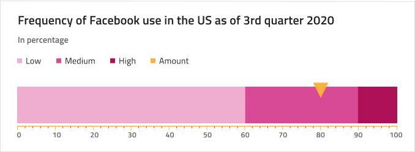
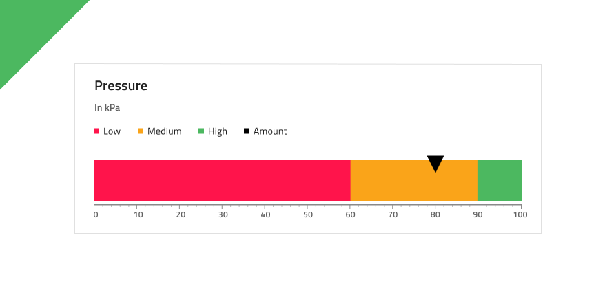

# Linear Gauge (リニア ゲージ)

Linear Gauge コンポーネントをデータ可視化に使用して、カラーコードされた下部の範囲で描かれたコンテキスト内の値を表示します。Linear Gauge は、[Ignite UI for Angular Linear Gauge コンポーネント](https://jp.infragistics.com/products/ignite-ui-angular/angular/components/linear-gauge.html)と視覚的に同じものです。

ターゲット値が情報の理解や解釈に非常に重要である場合、代わりに [Bullet Graph](bullet-graph.md) を使用します。

## Linear Gauge のデモ

## Title and Subtitle

The Linear Gauge has a Title and Subtitle and their text can be changed. They can also be hidden if not needed by setting them to ~No Symbol.

## Legend

The Linear Gauge comes with a Legend that can be adjusted to match the ranges shown on it and the current value. Legend items can be removed by setting the corresponding Series to ~No Symbol or added by finding it in the Overrides/Charts/Legend/Serie. Also there you can change the icon type between Square, Line or Circle.

## Tooltip

The Linear Gauge comes with a tooltip that may be hidden by setting the override to ~No Symbol.

## 針のタイプ

Linear Gauge は、現在の値を示す針の形 (**wide triangle**、needle、trapezoid、および triangle) を制御するさまざまなオーバライドをサポートします。

## 範囲のサイズ

Linear Gauge は、リニア済みの 3 つの範囲 (2 つ、**3 つ**、4 つ) 設定があります。

## Ticks and Values

Ticks and Values are also configurable. The two types of ticks: Ticks and Minor Ticks can be hidden by setting their color to `Transparent`. The default Values 0,10,20 etc. up to 100 can be adjusted according to one's needs.

## スタイル設定

The Linear Gauge comes with styling flexibility through the various overrides controlling a selection of brushes including Value Brush, Target Value Brush, Tick Brush, Minor Tick Brush, and a collection of Range Brushes.

## 使用方法

データ可視化や情報ダッシュボードの作成時では、、シナリオにターゲット値があるかないかに基づいて Bullet Graph と Linear Gauge のいずれかを選択し、スクリーンのスペースに基づいて Linear と Radial Gauge のいずれかを選択します。Graphs と Gauges は両方とも現在の値のみ表示し、過去の値を表示する方法はありません。アプリケーションでそのようなデータが必要な場合は Line Chart または Column Chart を検討してください。
わかりやすく、鮮明なデータ可視化を簡単に作成するために Needle の色は範囲や背景と十分なコントラストのある色にし、読みにくい、解釈しずらい結果となる同じ色のバリアントは使用しないようにします。[Radial Gauge](radial-gauge.md) とは異なり、Linear Gauge コンポーネントは周りにより多くの空スペースが必要なため、Linear Gauges のコレクションを密集して配置しないようにします。

| 良い例                                                                                 | 悪い例                                                                                  |
| ---------------------------------------------------------------------------------- | -------------------------------------------------------------------------------------- |
|  |  |
|  |  |

## その他のリソース

関連トピック:

- [Bullet Graph](bullet-graph.md)
- [Line Chart](line-chart.md)
- [Column Chart](column-chart.md)
- [Radial Gauge](radial-gauge.md)

コミュニティに参加して新しいアイデアをご提案ください。
