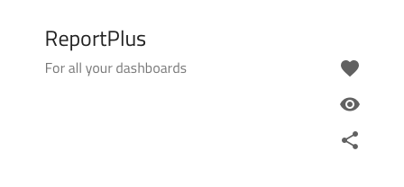
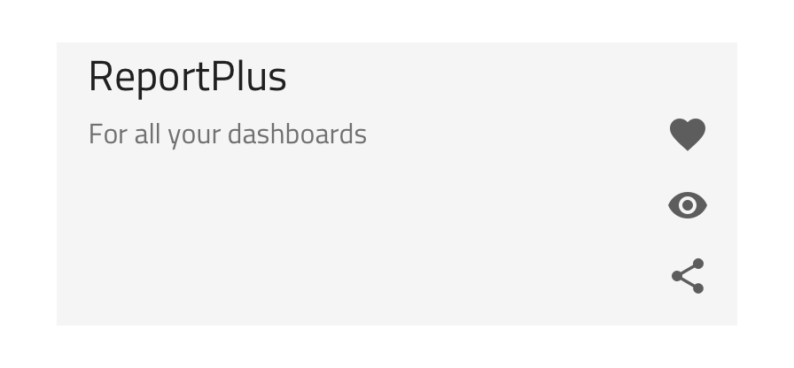
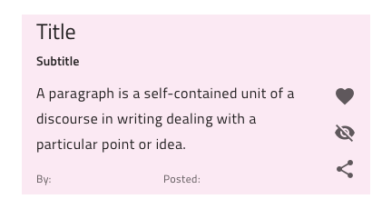
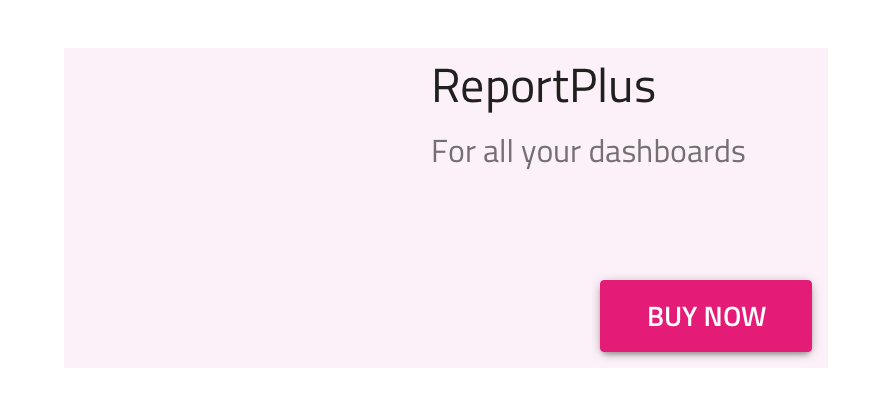
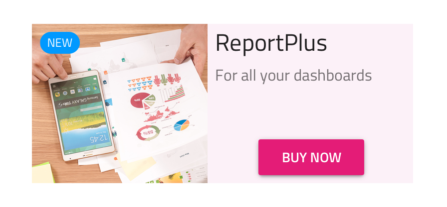

---
title: Sketch の Custom List Item - デザイン システム コンポーネント
_description: List Items コレクションは、完全なカスタマイズ可能な Custom レイアウトを作成する List Item を含みます。
_keywords: デザイン システム, デザイン システム UX, UI キット, Sketch, Ignite UI for Angular, Sketch to Angular, Angular, Angular デザイン システム, Sketch からコードをエクスポート, Angular 用のデザイン キット, Sketch HTML, Sketch to HTML, Sketch UI キット
_language: ja
---

> [!NOTE]
> このトピックは、<b>Sketch ライブラリ</b>のユーザーにのみ関連します。

# Custom List Item (カスタム リスト アイテム)

Sketch の Custom List Item コンポーネントを使用して、通常の List Item と同じタイプの情報を表示しますが、レイアウトを自由に配置できます。

## Custom List Item のデモ

## 状態

Custom List Item はオーバライドとして以下のインアクティブ状態をサポートします: 標準状態の **inactive** と選択状態の active です。

## Using the Custom List Item

List Item レイアウトをカスタマイズするには、`List/Custom/Item` をアートボードにドラッグして一番上を右クリックし、コンテキスト メニューの下の方にある `Detach from Symbol` オプションを選択します。新しく表示される `List/Custom/Item` グループの下のレイヤー パネルには以下があります。

| レイヤー                 | 使用                                                                                                                           |
| ------------------------ | ------------------------------------------------------------------------------------------------------------------------------ |
| 🚫 metadata  | 禁止されたアイコンで開始する特定のロックされたレイヤー。このレイヤーはコード生成に必要なため、削除または変更しないでください。 |
| 💡Primary Action Group   | Primary Action レイアウト要素をグループ化                                                                                      |
| 💡Secondary Action Group | Secondary Action レイアウト要素をグループ化                                                                                    |
| 💡State                  | 項目の Background を含み、List Item がアクティブまたは非アクティブな状態にあるかどうかを定義します。                           |

### レイアウト

以下は、上記の製品 List Item の複雑なレイアウトを 3 つのシンプルなステップで作成する方法です。空 Artboard の Custom List Item をドラッグし、`Detach from Symbol` を選択して、状態の背景色を変更する基本スタイルを適用します。開始ポイントにも同様に適用します。

1.  最初に、段落とフッターを削除する必要があります。次に、Primary Action Group の Header を再利用しますが右半分のみに合わせてサイズ変更し、Title と Subtitle Text の文字列を更新します。Secondary Action Group で Raised Button 配置を右下近くに追加します。テキストを更新して新しい値に合わせてサイズ変更します。テキストの更新して新しい値に合わせてサイズ変更します。ターゲット カスタム レイアウトに Icons は必要ないため、最後にデフォルト Secondary Action を削除します。

    

2.  次に List/Custom/Blocks/Image Content を Primary Action Group に挿入し、同じグループ内で一番上に Badge を追加します。Item サイズに基づいて画像をサイズ変更し、コンテンツを選択します。Badge を変更し、Value Text を更新し、Elevation を None に設定すると、以下のようになります。

    

3.  前のステップでは Text/Title 要素を Primary Action Group に追加します。H3 で製品価格を表示し、その右に Body 1 で追加のテキストを表示します。Header と Raised Button 間の空スペースに配置後、ターゲット レイアウトが完了した Raised Button の最終的な配置を調整できます。

    

## スタイル設定

Custom List Item は、Secondary Actions のオーバーライドおよびテキスト、アイコン、ボタン色の制御の一般的な List Item 同様にスタイル設定に高い柔軟性があります。各 List Item 同様にオーバーライドで Item 背景色を指定できます。

さらに、Custom List Item に挿入された要素に基づいて、追加のスタイル設定が可能です。たとえば、テキストの色を設定して強調したり、Badge 背景や Raised Button 背景の色を変更したりできます。

## その他のリソース

関連トピック:

- [Badge](badge.md)
- [Button](button.md)
- [List](list.md)
- [List Item](list-item.md)
- [Lists パターン](../patterns/lists.md)
  

コミュニティに参加して新しいアイデアをご提案ください。
