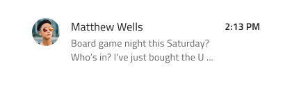
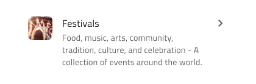
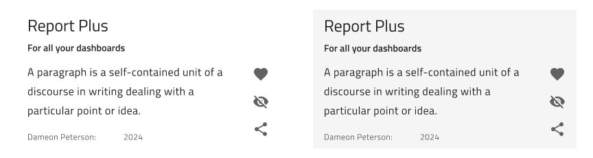

# List Item (リスト項目)

List Item を使用して、テキスト、アイコン、画像、および Switch や Checkbox などのコンポーネントを含む List コンポーネントに繰り返し情報を表示し、ユーザーが可能なアクションを実行できるようにします。List Item は、[Ignite UI for Angular List コンポーネント](https://jp.infragistics.com/products/ignite-ui-angular/angular/components/list.html)と視覚的に同じものです。

## List Item のデモ

## タイプ

Figma では、List Item には次の 3 つのプリセットタイプがあります: グループの見出しを定義する Header、1 行のテキストを含む短い項目の One-line、プライマリおよびセカンダリ テキストをサポートするより高さのある項目の Two-line。

> [!NOTE]
> リスト項目が **3** または **4** 行で構成されている場合に適切に配置するには、Avatar と Actions を手動で調整して先頭に配置する必要があります。この位置合わせは予期された動作とみなされます。現在、これは Figma **Indigo.Design システム**で可能であり、これらの調整は簡単にアクセスでき、実現可能です。 
>
> この上部の配置を実現するには、`State` フレームと `Thumbnail` フレームを **top left (左上)** に設定する必要があります。まれに、Secondary Actions をテキスト コンテナーと操作アイコンで構成する必要がある場合は、`Secondary Actions` フレームを **top right (右上)** に設定する必要もあります。 

## 状態

Items は、次のインタラクティブ状態をサポートします: 通常の状態では**非アクティブ**、選択した状態では**アクティブ**です。Figma では、状態は右側のサイドバーの `State` プロパティの下にあります。Header List Item は選択できないため、そのような状態はサポートしません。

## 領域

Figma では、List Item には 2 つの異なる領域があります: Avatar やテキストなどの非インタラクティブ コンテンツを使用した Primary Action と、List Item に関連するクイック アクションを使用した Secondary Action。Primary Action と Secondary Action を任意に組み合わせると、リストのすべての項目で一貫して使用する必要がある一意のリスト項目テンプレートが作成されます。

## Figma の Primary Action

Figma の 「Type」 プロパティには、5 つの交換可能な List Item Primary Action があります。List Item は、`Line` プロパティの下にある One-line とTwo-line オプションをサポートしています。

|                              |                                                                                                  |                                                                                                                                            |
| ---------------------------- | ------------------------------------------------------------------------------------------------ | ------------------------------------------------------------------------------------------------------------------------------------------ |
| Avatar + Label + Description |      |                                                                                                                                            |
| Checkbox + Label               |    |  List Item 内の Checkbox には独自のラベルを付けることができないため、Figma のレイヤー パネルでは前後のラベルがオフに切り替わります。 この設定は変更するべきではありません。 |
| Icon + Label + Desc |    |                                                                                                                                            |
| Label + Progress          |    | List Item 内の Linear Progress Bar には値ラベルを付けることができません。そのため、Figma のレイヤー パネルでラベルのレイヤーがオフに切り替わります。 この設定は変更するべきではありません。 |                                    
| Label |      |                                                                                                                                            |

## Figma の Secondary Action

Figma には、交換可能な List Item Secondary Action が 4 つあります。これらは `Secondary Action` 基本コンポーネントのプロパティで利用でき、ケースや必要に応じて切り替えたり、オン/オフしたりできます。Figma の自動レイアウトは、選択したプロパティに基づいてコンポーネントを自動的に調整します。

|                  |                                                                                                    |                                                                                                                                       |
| ---------------- | -------------------------------------------------------------------------------------------------- | ------------------------------------------------------------------------------------------------------------------------------------- |
| Badge            |    |                                                                                                                                       |
| Checkbox         |  | List Item 内の Checkbox にはラベルを付けることができないため、Figma のレイヤー パネルでは前後のラベルがオフに切り替わります。 この設定は変更するべきではありません。 |
| Text and Icon            |  | テキストとアイコンは独立して使用できます。Figma では、Text Container のオンとオフを切り替えて、一方または両方のアイコンを非表示にすることができます。                                                                                                                                     |
| Toggle/Switch             |  | List Item 内の Switch にはラベルを付けることができないため、Figma のレイヤー パネルでは前後のラベルがオフに切り替わります。この設定は変更するべきではありません。   |                                                                                                                                          |

## スタイル設定

List Item には、アイコン、テキスなどのさまざまな要素および Avatar、Badge、Checkbox、Icon、Progress、Switch などのコンポーネントで使用できるオプションを通じて、スタイルの柔軟性があり、それぞれに独自のスタイル機能があります。

## Custom List Item コンポーネント

Custom List Item コンポーネントでは、通常の List Item と同じタイプの情報を表示できますが、その中の要素のレイアウトは異なります。Custom List Item は、次の 2 つのインタラクティブな状態をサポートします。 通常の状態では Inactive (非アクティブ)、選択された状態では Active (アクティブ) になります。 

## その他のリソース

関連トピック:

- [Avatar](avatar.md)
- [Badge](badge.md)
- [Checkbox](checkbox.md)
- [Icon](icon.md)
- [List](list.md)
- [Skeleton List](list-skeleton.md)
- [Progress](progress.md)
- [Switch](switch.md)
- [Lists パターン](../patterns/lists.md)
  

コミュニティに参加して新しいアイデアをご提案ください。
