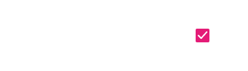

# List Item (リスト項目)

List Item を使用して、テキスト、アイコン、画像、および Switch や Checkbox などのコンポーネントを含む List コンポーネントに繰り返し情報を表示し、ユーザーが可能なアクションを実行できるようにします。List Item は、[Ignite UI for Angular List コンポーネント](https://jp.infragistics.com/products/ignite-ui-angular/angular/components/list.html)と視覚的に同じものです。

## List Item のデモ

## タイプ

Sketch では、List Item には次の 3 つのプリセットタイプがあります: グループの見出しを定義する Header、1 行のテキストを含む短い項目の One-line、プライマリおよびセカンダリ テキストをサポートするより高さのある項目の Two-line。プリセットが 2 つしかない Adobe XD では、同じ以上のことを実現できるため、Header と Item タイプのみがあります。

## 状態

Items は、次のインタラクティブ状態をサポートします: 通常の状態では**非アクティブ**、選択した状態ではアクティブです。Sketch では、これを `Symbol Overrides` で実現していますが、Adobe XD では `Component States` パラダイムを使用して簡単に状態を切り替えることができます。Header List Item は選択できないため、そのような状態はサポートしません。

## 領域

Sketch では、List Item には 2 つの異なる領域があります: Avatar やテキストなどの非インタラクティブ コンテンツを使用した Primary Action と、List Item に関連するクイック アクションを使用した Secondary Action。Primary Action と Secondary Action を任意に組み合わせると、リストのすべての項目で一貫して使用する必要がある一意のリスト項目テンプレートが作成されます。

Adobe XD では、リスト項目には、Avatar、Progress bar、テキストなどの非インタラクティブ コンテンツが配置されたグループと、項目の右側にアクション可能なアイコンを含む Actions コンポーネントがあります。どちらの領域でも、`Libraries` パネルから任意のコンポーネントをドラッグして、テンプレート内のコンポーネントや項目自体を破棄することなく、必要なレイアウトを作成できます。

## Sketch の Primary Action

`Symbol Overrides` として利用可能な、4 つの交換可能な List Item Primary Action があります。Smart Layout のおかげで、不要な要素を ~No Symbol に設定することで、さらに調整することができます。

|                              |                                                                                                  |                                                                                                                                            |
| ---------------------------- | ------------------------------------------------------------------------------------------------ | ------------------------------------------------------------------------------------------------------------------------------------------ |
| Avatar + Label + Description |      |                                                                                                                                            |
| Checkbox + Label               |    |  List Item 内の Checkbox に独自のラベルを付けることはできないため、前後のラベルは Sketch で ~No Symbol に設定され、ラベル レイヤーは Adobe XD に存在しません。この設定は変更するべきではありません。 |
| Icon + Label + Desc |    |                                                                                                                                            |
| Label + Progress          |    | List Item 内の Linear Progress Bar に値ラベルを付けることはできないため、Sketch では ~No Symbol に設定され、Adobe XD には値ラベル レイヤーが存在しません。この設定は変更するべきではありません。 |                                                                                                                                            |

## Sketch の Secondary Action

`Symbol Overrides` として使用可能な 4 つの交換可能な List Item Secondary Action があります。Smart Layout のおかげで、不要な要素を ~No Symbol に設定することで、さらに調整することができます。

|                  |                                                                                                    |                                                                                                                                       |
| ---------------- | -------------------------------------------------------------------------------------------------- | ------------------------------------------------------------------------------------------------------------------------------------- |
| Badge            |    |                                                                                                                                       |
| Checkbox         |  | List Item 内の Checkbox にラベルを付けることはできません。そのため、前後のラベルは Sketch で ~No Symbol に設定され、Adobe XD ではラベル レイヤーが存在しません。この設定は変更するべきではありません。 |
| Text and Icon            |  |                                                                                                                                       |
| Toggle/Switch             |  | List Item 内の Switch にラベルを付けることはできません。そのため、前後のラベルは Sketch で ~No Symbol に設定され、ラベル レイヤーは Adobe XD に存在しません。この設定は変更するべきではありません。   |

## Adobe XD の Thumbnail (サムネイル)

Adobe XD の左側の List Item 領域にある Thumbnail コンポーネントは、`Component States` パラダイムを介して 3 つの交換可能なオプションを提供し、それらを簡単に切り替えることができます。これにより、Sketch の各 Primary Action に一致するデザインを作成できます。

## Adobe XD の Actions

Adobe XD の適切な List Item 領域を構成する Actions コンポーネントは、`Component States` パラダイムを介して 4 つの交換可能なオプションを提供し、それらを簡単に切り替えることができます。これにより、Sketch の各 Secondary Action に一致するデザインを作成できます。

## スタイル設定

List Item には、アイコン、テキスなどのさまざまな要素および Avatar、Badge、Checkbox、Icon、Progress、Switch などのコンポーネントで使用できるオプションを通じて、スタイルの柔軟性があり、それぞれに独自のスタイル機能があります。

## その他のリソース

関連トピック:

- [Avatar](avatar.md)
- [Badge](badge.md)
- [Checkbox](checkbox.md)
- [Icon](icon.md)
- [List](list.md)
- [Sketch の Custom List Item](list-custom.md)
- [Skeleton List](list-skeleton.md)
- [Progress](progress.md)
- [Switch](switch.md)
- [Lists パターン](../patterns/lists.md)
  

コミュニティに参加して新しいアイデアをご提案ください。
