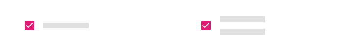

# Skeleton List (スケルトン リスト)

Skeleton List コンポーネントを使用して、標準の情報と同じタイプの情報をレイアウトします。ただし、データが存在しない場合のアプリケーションの状態 (データがリモート データソースからロードされ、接続が切れているか、時間がかかる場合など) も示します。Skeleton List は、既知のレイアウトの [List](list.md) を視覚的に表したものですが、表示するデータはありません。

## Skeleton List のデモ

## タイプ

Skeleton List は、標準の [List](list.md) と同じ 2 つのタイプをサポートします: One-line Item List (1 行の項目リスト) と Two-line Item List (2 行の項目リスト)。

## Skeleton List Item

Skeleton List Item には、プロパティ パネルの `Line` プロパティの下にある標準の[リスト](list.md)と同じ 3 つのプリセット タイプ (Header、One-line、Two-line) があります。

## List Item の領域

Skeleton List Item には、標準 [List](list.md) のような 2 つの異なる領域があります: Primary Action と Secondary Action。

## Primary Action

Figma の 「Type」 プロパティには、5 つの交換可能な Skeleton List Item Primary Action があります。Skeleton List Item Primary Actions は、標準の [List Item](list-item.md) に似ています。List Item は、`Line` プロパティの下にある One-line と Two-line オプションをサポートしています。

|                              |                                                                                                  |                                                                                                                                            |
| ---------------------------- | ------------------------------------------------------------------------------------------------ | ------------------------------------------------------------------------------------------------------------------------------------------ |
| Avatar + Label + Description |      |                                                                                                                                            |
| Checkbox + Label               |    |  Primary Action の Checkbox にはラベルを付けることができないため、Figma のレイヤー パネルで前後のラベルがオフになっており、この設定は変更するべきではありません。|
| Icon + Label + Desc |    |                                                                                                                                            |
| Label + Progress          |    | |                                                                                                                                            |
| Label |      |                                                                                                                                            |

## Figma の Secondary Action

Skeleton List Item の Secondary Action は、`Symbol Overrides` として利用可能な標準の [List Item](list-item.md) からの対応物で可能なすべてのシナリオを含みます。Figma では、すべてのアクションは間もなく追加される予定です。

|                  |                                                                                                    |                                                                                                                                       |
| ---------------- | -------------------------------------------------------------------------------------------------- | ------------------------------------------------------------------------------------------------------------------------------------- |
| Text と Icon            |  |                                                                                                                                       |

## 使用方法

リスト レイアウトを作成するときは、標準リスト項目と Skeleton List Item を組合さないようにします。データはすべてのリスト項目に存在するか、いずれにも存在しないため、2 つのタイプを同じレイアウト内で使用しないでください。

| 良い例                                                                         | 悪い例                                                                          |
| -------------------------------------------------------------------------- | ------------------------------------------------------------------------------ |
|  |  |

## その他のリソース

関連トピック:

- [List](list.md)
- [List Item](list-item.md)

コミュニティに参加して新しいアイデアをご提案ください。
