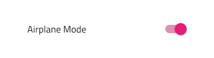

## List

List コンポーネント シンボルは、ユーザーのブラウジングやテキスト、アイコン、画像、ボタンやアバターなどのコンポーネントを含むテンプレート項目の一連の垂直コレクションとのインタラクションを可能にします。List は、[Ignite UI for Angular List コンポーネント](https://jp.infragistics.com/products/ignite-ui-angular/angular/components/list.html)と視覚的に同じものです。

### List デモ


### シンボルからデタッチ

List は、本来インデックス付きの垂直コレクションとしてデータを表示する行のリピーターです。従って `Generic List` をアートボードにドラッグして一番上を右クリックし、コンテキスト メニューの下にある `Detach from Symbol` オプションを選択します。新しく表示される `List/Generic List` グループの下のレイヤー パネルには以下があります。

| レイヤー      | 使用                                                                                                                           |
| ------------- | ------------------------------------------------------------------------------------------------------------------------------ |
| 🚫 igx-list   | 禁止されたアイコンで開始する特定のロックされたレイヤー。このレイヤーはコード生成に必要なため、削除または変更しないでください。 |
| List Header   | リスト ヘッダー項目のインスタンス                                                                                              |
| 1 Item        | 2 行リスト項目のインスタンス                                                                                                   |
| 2 Item        | 2 行リスト項目のインスタンス                                                                                                   |
| 🌈 Background | リストの背景色を定義                                                                                                           |
| 🕹️Data        | データ バインドのコード生成で使用されます。                                                                                    |

デタッチ後に Sketch メニューから追加でヘッダーまたは項目を挿入、または既存のシンボルを複製します。常に項目とヘッダーを同じ水平幅と配置で次々に配置し、項目間に垂直のギャップがないようにします。

### List 項目のタイプ

List 項目には 3 つのプリセット タイプがあります。グループの見出しを定義する Header、1 行のテキストを含む短い項目の One-line、プライマリおよびセカンダリ テキストをサポートするより高さのある項目の Two-line。





### List 項目の状態

One-line および Two-line List 項目は**インアクティブ**状態 (標準状態のインアクティブと選択状態のアクティブ) をサポートします。Header List 項目は選択できないため、そのような States はサポートしません。


### List 項目の領域

List 項目は、2 つの異なる領域があります。Primary Action は、非インタラクティブなコンテンツで Avatar やテキストなどをレイアウトします。Secondary Action には List 項目に関連するクイック アクションがあります。Primary と Secondary 操作は有効なリスト項目テンプレートを形成し、常に List 項目全体で使用されます。


### List 項目プライマリ アクション

以下は置き換え可能な List 項目プライマリ アクションです。

|                              |                                                                                                  |                                                                                                                        |
| ---------------------------- | ------------------------------------------------------------------------------------------------ | ---------------------------------------------------------------------------------------------------------------------- |
| Avatar + Description + Label |      |                                                                                                                        |
| Avatar + Label               |    |                                                                                                                        |
| Avatar + Label + Description |    |                                                                                                                        |
| Description + Label          |    |                                                                                                                        |
| Icon + Description + Label   |    |                                                                                                                        |
| Icon + Label                 |    |                                                                                                                        |
| Icon + Label + Description   |    |                                                                                                                        |
| Label                        |    |                                                                                                                        |
| Label + Description          |    |                                                                                                                        |
| Label + Progress             |  | Primary Action の Progress に基本テキストを設定できないため、Text Style が None に設定され、この設定は変更できません。 |

### List 項目セコンダリ アクション

以下は置き換え可能な List 項目セコンダリ アクションです。

|                  |                                                                                                    |                                                                                                                     |
| ---------------- | -------------------------------------------------------------------------------------------------- | ------------------------------------------------------------------------------------------------------------------- |
| Badge            |    |                                                                                                                     |
| Checkbox         |  | Secondary Action の Checkbox にラベルを設定できないため、Label Style が None に設定され、この設定は変更できません。 |
| Icons            |  |                                                                                                                     |
| Text             |  |                                                                                                                     |
| Text + Icons     |  |                                                                                                                     |
| Toggle           |  | Secondary Action の Switch にラベルを設定できないため、Label Style が None に設定され、この設定は変更できません。   |
| Two-line Numbers |  |                                                                                                                     |

### スタイル設定

List は、さまざまなオーバーライドで背景色、アイコン、テキストなどの List 項目に使用するさまざまな要素、Avatar、Badge、Chechbox、Icon、Progress、Switch などのコンポーネントなどスタイル設定に柔軟性があります。


## 使用方法

List および List 項目には固有のデザインがありますが、List は同様の項目のコレクションで、通常以下の共通テンプレートを使用します。従って同じリスト内で複数のテンプレートを組み合わせないようにします。要素を非表示にせずに、特定のコンテンツ タイプがない場合にプレースホルダーまたは空要素を表示します。テンプレートを構成する要素は垂直方向に継続的に形成する必要があるため、配置に注意が必要です。

| 良い例                                                                     | 悪い例                                                                         |
| -------------------------------------------------------------------------- | ------------------------------------------------------------------------------ |
|  |  |
|  |  |
|  |  |

## コード生成

List の色またはフォントを指定した場合、List HTML 要素は div でラップされます。ブラウザーによってネスト コンポーネント (他のコンポーネント内のコンポーネント) のスタイル設定が要求されます。リストを使用するためにデタッチ シンボルに設定する必要があります。

### データ バインディング

データ バインディングは波括弧構文によって指定されます。例: {isAdmin}。テキスト フィールド (`🕹️DataProperty` および `🕹️DataSource` 以外) も文字列補間構文をサポートします。例: 管理者: {isAdmin}。データ バインディングはネストまたはネストなしが可能です。ターゲット プロパティがネストされたプロパティの場合、ネストされたプロパティ チェーンを含みますがモデル オブジェクト名は含みません。例:

#### ネストなし

```typescript
Customer {
  imageName: String;
}
```

DataProperty: `{imageName}`

#### ネストあり

```typescript
Profile {
  imageName: String;
}

Customer {
  profile: Profile;
}
```

DataProperty: `{profile.imageName}`

### データ ソース プロパティ

`🕹️DataSource` 値は List のデータ ソースを設定するために使用されます。データを表示するためにオブジェクト (行) の配列にバインドします。データ ソースが設定されない場合、リストはヘッダーおよびデザイン ファイルに設定されるリスト項目の数を描画します。データ ソースが設定される場合、スタイルおよびレイアウトは最初のリスト項目から取得されます。

### リスト ヘッダー

リストのヘッダーを構成します。

### リスト項目

リスト項目は List の List Item コレクションを構成します。各 List Item はリスト項目をレイアウト/設定するコントロールを含みます。リスト項目はプライマリおよびセコンダリ アクション セクションに分割されます。

### プライマリ アクション

プライマリ アクションのレイアウトを決定します。Avatar、Linear Progress Bar、または Icon を含むことができます。更に 2 つの Text を含むことができます。(使用方法については上記の説明を参照してください)。

### セカンダリ アクション

セコンダリ アクションのレイアウトを決定します。2 つ以下の Icon、2 つ以下の Text、Checkbox、Badge、Switch、または Text および Icon を含むことができます。(使用方法については上記の説明を参照してください)。

### テキスト

Text プロパティには、テキスト、バインディング、またはその両方を含むことができます。例:

- 設定
- {settingsLabel}
- 重要な {labelText}

## その他のリソース

関連トピック:

- [Avatar](avatar.md)
- [Badge](badge.md)
- [Checkbox](checkbox.md)
- [Icon](icon.md)
- [Progress](progress.md)
- [Switch](switch.md)
- [Lists Pattern](../patterns/lists.md)
  <div class="divider--half"></div>

コミュニティに参加して新しいアイデアをご提案ください。

- [Indigo Design **GitHub** (英語)](https://github.com/IgniteUI/design-system-docfx)
