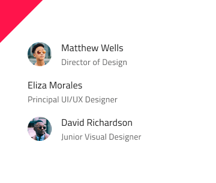

# List (リスト)

List コンポーネントは、ユーザーのブラウジングやテキスト、アイコン、画像、ボタンやアバターなどのコンポーネントを含むテンプレート項目の一連の垂直コレクションとのインタラクションを可能にします。List は、[Ignite UI for Angular List コンポーネント](https://jp.infragistics.com/products/ignite-ui-angular/angular/components/list.html)と視覚的に同じものです。

## List のデモ

## タイプ

List は、1 行項目または 2 行項目のプリセットに挿入できます。どちらも最初は 10 項目を含みます。

## Sketch で List を使用

List は、本来インデックス付きの垂直コレクションとしてデータを表示する行のリピーターです。
アイテムに Smart Layout を使用しているため、1 つ以上のアイテムを ~No Symbol に設定することで、サイズを調整できます。より多くのアイテムを含むリストをデザインする必要がある場合、最も簡単な方法は、アートボードに List タイプのいずれかを挿入し、その上を右クリックして、コンテキスト メニューの下部にある `Detach from Symbol` を選択することです。新しく表示された _List/One-line Item List_ または _List/Two-line Item List_ グループの下のレイヤー パネルに、次のように表示されます:

|  レイヤー         | 使用                                                                                                                                                  |
| ------------- | ---------------------------------------------------------------------------------------------------------------------------------------------------- |
| 🚫 metadata   | 禁止されたアイコンで開始する特定のロックされたレイヤー。このレイヤーはコード生成に必要なため、削除または変更しないでください。 |
| List Header   | リスト ヘッダー アイテムのインスタンス                                                                                                                    |
| 1 Item        | 1 行 / 2 行リスト アイテムのインスタンス                                                                                                                  |
| 2 Item        | 1 行 / 2 行リスト アイテムのインスタンス                                                                                                                  |
| 3 Item        | 1 行 / 2 行リスト アイテムのインスタンス                                                                                                                  |
| 4 Item        | 1 行 / 2 行リスト アイテムのインスタンス                                                                                                                  |
| 5 Item        | 1 行 / 2 行リスト アイテムのインスタンス                                                                                                                  |
| 6 Item        | 1 行 / 2 行リスト アイテムのインスタンス                                                                                                                  |
| 7 Item        | 1 行 / 2 行リスト アイテムのインスタンス                                                                                                                  |
| 8 Item        | 1 行 / 2 行リスト アイテムのインスタンス                                                                                                                  |
| 9 Item        | 1 行 / 2 行リスト アイテムのインスタンス                                                                                                                  |
| 10 Item        | 1 行 / 2 行リスト アイテムのインスタンス                                                                                                                  |
| 🌈 Background | リストの背景色を定義                                                                                                             |

これで、メニューから、または単に既存のものを複製することによって、追加のヘッダーまたはアイテムを挿入できます。常にアイテムとヘッダーを同じ水平幅と配置で次々に配置し、アイテム間にギャップがないようにします。

## Adobe XD で List を使用

Adobe XD では、List コンポーネントをアートボードにドラッグした後、不要なアイテムを削除するだけでアイテムの数を減らしたり、既存のアイテムの 1 つを複製してアイテムの数を増やしたりできます。リストはアイテムを `Stack` に配置するため、アイテムを追加または削除すると、アイテムは自動的に垂直方向に整列および分散されます。リスト内の位置を変更するには、目的の位置まで上下にドラッグする必要があります。Sketch とは異なり、Adobe XD では、シンボルを破棄する必要はありません。

## スタイル設定

List は、さまざまなオプションを通じて背景色、アイコン、テキストなどの List 項目に使用するさまざまな要素、Avatar、Badge、Checkbox、Icon、Progress、Switch などのコンポーネントなどを柔軟にスタイル設定できます。

## 使用方法

List および List Items には固有のデザインがありますが、List は同様の項目のコレクションで、通常以下の共通テンプレートを使用します。従って同じリスト内で複数のテンプレートを組み合わせないようにします。要素を非表示にせずに、特定のコンテンツ タイプがない場合にプレースホルダーまたは空要素を表示します。テンプレートを構成する要素は垂直方向に継続的に形成する必要があるため、配置に注意が必要です。

| 良い例                                                                         | 悪い例                                                                          |
| -------------------------------------------------------------------------- | ------------------------------------------------------------------------------ |
|  |  |
|  |  |
|  |  |

## その他のリソース

関連トピック:

- [Avatar](avatar.md)
- [Badge](badge.md)
- [Checkbox](checkbox.md)
- [Sketch の Custom List Item](list-custom.md)
- [Icon](icon.md)
- [List Item](list-item.md)
- [Lists パターン](../patterns/lists.md)
- [Progress](progress.md)
- [Skeleton List](list-skeleton.md)
- [Switch](switch.md)

コミュニティに参加して新しいアイデアをご提案ください。
