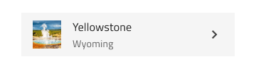
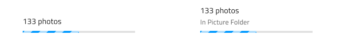

# List (リスト)

List コンポーネントは、ユーザーのブラウジングやテキスト、アイコン、画像、ボタンやアバターなどのコンポーネントを含むテンプレート項目の一連の垂直コレクションとのインタラクションを可能にします。List は、[Ignite UI for Angular List コンポーネント](https://jp.infragistics.com/products/ignite-ui-angular/angular/components/list.html)と視覚的に同じものです。

## List デモ

## タイプ

List は、1 行項目または 2 行項目のプリセットに挿入できます。どちらも最初は 10 項目を含みます。List は、Sketch の Smart Layout を項目に使用します。項目の 1 つ以上を ~No Symbol に設定してサイズを調整できます。

## List Item のタイプ

List Item には 3 つのプリセット タイプがあります。グループの見出しを定義する Header、1 行のプライマリ テキストを含む短い項目の One-line、プライマリおよびセカンダリ テキストをサポートするより高さのある項目の Two-line。

## List Item の状態

One-line および Two-line リスト項目はインアクティブ状態 (標準状態の**インアクティブ**と選択状態のアクティブ) をサポートします。Header List Item は選択できないため、そのような States はサポートしません。

## List Item の領域

List Item は、2 つの異なる領域があります。Primary Action には、非インタラクティブなコンテンツの Avatar やテキストがあり、Secondary Action には List Item に関連するクイック アクションがあります。プライマリとセカンダリ アクションは一意のリスト項目テンプレートを作成し、常に List 項目全体で使用されます。

## List Item Primary Action (リスト項目プライマリ アクション)

以下に置き換え可能な 4 つのリスト項目プライマリ アクションがあります。Sketch で Smart Layout を使用しているため、不要な要素を ~No Symbol に設定して調整できます。

|                              |                                                                                                  |                                                                                                                                            |
| ---------------------------- | ------------------------------------------------------------------------------------------------ | ------------------------------------------------------------------------------------------------------------------------------------------ |
| Avatar + Label + Description |      |                                                                                                                                            |
| Checkbox + Label               |    |  Secondary Action の Checkbox にラベルを設定できないため、前後のラベルを ~No Symbol に設定し、この設定は変更しないでください。 |
| Icon + Label + Desc |    |                                                                                                                                            |
| Label + Progress          |    | Primary Action の Linear Progress Bar は値ラベルを持つことができないため、~No Symbol に設定され、この設定は変更しないでください。 |                                                                                                                                            |

## List Item Secondary Action (リスト項目セカンダリ アクション)

以下に置き換え可能な 4 つの List Item Secondary Action があります。Sketch で Smart Layout を使用しているため、不要な要素を ~No Symbol に設定して調整できます。

|                  |                                                                                                    |                                                                                                                                       |
| ---------------- | -------------------------------------------------------------------------------------------------- | ------------------------------------------------------------------------------------------------------------------------------------- |
| Badge            |    |                                                                                                                                       |
| Checkbox         |  | 	Secondary Action の Checkbox にラベルを設定できないため、前後のラベルを ~No Symbol に設定し、この設定は変更しないでください。 |
| Text and Icon            |  |                                                                                                                                       |
| Toggle             |  | Secondary Action の Switch にラベルを設定できないため、前後のラベルを ~No Symbol に設定し、この設定は変更しないでください。                                                                                                                 |

## スタイル設定

List は、さまざまなオーバーライドで背景色、アイコン、テキストなどの List 項目に使用するさまざまな要素、Avatar、Badge、Checkbox、Icon、Progress、Switch などのコンポーネントなどスタイル設定に柔軟性があります。

## 使用方法

List および List Items には固有のデザインがありますが、List は同様の項目のコレクションで、通常以下の共通テンプレートを使用します。従って同じリスト内で複数のテンプレートを組み合わせないようにします。要素を非表示にせずに、特定のコンテンツ タイプがない場合にプレースホルダーまたは空要素を表示します。テンプレートを構成する要素は垂直方向に継続的に形成する必要があるため、配置に注意が必要です。

| 良い例                                                                         | 悪い例                                                                          |
| -------------------------------------------------------------------------- | ------------------------------------------------------------------------------ |
|  |  |
|  |  |
|  |  |

## Detach from Symbol (シンボルからデタッチ)

List は、本来インデックス付きの垂直コレクションとしてデータを表示する行のリピーターです。より多くの項目のリストをデザインする最も簡単な方法は、アートボードに List タイプのいずれかを挿入し、リストの上で右クリックし、コンテキストメニューの下部で `Detach from Symbol` を選択することです。新しく表示される _List/One-line Item List_ または _List/Two-line Item List_ グループの下のレイヤー パネルには、以下が表示されます。

| レイヤー         | 使用                                                                                                                                                  |
| ------------- | ---------------------------------------------------------------------------------------------------------------------------------------------------- |
| 🚫 metadata   | 禁止されたアイコンで開始する特定のロックされたレイヤー。このレイヤーはコード生成に必要なため、削除または変更しないでください。 |
| List Header   | リスト ヘッダー項目のインスタンス                                                                                                                    |
| 1 Item        | 1 行 / 2 行リスト項目のインスタンス                                                                                                                  |
| 2 Item        | 1 行 / 2 行リスト項目のインスタンス                                                                                                                  |
| 3 Item        | 1 行 / 2 行リスト項目のインスタンス                                                                                                                  |
| 4 Item        | 1 行 / 2 行リスト項目のインスタンス                                                                                                                  |
| 5 Item        | 1 行 / 2 行リスト項目のインスタンス                                                                                                                  |
| 6 Item        | 1 行 / 2 行リスト項目のインスタンス                                                                                                                  |
| 7 Item        | 1 行 / 2 行リスト項目のインスタンス                                                                                                                  |
| 8 Item        | 1 行 / 2 行リスト項目のインスタンス                                                                                                                  |
| 9 Item        | 1 行 / 2 行リスト項目のインスタンス                                                                                                                  |
| 10 Item        | 1 行 / 2 行リスト項目のインスタンス                                                                                                                  |
| 🌈 Background | リストの背景色を定義                                                                                                             |

Sketch メニューから追加でヘッダーまたは項目を挿入、または既存のヘッダー/項目を複製します。常に項目とヘッダーを同じ水平幅と配置で次々に配置し、項目間にギャップがないようにします。

## その他のリソース

関連トピック:

- [Avatar](avatar.md)
- [Badge](badge.md)
- [Checkbox](checkbox.md)
- [Icon](icon.md)
- [Progress](progress.md)
- [Switch](switch.md)
- [Lists パターン](../patterns/lists.md)
- [データ バインディング](../codegen/data-binding.md)
  

コミュニティに参加して新しいアイデアをご提案ください。

