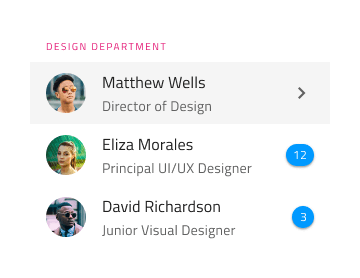
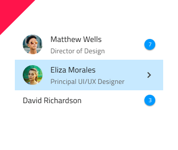

# List (リスト)

List コンポーネントは、ユーザーのブラウジングやテキスト、アイコン、画像、ボタンやアバターなどのコンポーネントを含むテンプレート項目の一連の垂直コレクションとのインタラクションを可能にします。List は、[Ignite UI for Angular List コンポーネント](https://jp.infragistics.com/products/ignite-ui-angular/angular/components/list.html)と視覚的に同じものです。

## List のデモ

## タイプ

List は、1 行項目または 2 行項目のプリセットに挿入できます。どちらも最初は 10 項目を含みます。

## Using the List in Sketch

The List is essentially a repeater of rows showing data as an indexed vertical collection of items. It uses Smart Layout for its items which makes it possible to adjust the size by setting one or more of the items to ~No Symbol. If you need to design a list with more items, the easiest way to do so is by inserting any of the List types on your artboard, right-click on top of it, and select the `Detach from Symbol` at the bottom of the contextual menu. In your layers panel under the newly appeared _List/One-line Item List_ or _List/Two-line Item List_ group, you should see the following:

|  レイヤー         | 使用                                                                                                                                                  |
| ------------- | ---------------------------------------------------------------------------------------------------------------------------------------------------- |
| 🚫 metadata   | A special locked layer starting with a prohibited icon. This layer is required by the code generation and you should avoid deleting or modifying it. |
| List Header   | An instance of a list header item                                                                                                                    |
| 1 Item        | An instance of a one-line/two-line list item                                                                                                                  |
| 2 Item        | An instance of a one-line/two-line list item                                                                                                                  |
| 3 Item        | An instance of a one-line/two-line list item                                                                                                                  |
| 4 Item        | An instance of a one-line/two-line list item                                                                                                                  |
| 5 Item        | An instance of a one-line/two-line list item                                                                                                                  |
| 6 Item        | An instance of a one-line/two-line list item                                                                                                                  |
| 7 Item        | An instance of a one-line/two-line list item                                                                                                                  |
| 8 Item        | An instance of a one-line/two-line list item                                                                                                                  |
| 9 Item        | An instance of a one-line/two-line list item                                                                                                                  |
| 10 Item        | An instance of a one-line/two-line list item                                                                                                                  |
| 🌈 Background | Defines the background color of the list                                                                                                             |

Now, you may insert additional headers or items either from the menu or simply by duplicating an existing one. Always place items and headers one after another with consistent horizontal width and alignment, making sure there are no gaps between the items.

## Using the List in Adobe XD

In Adobe XD, after you drag a List component on your artboard, you may reduce the number of items simply by deleting the unnecessary ones or increase it by duplicating one of the existing ones. The List lays out its items in a `Stack`, so when you add or remove items, they align and distribute vertically automatically. To change their position in the list, you need to drag them up or down to the desired position. Unlike Sketch, in Adobe XD destroying the symbol is not necessary.

## スタイル設定

List は、さまざまなオプションを通じて背景色、アイコン、テキストなどの List 項目に使用するさまざまな要素、Avatar、Badge、Checkbox、Icon、Progress、Switch などのコンポーネントなどを柔軟にスタイル設定できます。

## 使用方法

List および List Items には固有のデザインがありますが、List は同様の項目のコレクションで、通常以下の共通テンプレートを使用します。従って同じリスト内で複数のテンプレートを組み合わせないようにします。要素を非表示にせずに、特定のコンテンツ タイプがない場合にプレースホルダーまたは空要素を表示します。テンプレートを構成する要素は垂直方向に継続的に形成する必要があるため、配置に注意が必要です。

| 良い例                                                                         | 悪い例                                                                          |
| -------------------------------------------------------------------------- | ------------------------------------------------------------------------------ |
|  |  |
|  |  |
|  |  |

## その他のリソース

関連トピック:

- [Avatar](avatar.md)
- [Badge](badge.md)
- [Checkbox](checkbox.md)
- [Sketch の Custom List Item](list-custom.md)
- [Icon](icon.md)
- [List Item](list-item.md)
- [Lists パターン](../patterns/lists.md)
- [Progress](progress.md)
- [Skeleton List](list-skeleton.md)
- [Switch](switch.md)

コミュニティに参加して新しいアイデアをご提案ください。
