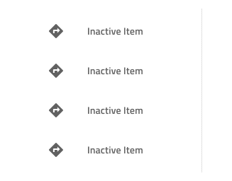
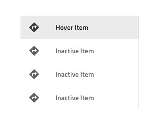
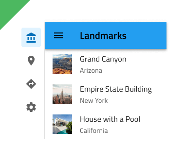
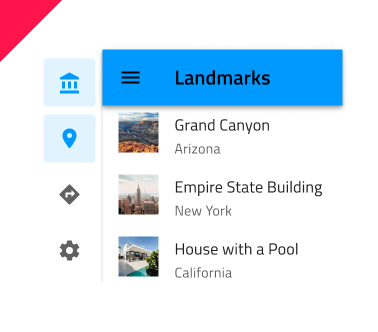

---
title: Navigation Drawer - デザイン システム コンポーネント
_description: Navigation Drawer コンポーネント シンボルは、アプリケーション レベルでシンプルおよび複雑なナビゲーションのデザインをサポートします。
_keywords: デザイン システム, デザイン システム UX, UI キット, Sketch, Ignite UI for Angular, Sketch to Angular, Angular, Angular デザイン システム, Sketch からコードをエクスポート, Angular 用のデザイン キット, Sketch HTML, Sketch to HTML, Sketch UI キット, Figma, Figma to Angular, Figma からコードをエクスポート, Figma HTML, Figma to HTML, Figma UI キット
_language: ja
---

# Navigation Drawer (ナビゲーション ドロワー)

Navigation Drawer コンポーネント シンボルは、複数の項目と画面左に境界線を配置して関連ビュー間のブラウジングを可能にするアプリケーション レベル ナビゲーションを実装します。通常 [Navbar](navbar.md) と組み合わせて使用します。Navigation Drawer は、[Ignite UI for Angular Navigation Drawer コンポーネント](https://jp.infragistics.com/products/ignite-ui-angular/angular/components/navdrawer.html)と視覚的に同じものです。

## Navigation Drawer のデモ

## タイプ

Navigation Drawer は、各項目のアイコンとラベルが付いた **Default** タイプと、アイコンのみが付いた Mini タイプをサポートしています。デザインに含まれる項目 / ビューが 5 つ以下の場合は、代わりに [Bottom Navigation](bottom-nav.md) の使用を検討することをお勧めします。

## 項目

Navigation Drawer は、Sketch と Figma で最大 21 個の項目を表示できます。必要以上の項目がある場合は、Sketch のオーバーライド パネルから不要なものを ~No Symbol に設定するか、Figma のレイヤー パネルから非表示にすることで、その数を減らすことができます。Sketch のスマート レイアウトと Figma の自動レイアウトによって、残りは自動的に調整されます。Adobe XD では、不要な項目を削除するだけで、アイテムの数を減らすことができます。Sketch および Figma とは異なり、既存の項目を複製することで 21 を超える項目を持つことができ、ドラッグして順序を並べ替えることもできます。これらの操作の最後で、レイアウトは項目のコレクションに適用される Stack から調整されます。

## 項目の状態

すべての Navigation Drawer 項目には、Active (アクティブ)、Inactive (非アクティブ)、または Hover (ホバー) の状態があります。Figma では、Disabled (無効) 状態も追加されています。Figma では、ネストされた Navigation Drawer Items に移動し、State プロパティから目的の状態を選択できます。Sketch では、これを `Symbol Overrides` で実現していますが、Adobe XD では `Component States` パラダイムを使用して簡単に状態を切り替えることができます。Figma では、`Icon` ブール値プロパティを使用してアイコンの表示/非表示を選択することもできます。Navigation Drawer では、画面の残りの部分に表示されるビューを示すために、一度に 1 つの項目のみをアクティブにすることができます。

`active`

`inactive`

`hover`

`disabled`

## スタイル設定

Navigation Drawer は、ラベルとアイコンの色、およびアクティブ / インアクティブな背景の色で使用可能なオプションを通じて基本的なスタイリング機能を提供します。

## 使用方法

Navigation Drawer は、アプリの主要ナビゲーションに使用するため、画面左端の一番上から一番下に配置します。Bottom Navigation など競合するアプリ ナビゲーション メカニズムと組み合わせないようにします。メイン ナビゲーションをユーザーに最初に表示する必要があるため、Navigation Drawer を画面の右端に配置するのは適していません。複数の Active の項目を含む Navigation Drawer を使用することも、有効な構成ではありません。

| 良い例                                | 悪い例                               |
| --------------------------------- | ----------------------------------- |
|  |  |
|  |  |
|  |  |
|  |  |

## その他のリソース

関連トピック:

- [Navbar](navbar.md)
- [Bottom Navigation](bottom-nav.md)
  

コミュニティに参加して新しいアイデアをご提案ください。
