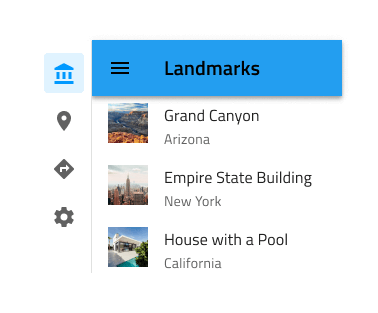
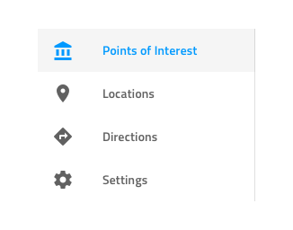
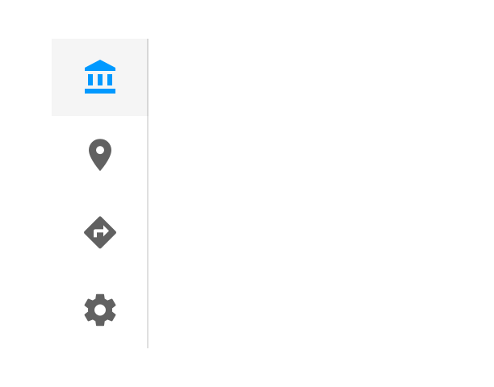
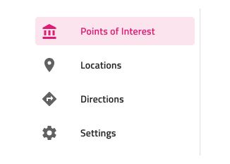
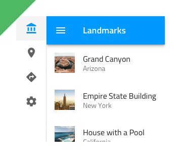
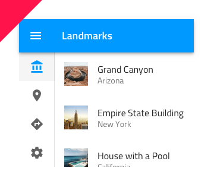
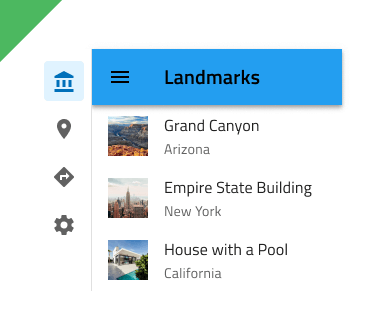
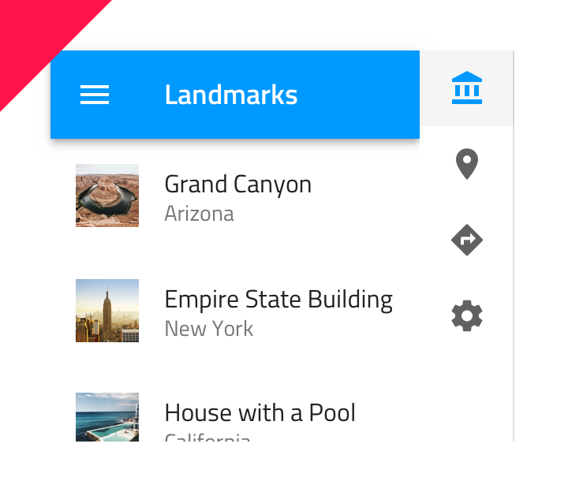
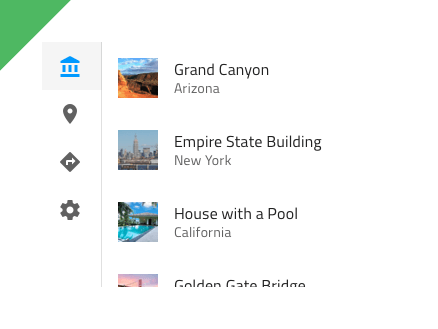
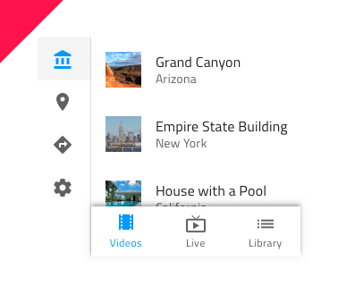

---
title: Navigation Drawer - デザイン システム コンポーネント
_description: Navigation Drawer コンポーネント シンボルは、アプリケーション レベルでシンプルおよび複雑なナビゲーションのデザインをサポートします。
_keywords: デザイン システム, Sketch, Ignite UI for Angular, コンポーネント, UI ライブラリ, ウィジェット
_language: ja
---

## Navigation Drawer

Navigation Drawer コンポーネント シンボルは、複数の項目と画面左に境界線を配置して関連ビュー間のブラウジングを可能にするアプリケーション レベル ナビゲーションを実装します。通常 [Navbar](navbar.md) と組み合わせて使用します。 Navigation Drawer は、[Ignite UI for Angular Navigation Drawer コンポーネント](https://jp.infragistics.com/products/ignite-ui-angular/angular/components/navdrawer.html)と視覚的に同じものです。

### Navigation Drawer デモ

### スタイル

Navigation Drawer は、各項目にアイコンとラベルを含む**デフォルト** スタイルとアイコンのみ含むミニ スタイルがあります。デザインにある項目/ビューが 5 つ以下の場合、Navigation Drawer または [Bottom Navigation](bottom-nav.md) が適しています。

### スタイル設定

Navigation Drawer には、ラベルやアイコンの色の変更、アクティブ/インアクティブな背景の色の変更など基本的なスタイル設定機能があります。

## 使用方法

Navigation Drawer は、アプリの主要ナビゲーションに使用するため、画面左端の一番上から一番下に配置します。Bottom Navigation など競合するアプリ ナビゲーション メカニズムと組み合わせないようにします。メイン ナビゲーションをユーザーに最初に表示する必要があるため、Navigation Drawer を画面の右端に配置するのは適していません。

| いい例                                | 悪い例                               |
| --------------------------------- | ----------------------------------- |
|  |  |
|  |  |
|  |  |

## その他のリソース

関連トピック:

- [Navbar](navbar.md)
- [Bottom Navigation](bottom-nav.md)
  

コミュニティに参加して新しいアイデアをご提案ください。

- [Indigo Design **GitHub** (英語)](https://github.com/IgniteUI/design-system-docfx)
