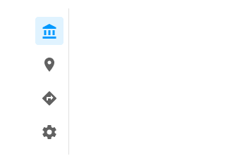

# Navigation Drawer (ナビゲーション ドロワー)

Navigation Drawer コンポーネント シンボルは、複数の項目と画面左に境界線を配置して関連ビュー間のブラウジングを可能にするアプリケーション レベル ナビゲーションを実装します。通常 [Navbar](navbar.md) と組み合わせて使用します。Navigation Drawer は、[Ignite UI for Angular Navigation Drawer コンポーネント](https://jp.infragistics.com/products/ignite-ui-angular/angular/components/navdrawer.html)と視覚的に同じものです。

## Navigation Drawer のデモ

## タイプ

Navigation Drawer は、各項目のアイコンとラベルが付いた**デフォルト**タイプと、アイコンのみが付いたミニ タイプをサポートしています。デザインに含まれる項目 / ビューが 5 つ以下の場合は、代わりに [Bottom Navigation](bottom-nav.md) の使用を検討することをお勧めします。

## 項目

Navigation Drawer はスマート レイアウトを使用し、最大 21 個の項目を表示できます。正確な数は、不要な項目を ~No Symbol に設定することで構成できます。

## 項目の状態

すべての Navigation Drawer 項目には、Active、Inactive、または Hover の状態があります。Sketch では、これを `Symbol Overrides` で実現していますが、Adobe XD では `Component States` パラダイムを使用して簡単に状態を切り替えることができます。Navigation Drawer では、画面の残りの部分に表示されるビューを示すために、一度に 1 つの項目のみをアクティブにすることができます。

## スタイル設定

Navigation Drawer は、ラベルとアイコンの色、およびアクティブ / インアクティブな背景の色で使用可能なオプションを通じて基本的なスタイリング機能を提供します。

## 使用方法

Navigation Drawer は、アプリの主要ナビゲーションに使用するため、画面左端の一番上から一番下に配置します。Bottom Navigation など競合するアプリ ナビゲーション メカニズムと組み合わせないようにします。メイン ナビゲーションをユーザーに最初に表示する必要があるため、Navigation Drawer を画面の右端に配置するのは適していません。複数の Active の項目を含む Navigation Drawer を使用することも、有効な構成ではありません。

| 良い例                                | 悪い例                               |
| --------------------------------- | ----------------------------------- |
|  |  |
|  |  |
|  |  |
|  |  |

## その他のリソース

関連トピック:

- [Navbar](navbar.md)
- [Bottom Navigation](bottom-nav.md)
  

コミュニティに参加して新しいアイデアをご提案ください。

