# NavBar (ナビバー)

Navbar コンポーネントを使用して、アプリケーション内の現在の位置を明確にし、単純なアプリケーション レベルのナビゲーションを実装します。アプリケーションで多くの操作を伴うより複雑なナビゲーションが必要な場合は、代わりに [Navigation Drawer](nav-drawer.md) または [Menu](../patterns/menu.md) の使用を検討してください。Navbar は常に画面の上部にあり、[Ignite UI for Angular Navbar コンポーネント](https://jp.infragistics.com/products/ignite-ui-angular/angular/components/navbar.html)と視覚的に同じものです。

## Navbar デモ

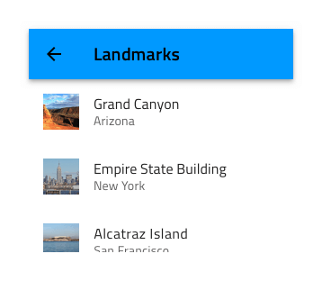

## タイプ

Navbar には、2 つの異なるタイプのバリエーションがあります。メイン コンテンツ領域に影を落とす Elevated のものと、コンテンツの残りの部分から分離する代わりに境界線がある Outlined です。どちらのバリアントも、内部で同じ機能をサポートしています。

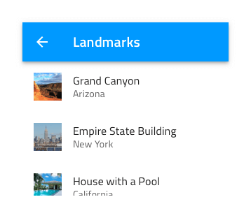
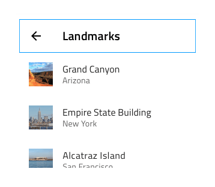

## コンテンツのレイアウト

Navbar のコンテンツは、Left Action と Title で構成される左側の領域と、さまざまな操作用の 4 つの隣接するアイコンがある右側の領域に分割されます。左側の操作または右側のアイコンを ~No Symbol に設定することで、Navbar のレイアウトを構成できます。

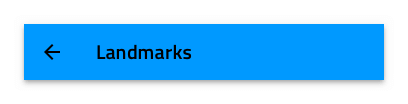
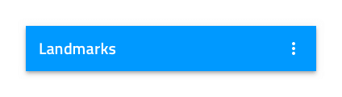

## アクション アイコン

Navbar は、さまざまな単純なイベントをトリガーできる右側の最大 4 つの操作アイコンをサポートできます。

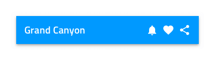
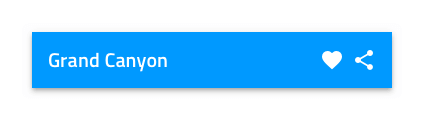
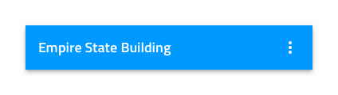

## スタイル設定

Navbar には、タイトル、アイコン、境界線、背景色を変更する基本的なスタイル設定機能があります。

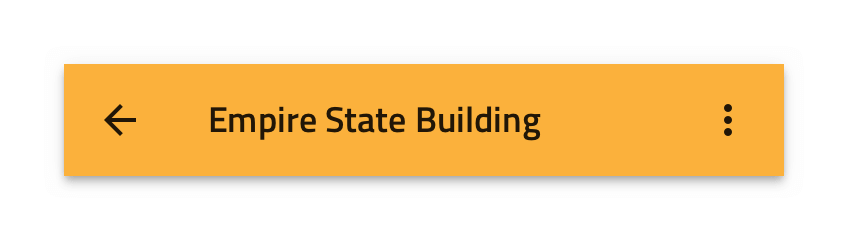

## 使用方法

Navbar の操作は、タイトルと重ならないように注意深く設定する必要があります。これは、1 つを除くすべてのアイコンを右側に非表示にし、3 つの点で表される「その他」アイコンを割り当てて、単純なメニューの表示をトリガーすることで回避できます。操作で「その他」アイコンを指定した場合、Navbar に通常配置するすべての操作をその下に統合し、Navbar にスタンドアロンの操作を配置しないようにします。

| 良い例                                                                             |悪い例                                                                              |
| ------------------------------------------------------------------------------ | ---------------------------------------------------------------------------------- |
| 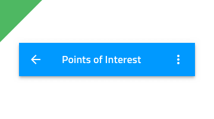|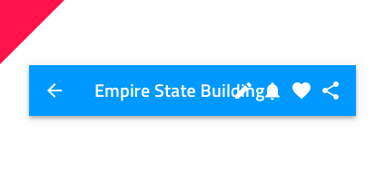 |
| |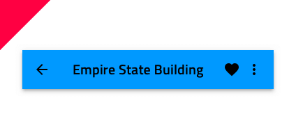 |

## その他のリソース

関連トピック:

- [Icon](icon.md)
- [Navigation Drawer](nav-drawer.md)
- [Menu パターン](../patterns/menu.md)
  

コミュニティに参加して新しいアイデアをご提案ください。

