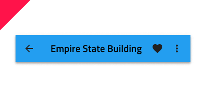

## Navbar

Navbar コンポーネント シンボルは、アプリケーションでユーザーの現在の位置を明確にし、アプリケーション レベルのナビゲーションを向上します。常に画面の上に配置されます。Navbar は、[Ignite UI for Angular Navbar コンポーネント](https://jp.infragistics.com/products/ignite-ui-angular/angular/components/navbar.html)と視覚的に同じものです。

### Navbar デモ

### タイプ

Navbar は、3 つのレイアウト構成があり、**アイコン アクションとタイトル**、テキスト アクションとタイトル、タイトルのみで定義されます。

### アクション アイコン

各 Navbar は、画面右端から左へ描画されるシンプルなイベントをトリガーする操作アイコンを 4 アイコンまでサポートします。

### スタイル設定

Navbar には、タイトル、アイコン、背景色を変更する基本的なスタイル設定機能があります。

## 使用方法

Navbar 操作は、タイトルと重ならないようにシンプル メニューの表示をトリガーするアイコンを使用します。操作で他のアイコンを指定した場合、Navbar に通常配置するすべての操作をその下に統合し、 Navbar にスタンドアロンの操作を配置しないようにします。

| 良い例                                                                         | 悪い例                                                                             |
| ------------------------------------------------------------------------------ | ---------------------------------------------------------------------------------- |
|  |  |
|  |  |

## その他のリソース

関連トピック:

- [Icon](icon.md)
- [Navigation Drawer](nav-drawer.md)
  

コミュニティに参加して新しいアイデアをご提案ください。

- [Indigo Design **GitHub** (英語)](https://github.com/IgniteUI/design-system-docfx)
