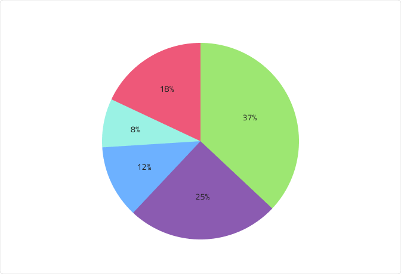

# Pie Chart (円チャート)
円チャートは円形のグラフィックで、スライスまたはセグメントに分割され、データ セットのカテゴリ (部分) がどのように合計 (全体) 値になるかを示します。各セクションまたは円スライスは、基本データ値に比例した弧の長さを持ちます。カテゴリは、分析されている合計値に対する値のパーセンテージ (100 または 100% の一部) に基づいて、他のカテゴリに比例して表示されます。円チャートは小さなデータ セットに適しており、読みやすく、一目で理解できます。Pie Chart は、[Ignite UI for Angular Pie Chart コンポーネント](https://jp.infragistics.com/products/ignite-ui-angular/angular/components/charts/types/pie-chart.html)と視覚的に同じものです。

## Pie Chart のデモ

Pie Chart は、個々のシリーズ (スライス) に分割された `Series` グループと、対応するシリーズを指す `Hairlines` (ヘアライン) 付きの `Labels` (ラベル) で構成されます。

## Series (シリーズ)

円チャート コンポーネントには、3、4、および 5 シリーズ数が用意されています。Figma では、プロパティ パネルの 「Series Amount」 プロパティを使用して 3 つを切り替えることができますが、Sketch ではこれは `Symbol Overrides` で実現されます。

## Hairlines (ヘアライン)

Pie Chart のラベルには、対応するヘアラインがあります。ラベルの位置は、Center、InsideEnd、OutsideEnd の 3 つから選択できます。Figma では、ネストされた Labels Position コンポーネントを選択し、プロパティ パネルから 「Position」 プロパティの値を変更するだけで位置を変更できますが、Sketch では `Symbol Overrides` で実現されます。また、Figma のプロパティ パネルからブール値プロパティ 「Hairlines」 をオフにすることで、OutsideEnd タイプのヘアラインを非表示にすることもできます。Sketch では、~No Symbol に設定することでこれを実現できます。

`Center`

`InsideEnd`

`OutsideEnd`

## スタイル設定 

まずはじめに、Pie Chart を使用すると、シリーズの色を変更できます。データ視覚化のパレットからニュアンス series.1、series.2 などから series.10 までの色のみを使用することをお勧めします。ヘアラインの色も変更できますが、対応するシリーズの色と一致する必要があります。ラベルは、**Indigo.Design システム**で利用可能なテキスト スタイルを介してカスタマイズすることもできます。

## 使用方法

Pie Chart を使用して、データ セットのカテゴリ (部分) がどのように合計 (全体) 値に構成されるかを視覚化します。データの混乱や誤解を避けるために、2 つ以上のカテゴリに同じ色を使用しないでください。また、Pie Chart を読みやすく理解しやすいものにするために、シリーズ数を 3 ～ 5 にすることをお勧めします。チャートの煩雑さを減らし、より大きく重要な値またはカテゴリに注目しやすくするには、「その他」 カテゴリ スライスまたはセグメントを使用して、小さい値をまとめた合計パーセンテージで表すことを検討してください。

| 良い例                                                                         | 悪い例                                                                         |
| -------------------------------------------------------------------------- | ------------------------------------------------------------------------------ |
|  |  |

## その他のリソース

関連トピック:

- [Line Chart](line-chart.md)
- [Spline Chart](spline-chart.md)
- [Step Chart](step-chart.md)
- [Column Chart](column-chart.md)
- [Skeleton Charts](skeleton-charts.md)
  

コミュニティに参加して新しいアイデアをご提案ください。
