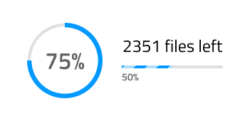
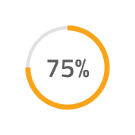

# Progress (プログレス)

Progress コンポーネントは、タスクの進行状況について明確に示し、長くかかるタスクの完了予測を示します。また、正確な完了時刻がわからないシナリオや、注文の履行やファイルのアップロード / ダウンロードなどの一連の小さなタスクの完了に応じて、より大きなワークフローがある場合にも非常に効果的です。Progress コンポーネントは、[Ignite UI for Angular Linear Progress コンポーネント](https://jp.infragistics.com/products/ignite-ui-angular/angular/components/linear_progress.html)および [Ignite UI for Angular Circular Progress コンポーネント](https://jp.infragistics.com/products/ignite-ui-angular/angular/components/circular_progress.html)と視覚的に同じものです。

## Progress デモ

## 形状とタイプ

Progress は、さまざまなユースケースとレイアウト要件に適合する 2 つのレイアウト形状をサポートしています: Circular Bar と Linear Bar。これらの各レイアウトには、進行のタイプの追加の選択が付属しています: 確定および不確定。

## 状態

Progress は、以下のプリセット カラーの組み合わせの 1 つを使用できます。

- **default**: デフォルトで基本原色を利用します。
- error: `error` テーマ カラーを使用して進行状況を表示
- info: `info` テーマ カラーを使用して進行状況を表示
- success: `success` テーマの色を使用して進行状況を表示します。
- warn: `warn` テーマの色を使用して進行状況を表示します。

## Progress の量

確定タイプの Progress を使用する場合、6 種類のパーセント値を Progress の量として選択できます。

## ストライプ

Progress コンポーネントに Linear Bar レイアウト形状を使用する場合、塗りつぶし領域のストライプの追加オプションが付属します。ストライプを削除するには、`🌈 Stripes` 色オーバーライドを `transparent` に設定するだけです。

## スタイル設定

Progress は、さまざまなオーバーライドでテキストおよび必要に応じて、プログレス、基本色、ストリップ、塗りつぶし、トラックの色を制御することにより柔軟にスタイル設定できます。

## 使用方法

Circular Bar は常にテキスト ラベルの実際の値を使用し、Linear Bar は一般的な文字列をユーザーに表示するのではなく、残りの時間とファイルに基づいてタスクの完了状況の正確な予測を提供します。ただし、両方のバーに不確定バリアントを使用して、確実で明確な完了時間を表示せずに Progress を表示することができます。

| 良い例                                                                             | 悪い例                                                                                 |
| ---------------------------------------------------------------------------------- | -------------------------------------------------------------------------------------- |
|  |  |
|  |  |
|  |  |

## その他のリソース

関連トピック:

- [AV Player パターン](../patterns/av.md)
  

コミュニティに参加して新しいアイデアをご提案ください。
