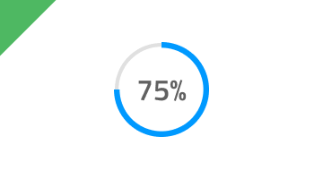

## Progress

Progress コンポーネント シンボルは、タスクの進行状況について明確に示し、長くかかるタスクの完了予測を示します。Progress コンポーネントは、大きなワークフローの完了がよりシンプルで小さい一連のタスクの完了に依存している場合に適しています。Progress は、[Ignite UI for Angular Linear Progress コンポーネント](https://jp.infragistics.com/products/ignite-ui-angular/angular/components/linear_progress.html)および [Ignite UI for Angular Circular Progress コンポーネント](https://jp.infragistics.com/products/ignite-ui-angular/angular/components/circular_progress.html)と視覚的に同じものです。

### Progress デモ


### タイプ

Progress は、さまざまなユースケースやレイアウト要件に対応するための 2 つのレイアウト タイプ (Circular Bar および Linear Bar) をサポートします。


### 状態

Progress は、以下のプリセット カラーの組み合わせの 1 つを使用できます。

- **default**
- success: `success` テーマ カラーを使用して進行状況を表示
- warn: `warn` テーマ カラーを使用して進行状況を表示
- error: `error` テーマ カラーを使用して進行状況を表示
- info: `info` テーマ カラーを使用して進行状況を表示


### スタイル設定

Progress は、さまざまなオーバーライドでテキスト、ストリップ、塗りつぶし、トラックの色を制御することにより柔軟にスタイル設定できます。


## 使用方法

Circular Bar は常にテキスト ラベルの実際の値を使用し、Linear Bar は一般的な文字列をユーザーに表示するのではなく、残りの時間とファイルに基づいてタスクの完了状況の正確な予測を提供します。

| いい例                              | 悪い例                             |
| ------------------------------- | --------------------------------- |
|  |  |
|  |  |

## コードの生成

Progress に色を指定した場合、Circular または Linear Bar 要素は div でラップされます。ブラウザーによってネスト コンポーネント (他のコンポーネント内のコンポーネント) のスタイル設定が要求されます。

> [!WARNING]
> デザインの Circular または Linear Bar のインスタンスで`シンボルからデタッチ`をトリガーすると、ほとんどの場合で Circular または Linear Bar のためのコード生成機能が失われる結果となります。

### データ プロパティ バインディング

提供された場合、`🕹️DataProperty` バインドはネストあり/なしが可能です。このプロパティ データは、Circular または Linear Bar の値をバインドします。進行状況の値は達成率を指定します。

プロパティがネストされたプロパティの場合、ネストされたプロパティ チェーンを含みますがモデル オブジェクト名は含みません。例:

#### 例: ネストなし

```PseudoCode
Customer {
imageName: String;
}

DataProperty: {imageName}
```

#### 例: ネストあり

```PseudoCode
Profile {
imageName: String;
}

Customer {
profile: Profile;
}

DataProperty: {profile.imageName}
```

### リニアバー テキスト スタイル

リニア バー テキスト スタイルは、Linear Bar の配置とテキスト色の制御に使用します。Text Style を 'None' に変更した場合、テキストは Linear Bar で非表示になります。ジェネレーターは Text Style の Bold オプションを無視しますが、デフォルト フォント ウェイトを使用する Linear Bar を描画します。

### リニアバー テキスト

リニア バー テキストは、バインディングと非バインディングを含むことができます。例:

#### 非バインディング

ダウンロードしています...

#### バインディング

ダウンロード進行状況: {progress}%

ネストあり/ネストなしのプロパティについて上記の Data Property Binding セクションと同様のルールが適用されます。

## その他のリソース

関連トピック:

- [AV Player Pattern](av-player.md)
  <div class="divider--half"></div>

コミュニティに参加して新しいアイデアをご提案ください。

- [Indigo Design **GitHub** (英語)](https://github.com/IgniteUI/design-system-docfx)
