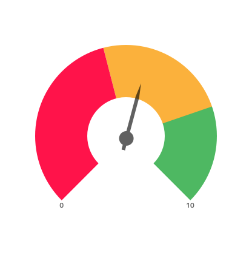
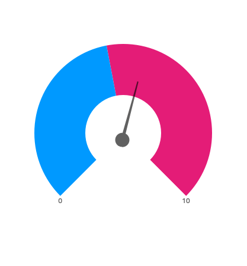
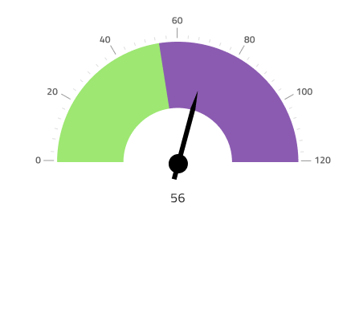
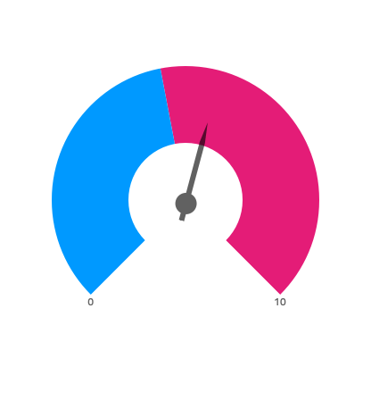
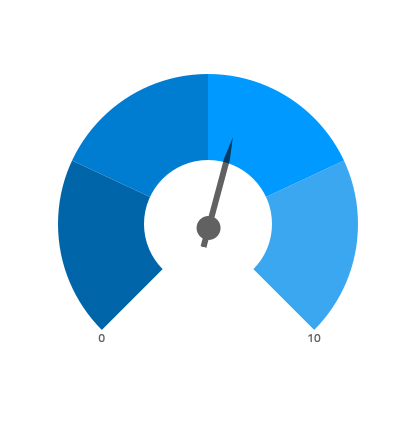
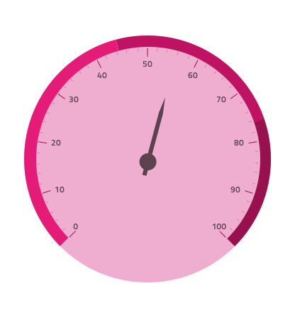
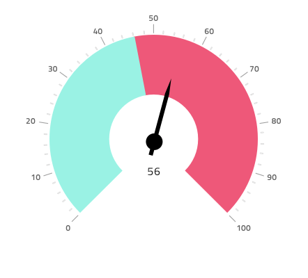
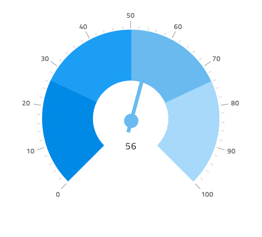
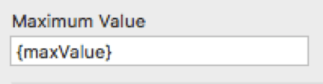
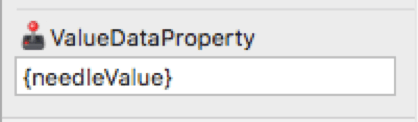

## Radial Gauge

Radial Gauge コンポーネントを円形のデータ可視化を使用し、カラーコードされた下部の範囲で描かれたコンテキスト内の値を表示します。Radial Gauge は、[Ignite UI for Angular ラジアルゲージ コンポーネント](https://jp.infragistics.com/products/ignite-ui-angular/angular/components/radialgauge.html)と視覚的に同じものです。

ターゲット値が情報の理解や解釈に非常に重要である場合、代わりに [Bullet Graph](bullet-graph.md) を使用します。

### ラジアル ゲージのデモ

### 針のタイプ

Radial Gauge は、現在の値を示す針の形 (**needle**、trapezoid、triangle) を制御するさまざまなオーバライドをサポートします。

### ダイアル タイプ

Radial Gauge は、範囲 (**full**、half、inside、outside) を表示するダイアルを制御するさまざまなオーバーライドをサポートします。

### 範囲のサイズ

Radial Gauge は、定義済みの 3 つの範囲 (2 つ、**3 つ**、4 つ) 設定があります。

### スタイル設定

Radial Gauge のスタイル設定は高い柔軟性があり、背景色の制御をオーバライドやブラシ範囲 (Needle Brush、Range Brushes、Tick Brush の範囲、Minor Tick Brush) があります。

## 使用方法

データ可視化や情報ダッシュボードの作成時では、スクリーンスペースの量に基づいて Linear と Radial Gauges のいずれかを選択します。Gauges は現在の値のみ表示し、過去の値を表示する方法はありません。アプリケーションでそのようなデータが必要な場合は[Category Chart](chart-category.md) を検討してください。
わかりやすく、鮮明なデータ可視化を簡単に作成するために Needle の色は範囲や背景と十分なコントラストのある色にし、読みにくい、解釈しずらい結果となる同じ色のバリアントは使用しないようにします。[Linear Gauge](linear-gauge) とは異なり、Radial Gauge コンポーネントは空スペースが十分あるため必要な情報を維持しながら Radial Gauges のコレクションを並べて配置できます。

| 良い例                                                                                       |悪い例                                                                                        |
| ---------------------------------------------------------------------------------------- | -------------------------------------------------------------------------------------------- |
| | |

## コードの生成

このセクションは、オーバーライドとコード生成にどのような影響があるかについて説明します。

> [!WARNING]
> デザインの Radial Gauge のインスタンスで `Detach from Symbol` をトリガーすると、ほとんどの場合で Radial Gauge のためのコード生成機能が失われる結果となります。

### 最小値

このオーバーライドは、Radial Gauge で最小値を制御します。[データ バインド](../codegen/data-binding.md)と直接的な数値の設定ををサポートします。バインドで bound プロパティを使用する場合、ランタイムの結果が数値になる必要があります。バインドを使用しない場合は値が数値である必要があります。値が正しい書式でない場合、最小値を設定せずに Radial Gauge を生成でき、コントロールのデフォルト値が使用されます。

バインディング

非バインディング

### 最大値

Radial Gauge で最大値の制御をオーバーライドします。[データ バインド](../codegen/data-binding.md)と直接的な数値の設定ををサポートします。バインドで bound プロパティを使用する場合、ランタイムの結果が数値になる必要があります。バインドを使用しない場合は値が数値である必要があります。指定した値が正しい書式でない場合、最大値を設定せずに Radial Gauge を生成し、コントロールのデフォルト値が使用されます。

バインディング

非バインディング

### 範囲のサイズ

このオーバーライドは、Radial Gauge で表示する範囲の数を制御します。コード生成で単一範囲を表す `<igx-radial-gauge-range>` 要素を作成します。この範囲要素には `startValue`、`endValue`、`brush` プロパティがあり、範囲の開始と終了位置および色を定義するために使用されます。これらは Minimum Value や Maximum Value オーバライドの設定に関係なくすべて自動生成され、Sketch で表示されていた外観を常に再現できます。

範囲で開始値と終了値を自動生成しないことをお勧めしますが、自動生成した場合は生成した HTML の範囲を手動で更新する必要があります。

### ValueDataProperty

このオーバーライドは、Radial Gauge で表示する針の値の制御します。[データ バインディング](../codegen/data-binding.md) のみサポートするため、値は正しい書式にする必要があります。

バインド プロパティはランタイムの結果が数値である必要があります。

## その他のリソース

関連トピック:

- [Bullet Graph](bullet-graph.md)
- [Category Chart](chart-category.md)
- [Linear Gauge](linear-gauge.md)
- [Data Binding](../codegen/data-binding.md)
  

コミュニティに参加して新しいアイデアをご提案ください。

- [Indigo Design **GitHub** (英語)](https://github.com/IgniteUI/design-system-docfx)
