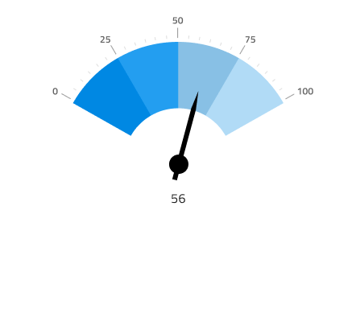
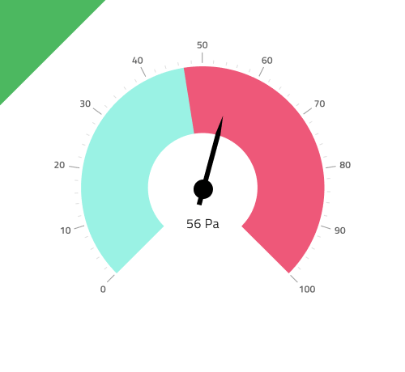

# Radial Gauge (ラジアル ゲージ)

Radial Gauge コンポーネントを円形のデータ可視化を使用し、カラーコードされた下部の範囲で描かれたコンテキスト内の値を表示します。Radial Gauge は、[Ignite UI for Angular Radial Gauge コンポーネント](https://jp.infragistics.com/products/ignite-ui-angular/angular/components/radial-gauge.html)と視覚的に同じものです。

ターゲット値が情報の理解や解釈に非常に重要である場合、代わりに [Bullet Graph](bullet-graph.md) を使用します。

## Radial Gauge のデモ

## 針のタイプ

Radial Gauge は、現在の値を示す針の形 (Needle、Trapezoid、Triangle) を制御するさまざまなオーバライドをサポートします。In Figma, you can switch between the type by selecting the `Needle Shape` instance and then choosing the type from the right sidebar. Sketch では、これを `Symbol Overrides` で実現していますが、Adobe XD では `Component States` パラダイムを使用して簡単にタイプを切り替えることができます。

## 目盛のタイプ

Radial Gauge の目盛りは外側または内側に配置でき、Thick 範囲と Thin 範囲の領域に 2 つの内側の種類があります。In Figma you can select the `Ranges` and the `Ticks` from the provided properties in the right sidebar. Sketch では、これを `Symbol Overrides` で実現していますが、Adobe XD では `Component States` パラダイムを使用して簡単にタイプを切り替えることができます。

## 範囲

Radial Gauge は、範囲 (Full、Half、および Quarter) を表示するダイアルを制御するさまざまなオーバーライドを提供します。In Figma select the `Range` property to be the same for Ranges and Ticks from the right sidebar. Sketch では、範囲を切り替えるには `Symbol Overrides` を使用する必要がありますが、Adobe XD では、上記のオプション用に Radial Gauge の個別のバリアントがあります。

## Series Thickness (シリーズの厚さ)

Radial Gauge には、**Thick** と Thin の 2 種類の Series Thickness があります。In Figma use the right sidebar properties and select between the two Series Thickness options. Sketch では、シリーズの厚さを切り替えるには `Symbol Overrides` を使用する必要がありますが、Adobe XD では、上記のオプション用に Radial Gauge の個別のバリアントがあります

## 範囲のサイズ

Radial Gauge は、定義済みの 3 つの範囲 (**2 つ**、3 つ、4 つ) 設定があります。In Figma you can change the series amount from the Ranges Amount property in the right sidebar. Sketch では、これを `Symbol Overrides` で実現していますが、Adobe XD では `Component States` パラダイムを使用して簡単に範囲のサイズを切り替えることができます。

## スタイル設定

Radial Gauge のスタイル設定は高い柔軟性があり、背景色のオプションやブラシの選択 (Needle Brush、Range Brushes、および内側と外側のダイヤル タイプでのみ使用できる Tick Brush、Minor Tick Brush) があります。

## 使用方法

データ可視化や情報ダッシュボードの作成時では、スクリーン スペースの量に基づいて Linear と Radial Gauges のいずれかを選択します。Gauges は現在の値のみ表示し、過去の値を表示する方法はありません。アプリケーションでそのようなデータが必要な場合は Line または Column Chart を検討してください。
わかりやすく、鮮明なデータ可視化を簡単に作成するために Needle の色は範囲や背景と十分なコントラストのある色にし、読みにくい、解釈しずらい結果となる同じ色のバリアントは使用しないようにします。[Linear Gauge](linear-gauge.md) とは異なり、Radial Gauge コンポーネントは空スペースが十分あるため必要な情報を維持しながら Radial Gauges のコレクションを並べて配置できます。

| 良い例                                                                                 | 悪い例                                                                                  |
| ---------------------------------------------------------------------------------- | -------------------------------------------------------------------------------------- |
|  |  |

## その他のリソース

関連トピック:

- [Bullet Graph](bullet-graph.md)
- [Linear Gauge](linear-gauge.md)
- [Line Chart](line-chart.md)
- [Column Chart](column-chart.md)

コミュニティに参加して新しいアイデアをご提案ください。
