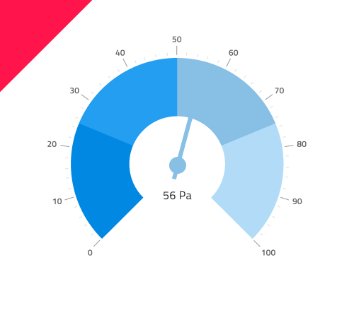

# Radial Gauge (ラジアル ゲージ)

Radial Gauge コンポーネントを円形のデータ可視化を使用し、カラーコードされた下部の範囲で描かれたコンテキスト内の値を表示します。Radial Gauge は、[Ignite UI for Angular Radial Gauge コンポーネント](https://jp.infragistics.com/products/ignite-ui-angular/angular/components/radial-gauge.html)と視覚的に同じものです。

ターゲット値が情報の理解や解釈に非常に重要である場合、代わりに [Bullet Graph](bullet-graph.md) を使用します。

## ラジアル ゲージのデモ

## 針のタイプ

Radial Gauge は、現在の値を示す針の形 (**needle**、trapezoid、triangle) を制御するさまざまなオーバライドをサポートします。

## Ticks Type

The ticks of the Radial Gauge can be placed **outside** or inside, with two inside variants for thick and thin range areas.

## Ranges

The Radial Gauge provides various overrides that control the ranges on the dial: **full**, half, and quarter.

## Series Thickness

The Radial Gauge comes with two kinds of Series Thickness: **Thick** and Thin.

## 範囲のサイズ

Radial Gauge は、定義済みの 3 つの範囲 (**2 つ**、3 つ、4 つ) 設定があります。

## スタイル設定

Radial Gauge のスタイル設定は高い柔軟性があり、背景色の制御をオーバライドやブラシの選択 (Needle Brush、Range Brushes、および内側と外側のダイヤル タイプでのみ使用できる Tick Brush、Minor Tick Brush) があります。

## 使用方法

データ可視化や情報ダッシュボードの作成時では、スクリーンスペースの量に基づいて Linear と Radial Gauges のいずれかを選択します。Gauges は現在の値のみ表示し、過去の値を表示する方法はありません。アプリケーションでそのようなデータが必要な場合は Line or Column Chart を検討してください。
わかりやすく、鮮明なデータ可視化を簡単に作成するために Needle の色は範囲や背景と十分なコントラストのある色にし、読みにくい、解釈しずらい結果となる同じ色のバリアントは使用しないようにします。[Linear Gauge](linear-gauge.md) とは異なり、Radial Gauge コンポーネントは空スペースが十分あるため必要な情報を維持しながら Radial Gauges のコレクションを並べて配置できます。

| 良い例                                                                                 | 悪い例                                                                                  |
| ---------------------------------------------------------------------------------- | -------------------------------------------------------------------------------------- |
|  |  |

## その他のリソース

関連トピック:

- [Bullet Graph](bullet-graph.md)
- [Line Chart](line-chart.md)
- [Column Chart](column-chart.md)
- [Linear Gauge](linear-gauge.md)

コミュニティに参加して新しいアイデアをご提案ください。
