---
title: Radio Group -  デザイン システム コンポーネント
_description: Radio Group コンポーネント シンボルは、一連のオプションで排他的な選択のメカニズムを提供します。
_keywords: デザイン システム, デザイン システム UX, UI キット, Sketch, Ignite UI for Angular, Sketch to Angular, Angular, Angular デザイン システム, Sketch からコードをエクスポート, Angular 用のデザイン キット, Sketch HTML, Sketch to HTML, Sketch UI キット
_language: ja
---

# Radio Group (ラジオ グループ)

Radio Group コンポーネント シンボルは、グループ項目で排他的な選択をサポートします。グループ内の項目は、1 つの列に次々に配置されます。Radio Group は、[Ignite UI for Angular Radio Button コンポーネント](https://jp.infragistics.com/products/ignite-ui-angular/angular/components/radio_button.html)と視覚的に同じものです。

## Radio Group のデモ

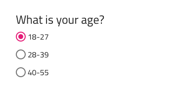

## 操作状態

Radio Group は、有効または無効の状態で挿入できます。

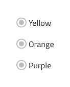

グループ内のラジオ ボタンの状態を無効に設定して、ユーザーによる操作を禁止することもできます。

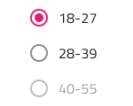

## テーマ

Radio Group は、明暗バリアントでわかりやすく、背景に明暗のコントラストを付けてスタイル設定できます。すべての Radios を同じテーマに設定してださい。

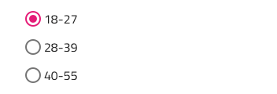
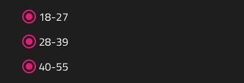

## レイアウト テンプレート

Radio Group は、Radio button 要素の前後に Radio button ラベルが配置されるラベル位置をサポートします。

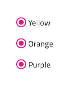
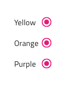

## 状態

グループ内の各ラジオ要素は、**オン**およびオフの選択状態をサポートします。

## スタイル設定

Radio Group は、さまざまなオーバーライドで各項目のラベル スタイルや色を制御することにより柔軟にスタイル設定できます。

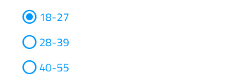

## 使用方法

追加の項目で Radio Group を拡張するときは、それらが一貫して整列され、単一の列を形成していることを確認してください。複数の列でのレイアウトや、一度に複数の Radio 要素がオン状態になる状況は避けてください。

| 良い例                                | 悪い例                               |
| --------------------------------- | ----------------------------------- |
| 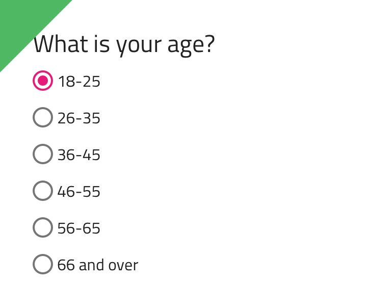 | 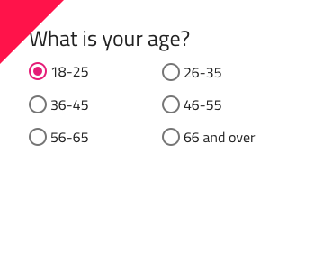 |
| 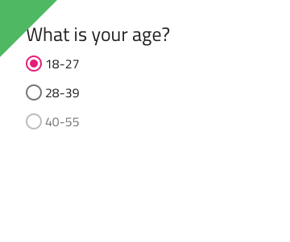 | 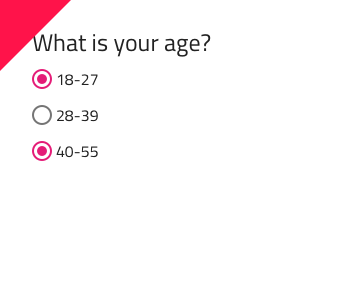 |

コミュニティに参加して新しいアイデアをご提案ください。
