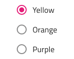
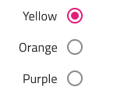
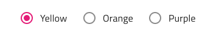
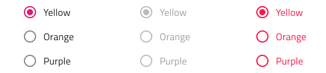
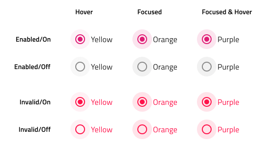

---
title: Radio Group -  デザイン システム コンポーネント
_description: Radio Group コンポーネント シンボルは、一連のオプションで排他的な選択のメカニズムを提供します。
_keywords: デザイン システム, デザイン システム UX, UI キット, Figma, Figma to Angular, Figma からコードをエクスポート, Figma to HTML, Figma HTML, Figma UI キット, Ignite UI for Angular, Angular, Angular デザイン システム, Angular 用のデザイン キット
_language: ja
---

# Radio Group (ラジオ グループ)

Radio Group コンポーネント シンボルは、グループ項目で排他的な選択をサポートします。グループ内の項目は、1 つの列に次々に配置されます。Radio Group は、[Ignite UI for Angular Radio Button コンポーネント](https://jp.infragistics.com/products/ignite-ui-angular/angular/components/radio_button.html)と視覚的に同じものです。

## Radio Group のデモ

## ラベル位置

Figma で Radio Group は、Radio button 要素の前後に Radio button ラベルが配置されるラベル位置のバリアントをサポートします。

          

## 方向

Radio Group には Vertical および Horizontal 方向があります。

          

## 操作状態

Radio Group は、**Enabled (有効)**、**Disabled (無効)**、および **Invalid (無効状態)** のインタラクション状態をサポートします。

          

グループ内のラジオ ボタンの状態を **Disabled** に設定して、ユーザーによる操作を禁止することもできます。

 

**Enabled** および **Invalid** のインタラクション状態では、各ラジオ要素は **Hover (ホバー)**、**Focused (フォーカス済み)**、および **Focused & Hover (フォーカス済みおよびホバー)** の状態もサポートします。

## 状態

グループ内の各ラジオ要素は、**オン**および**オフ**の選択状態をサポートします。Figma では、右側のサイドバーの `Checked` ブール値プロパティから状態を切り替えることができます。

## スタイル設定

Radio Group には、各項目のラベル スタイルと色のさまざまなオプションによるスタイリングの柔軟性があります。

## 使用方法

追加の項目で Radio Group を拡張するときは、それらが一貫して整列され、単一の列を形成していることを確認してください。複数の列でのレイアウトや、一度に複数の Radio 要素がオン状態になる状況は避けてください。

| 良い例                                                                                     | 悪い例                                                                                      |
| -------------------------------------------------------------------------------------- | ------------------------------------------------------------------------------------------ |
|  |  |
|  |  |

コミュニティに参加して新しいアイデアをご提案ください。
