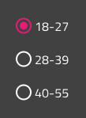
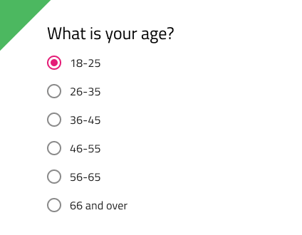
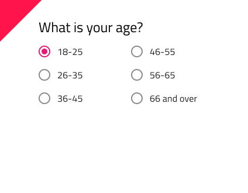

## Radio Group

Radio Group コンポーネント シンボルは、グループ項目で排他的な選択をサポートします。グループの項目は、左揃えで単一列に次々にレイアウトされます。Radio Group は、[Ignite UI for Angular Radio Button コンポーネント](https://jp.infragistics.com/products/ignite-ui-angular/angular/components/radio_button.html)と視覚的に同じものです。

### Radio Group デモ

### テーマ

Radio Group は、明暗バリアントでわかりやすく、背景に明暗のコントラストを付けてスタイル設定できます。すべての Radios を同じテーマに設定してださい。

### 状態

グループの各 Radio は、**オン**とオフ、そして追加のバリアントとしてインタラクション無効の状態があります。

### スタイル設定

Radio Group は、さまざまなオーバーライドで各項目のラベル スタイルや色を制御することにより柔軟にスタイル設定できます。

## 使用方法

Radio Group を追加項目で拡張する場合は、単一列で左寄せに統一してください。複数列のレイアウトや Radio を一度に 1 つ以上オンにしないようにします。

| いい例                                | 悪い例                               |
| --------------------------------- | ----------------------------------- |
|  |  |
|  |  |

## その他のリソース

関連トピック:

コミュニティに参加して新しいアイデアをご提案ください。

- [Indigo Design **GitHub** (英語)](https://github.com/IgniteUI/design-system-docfx)
