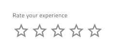
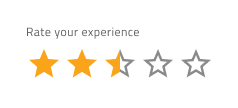
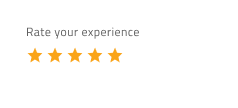
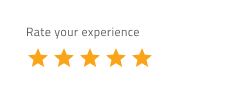
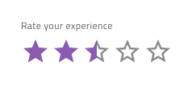
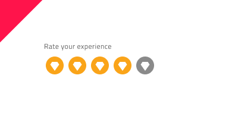

# Rating (レーティング)

Rating コンポーネントを使用すると、ユーザーは製品、サービス、ページ、その他のエンティティなどの項目またはエクスペリエンスに評価を適用できます。Rating には、単一ユーザーまたは集計されたスター レーティングを表示でき、ユーザーが独自のスター レーティングを設定できるようにするために使用されます。Rating は、[Ignite UI for Angular Rating コンポーネント](https://jp.infragistics.com/products/ignite-ui-angular/angular/components/rating)と視覚的に同じものです。

## Rating のデモ

## Figma での Rating の使用

Rating はラベルと値から構築されます。値はレーティングのスケールの数値です。ラベルはブール値プロパティを使用してオン/オフを切り替えることができます。レーティングのスケール内のアイコンの数は合計 5 つ星に事前定義されていますが、より多くのレーティングのアイコンを含む Rating をデザインする必要がある場合、最も簡単な方法は、コンポーネントをワークスペースに挿入することです。その後、コンポーネントを右クリックするとコンテキスト メニューが開き、`Detach instance` が選択され、次のデタッチされたレイヤー構造が表示されます。

| レイヤー                        | 使用                                                                                                                                                  |
| ---------------------------- | ---------------------------------------------------------------------------------------------------------------------------------------------------- |
| 🚫 componentVersion &nbsp; | 禁止されたアイコンで開始する特定のロックされたレイヤー。このレイヤーはコード生成に必要なため、削除または変更しないでください。 |
| 🚫 metadata         | 禁止されたアイコンで開始する特定のロックされたレイヤー。このレイヤーはコード生成に必要なため、削除または変更しないでください。 |
| Label              | 不要な場合は変更または非表示にできるテキスト レイヤー。                                                                                                              |
| Value              | すべてのレーティング アイコンが含まれています。                                                                                                                 |

デタッチした後、`Value` フレームにネストされている既存のレーティング アイコンのいずれかを複製することでレーティング アイコンの数を増やすことができ、自動レイアウトのおかげでサイズが調整されます。

レーティング アイコンの数を減らすために、コンポーネントをデタッチする必要はありません。[レイヤー] パネルから不要なアイコンを非表示にすることができます。

## Sketch での Rating の使用

Sketch の Rating コンポーネントは、ラベルと値セクションを含む Figma とほぼ同じ構築要素を共有し、デフォルトで 5 つのレーティング アイコンが付属しています。さらに多くのレーティング アイコンが必要な場合は、コンポーネントを右クリックし、コンテキスト メニューから `Detach from Symbol` を選択して、コンポーネントをデタッチする必要があります。デタッチすると、次のレイヤーが表示されます:

| レイヤー                        | 使用                                                                                                                                                  |
| ---------------------------- | ---------------------------------------------------------------------------------------------------------------------------------------------------- |
| 🚫 metadata        | 禁止されたアイコンで開始する特定のロックされたレイヤー。このレイヤーはコード生成に必要なため、削除または変更しないでください。  |
| Label              | 不要な場合は変更または非表示にできるテキスト レイヤー。                                                                                                                                                      |
| Value              | すべてのレーティング アイコンが含まれています。                                                                                                                         |

レーティング アイコンの数を増減するには、`Value` シンボルの上で `Detach from Symbol` オプションを再度使用し、既存のレーティング アイコンのいずれかを複製または削除することで、アイコンの希望の数を達成できます。

## Adobe XD での Rating の使用

> [!NOTE]
> WIP: 現在、Adobe XD では Rating コンポーネントはサポートされていません。

## 操作状態

Figma では、挿入時にRating コンポーネントがデフォルトで常に有効になります。プロパティ パネルから無効にできますが、Sketch では、Rating を有効または無効の状態で挿入できます。

## 状態

Rating コンポーネントには `Empty State` (空の状態) があり、Figma のブール値プロパティからオンとオフを切り替えることができます。さらに、Figma には、`Empty State` とは逆の `Value` プロパティがあり、0 ～ 5 の事前定義されたオプションから Value の達成を選択できます (星半分もサポート)。Sketch では、~Symbol Overrides を使用してこれを簡単に実現できます。

## サイズ

Rating には、小、中、大の 3 つのサイズがあります。

## スタイル設定

Rating には、値アイコンの色とタイプ、およびラベルのテキストの色の変更に使用できるオプションを通じて、スタイルを柔軟に設定できます。ただし、テキストの読みやすさを最適化するために、テーマの明度に基づいて、事前定義された色とアイコン タイプを使用することをお勧めします。

## 使用方法

星は非常に認識しやすいランキングのシンボルであり、人々は他のシンボルをレーティング　スケールと関連付けないかもしれません。星をカスタム シンボルに置き換える場合は、その目的が明確であることを確認してください。同色の似た色合いや色収差を生じる組み合わせなど、コントラストの低い色は避けるようにします。アイコンの選択は強調され、視覚的に明確な外観を持つ必要があります。

| 良い例                                                                           | 悪い例                                                                            |
| ---------------------------------------------------------------------------- | -------------------------------------------------------------------------------- |
|  |  |
|  |  |

コミュニティに参加して新しいアイデアをご提案ください。
