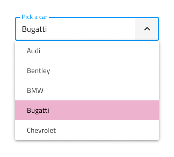
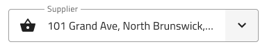

# Select (選択)

Select コンポーネントを使用して、ユーザーがドロップダウンに配置された項目のスクロール可能なリストから 1 つのオプションを選択できるようにします。Select は、ユーザーがデータを送信するための入力の一種です。シナリオで複数の項目を選択する必要がある場合は、代わりに [Combo](combo.md) を使用する必要があります。Select は、[Ignite UI for Angular Select コンポーネント](https://jp.infragistics.com/products/ignite-ui-angular/angular/components/select.html)と視覚的に同じものです。

## Select のデモ

Select は、現在の選択を含む入力と、項目を選択できるように表示されるドロップダウンを組み合わせて作成されます。

## Input タイプ

[Input](input.md) コンポーネントのように Select は border タイプ (単色背景でよりはっきりと表示)、より読みやすくするために鮮明な画像の上に配置する際に最適な box タイプから選択が可能です。

| Border | Box |
| ------- | ------- |
|  |  |

## サイズ

Select コンポーネントには、次の 3 つのサイズがあります。

- Large 
- Medium 
- Small

Dropdown は選択されたサイズ バリアントに合わせて自動的に寸法が調整されます。

## インタラクション状態

Figma では、プロパティ パネルを使用して、border と box タイプの Select Input の両方を Disabled (無効) 状態に設定できます。

## 状態

Select コンポーネントは Enabled バリアントに対して 5 つの状態 (**Idle**、**Idle & Hover**、**Filled**、**Filled & Hover**、**Focused**) と、3 つのバリデーション状態 (**Success**、**Warn**、**Error**) をサポートします。プロパティ パネルから Select の状態変更や Dropdown の表示切り替えが容易に行え、ネストされた Dropdown コンポーネントではコンテンツのさらに細かな調整が可能です。柔軟性が向上したことにより、Hi-Fi プロトタイプへシームレスにフローする動的なインタラクション デザインの作成が可能です。

 

経験豊富なデザイナーは、ユーザー入力を制限して無効な状態を防止するために、検証スタイルを使用します。Select の検証スタイルには統一感のある標準 [Input](input.md) があり、success (成功)、warning (警告)、error (エラー) を表示する洗練されたデザインを提供します。

 

Figma では、プロパティ パネルの `State` プロパティを使用して、すべての状態を切り替えることができます。

## Layout (レイアウト)

Select では、テキストとアイコンの組み合わせによるプレフィックスとサフィックスが豊富にサポートされています。Figma では、Prefix または Suffix を削除するには、プロパティ パネルでオンまたはオフに切り替えます。

| Prefix | Suffix | Prefix and Suffix |
| ------- | ------- | ------- |
|  |  |   |

## Dropdown (ドロップダウン)

Select は、利用可能なオプションを表示するために、その構造内で Dropdown コンポーネントを利用します。利用可能な構成の詳細については、[Dropdown](dropdown.md) ページをご覧ください。

## スタイル設定

Select は入力とドロップダウン項目でスタイルの組み合わせに柔軟性があります。テキストと入力に対してさまざまなスタイルと色を試すことができます。ドロップダウン項目の場合、背景とテキストの色を変更できます。

## 使用方法

Select を使用する際に入力とドロップダウンは同じ幅で左右の境界線が一致する必要があります。Select がフォーカスされている場合、ユーザーには現在の選択内容が常に通知される必要があるため、ドロップダウンは入力の上または下に表示されますが、入力の上には決して表示されません。リストから項目を選択すると、ドロップダウンが非表示になります。一方、ドロップダウンは、Select 入力と同じ面にある他のコンテンツの上に配置する必要があります。Select は、展開パネルのようにコンテンツをプッシュしません。

| 良い例                                                                           | 悪い例                                                                            |
| ---------------------------------------------------------------------------- | -------------------------------------------------------------------------------- |
|  |  |
|  |  |

## その他のリソース

関連トピック:

- [Combo](combo.md)
- [Dropdown](dropdown.md)
- [Input](input.md)
- [Form パターン](../patterns/form.md)
  

コミュニティに参加して新しいアイデアをご提案ください。
