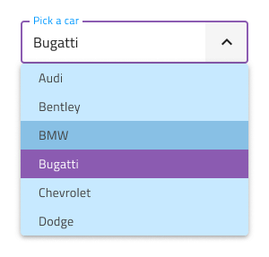

# Select (選択)

Select コンポーネントを使用して、ユーザーがドロップダウンに配置された項目のスクロール可能なリストから 1 つのオプションを選択できるようにします。Select は、ユーザーがデータを送信するための入力の一種です。シナリオで複数の項目を選択する必要がある場合は、代わりに [Combo](combo.md) を使用する必要があります。Select は、[Ignite UI for Angular Select コンポーネント](https://jp.infragistics.com/products/ignite-ui-angular/angular/components/select.html)と視覚的に同じものです。

## Select のデモ

Select は、現在の選択を含む入力と、項目を選択できるように表示されるドロップダウンを組み合わせて作成されます。

## Input タイプ

[Input](input.md) コンポーネントのように Select は線タイプ (エアリー スタイル)、境界線タイプ (単色背景でよりはっきりと表示)、より読みやすくするために鮮明な画像の上に配置する際に最適なボックス タイプから選択が可能です。

`line`

`border`

`box`

## 操作状態

3 つの Select 入力タイプはそれぞれ、有効または無効の状態で挿入できます。

## 状態

ユーザーが Select を操作すると、その入力はさまざまな選択状態になります。コンテンツの代わりにプレースホルダーを使用して **idle** 状態になり、ドロップダウンが開いているときの focused 状態、ユーザーが選択を終了して次に進むときの filled 状態です。柔軟性が向上したことにより、Hi-Fi プロトタイプへシームレスにフローする動的なインタラクション デザインの作成が可能です。

`idle`

`focused`

`filled`

経験豊富なデザイナーは、ユーザー入力を制限して無効な状態を防止するために、検証スタイルを使用します。Select の検証スタイルには統一感のある標準 [Input](input.md) があり、success (成功)、warning (警告)、error (エラー) を表示する洗練されたデザインを提供します。

`success`

`warning`

`error`

Sketch では状態と検証状態を `Symbol Overrides` で実現していますが、Adobe XD では `Component States` パラダイムを使用して簡単に状態を切り替えることができます。

> [!NOTE]
> Select 入力はレイアウ トオプションが 1 つしかありませんが、このオーバーライドは、標準 [Input](input.md) との一貫性を確保するために Sketch で保持されています。

## Dropdown Items (ドロップダウン項目)

Select に使用されるドロップダウン項目は、単一の選択タイプのみをサポートします。

## Dropdown Item の状態

Select 内の Dropdown Item は、5 つの状態をサポートします: disabled、**idle**、focused、selected、focused&selected。Sketch では、これを `Symbol Overrides` で実現していますが、Adobe XD では `Component States` パラダイムを使用して簡単に状態を切り替えることができます。

`disabled`

`idle`

`focused`

`selected`

`selected&focused`

## スタイル設定

Select は入力とドロップダウン項目でスタイルの組み合わせに柔軟性があります。入力テキスト要素の色と最終的な行のスタイルと色にはオプションがあります。ドロップダウン項目の場合、背景とテキストの色を変更できます。

## 使用方法

Select を使用する際に入力とドロップダウンは同じ幅で左右の境界線が一致する必要があります。Select がフォーカスされている場合、ドロップダウンは入力の上に表示され、リストから項目が選択されるまで非表示になります。ドロップダウンは、選択入力と同じ表面にある他のコンテンツの上に常に表示する必要があります。Select は、展開パネルのようにコンテンツをプッシュしません。

| 良い例                                                                           | 悪い例                                                                            |
| ---------------------------------------------------------------------------- | -------------------------------------------------------------------------------- |
|  |  |
|  |  |

## その他のリソース

関連トピック:

- [Combo](combo.md)
- [Input](input.md)
- [Form パターン](../patterns/form.md)
  

コミュニティに参加して新しいアイデアをご提案ください。
