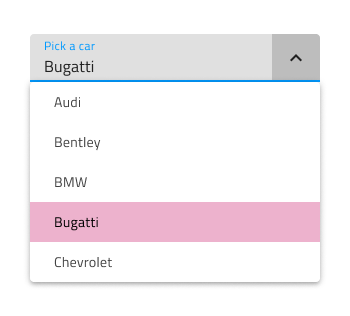
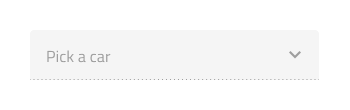
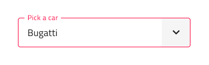
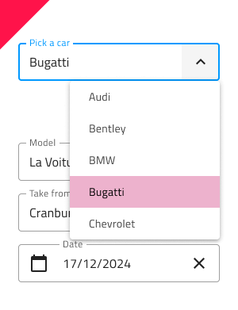
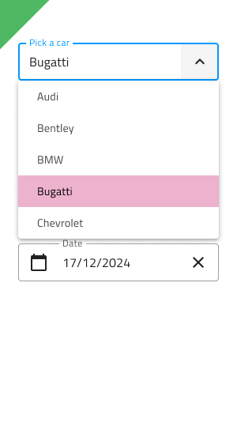

# Select (選択)

Select コンポーネントを使用して、ユーザーがドロップダウンに配置された項目のスクロール可能なリストから 1 つのオプションを選択できるようにします。Select は、ユーザーがデータを送信するための入力の一種です。シナリオで複数の項目を選択する必要がある場合は、代わりに [Combo](combo.md) を使用する必要があります。Select は、[Ignite UI for Angular Select コンポーネント](https://jp.infragistics.com/products/ignite-ui-angular/angular/components/select.html)と視覚的に同じものです。

## Select のデモ

Select は、現在の選択を含む入力と、項目を選択できるように表示されるドロップダウンを組み合わせて作成されます。

## Input タイプ

[Input](input.md) コンポーネントのように Select は line タイプ (エアリー スタイル)、border タイプ (単色背景でよりはっきりと表示)、より読みやすくするために鮮明な画像の上に配置する際に最適な box タイプから選択が可能です。Line スタイルは非推奨であるため、Figma では border と box のタイプのみを使用できます。

`border`

`box`

## 操作状態

Sketch と Adobe XD では、3 つの Select 入力タイプはそれぞれ、有効または無効の状態で挿入できます。Line スタイルは非推奨であるため、Figma では border と box のタイプのみを使用でき、プロパティ パネルから無効状態に切り替えることができます。

`enabled state`

`disabled state`

## 状態

ユーザーが Select を操作すると、その入力はさまざまな選択状態を経ます。**Idle (アイドル)** ー コンテンツの代わりにプレースホルダーがあります; ドロップダウンが開いているときの **Focused (フォーカス済み**; ユーザーが選択を終了して次に進むときの **Filled (塗りつぶし済み)** です。柔軟性が向上したことにより、Hi-Fi プロトタイプへシームレスにフローする動的なインタラクション デザインの作成が可能です。

`idle`

`filled`

`focused`

経験豊富なデザイナーは、ユーザー入力を制限して無効な状態を防止するために、検証スタイルを使用します。Select の検証スタイルには統一感のある標準 [Input](input.md) があり、success (成功)、warning (警告)、error (エラー) を表示する洗練されたデザインを提供します。

`success`

`warn`

`error`

Sketch では状態と検証状態を `Symbol Overrides` で実現していますが、Adobe XD では `Component States` パラダイムを使用して簡単に状態を切り替えることができます。Figma では、プロパティ パネルから `State` プロパティを使用して切り替えることができます。

> [!NOTE]
> Select 入力はレイアウ トオプションが 1 つしかありませんが、このオーバーライドは、標準 [Input](input.md) との一貫性を確保するために Sketch で保持されています。一方、Figma では、Select コンポーネントで明示的に使用される `.Select Input` と呼ばれる別の基本コンポーネントがあります。

## Layout (レイアウト)

Select では、テキストとアイコンの組み合わせによるプレフィックスとサフィックスが豊富にサポートされています。Figma では、Prefix または Suffix を削除するには、プロパティ パネルでオンまたはオフに切り替えます。Sketch で Prefix または Suffix を削除するには、オーバーライドを ~No Symbol に設定するだけで、スマート レイアウト ルールがそれに応じて Select を調整します。Adobe XD では、Prefix および/または Suffix レイヤーの表示をオンまたはオフに切り替えることで同じことを実現でき、Stack はそれに応じてレイアウトを調整します。

## Drop Down Items (ドロップダウン項目)

Select に使用されるドロップダウンは、ヘッダーと単一選択種類の 2 種類の項目をサポートします。ヘッダーを介して、項目をグループに体系化できます。Figma では、Drop Down コンポーネントは自動レイアウト オプションを利用しており、1 つ以上の項目を非表示または追加すると、すべての項目が適切に配置されます。Sketch では、Drop Down は、Smart Layout を使用しており、1 つ以上の項目が ~No Symbol に設定されていても、それに対応して調整できます。Adobe XD では、不要なものを削除し、Stack を使用してレイアウトを調整します。

## Drop Down Item の状態

Select 内のドロップダウン項目は、5 つの状態をサポートします: Disabled (無効)、**Idle (アイドル)**、Focused (フォーカス済み)、Selected (選択済み)、および Selected & Focused (選択済みおよびフォーカス済み)。Sketch ではこれを `Symbol Overrides` で実現していますが、Adobe XD では `Component States` パラダイムを使用して簡単に状態を切り替えることができます。Figma では、追加の状態が追加され、合計 6 つの状態になりました: **Selected & Disabled (選択済みおよび無効)**。

`idle`

`disabled`

`selected`

`selected & disabled`

`selected & focused`

`focused`

## スタイル設定

Select は入力とドロップダウン項目でスタイルの組み合わせに柔軟性があります。入力テキスト要素の色と最終的な行のスタイルと色にはオプションがあります。ドロップダウン項目の場合、背景とテキストの色を変更できます。

## 使用方法

Select を使用する際に入力とドロップダウンは同じ幅で左右の境界線が一致する必要があります。Select がフォーカスされている場合、ユーザーには現在の選択内容が常に通知される必要があるため、ドロップダウンは入力の上または下に表示されますが、入力の上には決して表示されません。リストから項目を選択すると、ドロップダウンが非表示になります。一方、ドロップダウンは、Select 入力と同じ面にある他のコンテンツの上に配置する必要があります。Select は、展開パネルのようにコンテンツをプッシュしません。

| 良い例                                                                           | 悪い例                                                                            |
| ---------------------------------------------------------------------------- | -------------------------------------------------------------------------------- |
|  |  |
|  |  |

## その他のリソース

関連トピック:

- [Combo](combo.md)
- [Input](input.md)
- [Form パターン](../patterns/form.md)
  

コミュニティに参加して新しいアイデアをご提案ください。
