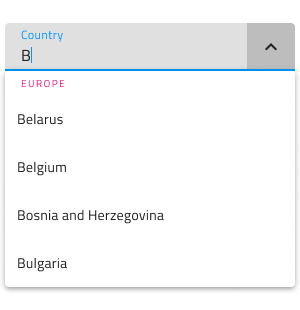
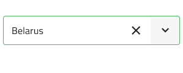
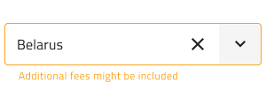
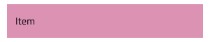

# Simple Combo (シンプルなコンボ)

Simple Combo コンポーネントを使用して、事前定義された選択肢のリストからオプションを選択したり、独自の値を入力したりすることができます。ユーザーは Combo Input に値を入力して検索するか、ドロップダウン矢印をクリックして表示されたリストからオプションを選択できます。Combo は、[Ignite UI for Angular Single Select ComboBox コンポーネント](https://jp.infragistics.com/products/ignite-ui-angular/angular/components/simple-combo.html)と視覚的に同じものです。

> [!Note]
> Combo には 2 つのレイアウト オプションがあります: 単一選択の Combo `(Simple Combo)` と [Combo (複数選択)](combo.md)。

## Simple Combo のデモ

Simple Combo には、現在の選択内容を含む入力と、事前定義されたドロップダウン リストからオプションを選択するために表示されるドロップダウンの 2 つの部分があります。

## Combo Input タイプ

Figma の Simple Combo Input には border (境界線) タイプ (単色背景でよりはっきりと表示)、より読みやすくするために鮮明な画像の上に配置する際に最適な box (ボックス) タイプから選択が可能です。

| Border | Box |
| ------- | ------- |
|  |  |

Simple Combo Input には Prefix コンテナーがあり、`Prefix Container` ブール値プロパティで**オン・オフ**を切り替えられます。Label と Hint も同様にブール値プロパティで**オン・オフ**できます。

| Prefix 付き | Label 付き | Hint 付き | 
| ------- | ------- | ------- |
|  |  |  |
|  |  |  |

## サイズ

Simple Combo には 3 つのサイズがあります。

- Large (大)
- Medium (中)
- Small (小)

Dropdown は選択されたサイズ バリアントに合わせて自動的に寸法が調整されます。

## インタラクション状態

Figma では border タイプと box タイプの Simple Combo を Disabled 状態に設定できます。

## State (状態)

Simple Combo コンポーネントは Enabled バリアントに対して 5 つの状態 (**Idle**、**Idle & Hover**、**Filled**、**Filled & Hover**、**Focused**) と、3 つのバリデーション状態 (**Success**、**Warn**、**Error**) をサポートします。プロパティ パネルから Simple Combo の状態変更や Dropdown の表示切り替えが容易に行え、ネストされた Dropdown コンポーネントではコンテンツのさらに細かな調整が可能です。柔軟性が向上したことにより、Hi-Fi プロトタイプへシームレスにフローする動的なインタラクション デザインの作成が可能です。

経験豊富なデザイナーは、ユーザー入力を制限して無効な状態を防止するために、検証スタイルを使用します。Simple Combo の検証スタイルには統一感のある標準 [Input](input.md) があり、成功、警告、エラーを表示する洗練されたデザインを提供します。

| Success | Warn | Error | 
| ------- | ------- | ------- |
|  |  |  |
|  |  |  |

Figma では、状態の変更はプロパティ パネルの `State` プロパティを介して行われます。

## Dropdown サイズ

Simple Combo に使用される Dropdown は、標準 [Dropdown](dropdown.md) コンポーネント同様に Large、Medium、および Small に適切なサイズがサポートされます。ドロップダウンはブール値プロパティから**オン**/**オフ**を切り替えることができ、入力に視覚的に影響を与える可能性がありますが、これは予期された動作です。

## Search Input (検索入力)

Simple Combo の検索はそれ自体が入力となります。

## Dropdown Items (ドロップダウン項目)

Simple Combo に使用される Dropdown は、ヘッダーと単一選択項目の 2 種類の項目をサポートします。どちらも Large、Medium、Small の各サイズが利用できます。ヘッダーを介して、項目をグループに体系化できます。Figma では、Dropdown は、1 つまたは複数の項目がレイヤー パネルから非表示になると、レイアウトを調整する自動レイアウト オプションを利用します。

## Dropdown Item の状態

Simple Combo 内のドロップダウン項目は、**Idle (アイドル)**、**Hover (ホバー)**、**Focused (フォーカス済み)** の 3 つの異なる状態をサポートします。**Disabled (無効)** および **Selected (選択済み)** の状態はブール値プロパティからオン/オフを切り替えることができます。Simple Combo Dropdown 項目の状態は、複数選択用のチェックボックス アイコンのない Combo Dropdown 項目と視覚的には同じです。

|  | Idle | Hover | Focused | Disabled |
|  | ---- | ----- | ------- | -------- |
|  |  |  |  |  |
| 選択済み |  |  |  |

## スタイル設定

Simple Combo は入力とドロップダウン部分でスタイルの組み合わせに柔軟性があります。入力テキスト要素の色、境界線のスタイルおよび色のオプションが利用できます。Dropdown の場合、背景色を変更するか、Simple Combo Dropdown に含まれる各項目の背景色およびテキストの色に関する各種オプションを使用できます。

## 使用方法

Simple Combo を使用する際に入力とドロップダウンは同じ幅で左右の境界線が一致する必要があります。Simple Combo がフォーカスされたときのドロップダウンの表示は、Simple Combo が表示をトリガーしたあとに常にコンテンツの上に表示する必要があります。Combo は、コンテンツを展開パネルのようにはプッシュしません。

| 良い例                                                                           | 悪い例                                                                            |
| ---------------------------------------------------------------------------- | -------------------------------------------------------------------------------- |
|  |  |
|  |  |

## その他のリソース

関連トピック:

- [Combo](combo.md)
- [Dropdown](dropdown.md)
- [Form パターン](../patterns/form.md)
- [Input](input.md)
  

コミュニティに参加して新しいアイデアをご提案ください。
