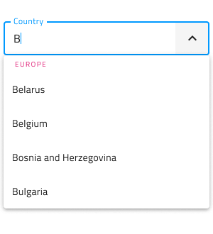
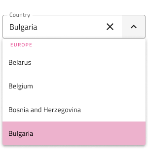
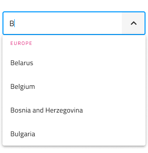
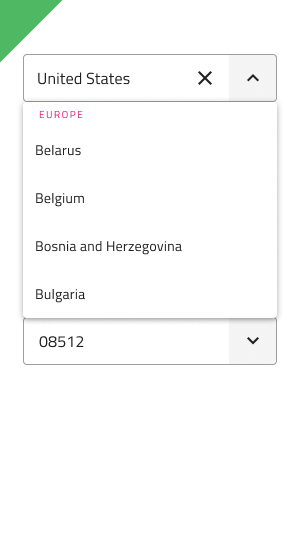

# Simple Combo (シンプルなコンボ)

Simple Combo コンポーネントを使用して、事前定義された選択肢のリストからオプションを選択したり、独自の値を入力したりすることができます。ユーザーがドロップダウン矢印をクリックすると、オプションのドロップダウン リストが表示され、オプションの 1 つを選択するか、テキスト ボックスで値を検索できます。Combo は、[Ignite UI for Angular Single Select ComboBox コンポーネント](https://jp.infragistics.com/products/ignite-ui-angular/angular/components/simple-combo.html)と視覚的に同じものです。

> [!Note]
> Combo には 2 つのレイアウト オプションがあります: 単一選択の Combo `(Simple Combo)` と [Combo (複数選択)](combo.md)。

## Simple Combo のデモ

Simple Combo には、現在の選択内容を含む入力と、事前定義されたドロップダウン リストからオプションを選択するために表示されるドロップダウンの 2 つの部分があります。

## Combo Input タイプ

Combo Input には border (境界線) タイプ (単色背景でよりはっきりと表示)、より読みやすくするために鮮明な画像の上に配置する際に最適な box (ボックス) タイプから選択が可能です。

| Border | Box |
| ------- | ------- |
|  |  |

## 操作状態

2 つの Simple Combo Input タイプはそれぞれ、**有効**または**無効**の状態で挿入できます。Figma では border と box のタイプを使用でき、プロパティ パネルから**オン**/**オフ**を `Disabled` 状態に切り替えることができます。

## State (状態)

ユーザーが Simple Combo を操作すると、その入力はさまざまな選択状態を経ます。**Idle (アイドル)** － コンテンツの代わりにプレースホルダーがあります; 入力が強調表示されているときの **Focused (フォーカス済み)**; ユーザーが選択を終了して次に進むときの **Filled (塗りつぶし済み)** です。柔軟性が向上したことにより、Hi-Fi プロトタイプへシームレスにフローする動的なインタラクション デザインの作成が可能です。

| Idle | Focused | Filled | 
| ------- | ------- | ------- |
|  |  |  |

経験豊富なデザイナーは、ユーザー入力を制限して無効な状態を防止するために、検証スタイルを使用します。Combo の検証スタイルには統一感のある標準 [Input](input.md) があり、成功、警告、エラーを表示する洗練されたデザインを提供します。

| Success | Warning | Error | 
| ------- | ------- | ------- |
|  |  |  |

Figma では、状態の変更はプロパティ パネルで行います。

> [!Note]
> Figma には、単一選択タイプと複数選択タイプの両方の Combo コンポーネントで明示的に使用される `.Combo Input` と呼ばれる別の基本コンポーネントがあります。Combo Input には、**オン**/**オフ**を切り替えることができる Prefix コンテナーがあります。

## Dropdown タイプ

Simple Combo に使用される Dropdown は、標準 [Dropdown](dropdown.md) コンポーネント同様にデスクトップやモバイルに適切なサイズがサポートされます。ドロップダウンはブール値プロパティから**オン**/**オフ**を切り替えることができ、入力に視覚的に影響を与える可能性がありますが、これは予期された動作です。

| Desktop | Mobile |
| ------- | ------- |
|  |  |

## Search Input (検索入力)

Simple Combo の検索はそれ自体が入力となります。

## Dropdown Items (ドロップダウン項目)

Simple Combo に使用される Dropdown は、ヘッダーと単一選択項目の 2 種類の項目をサポートします。ヘッダーを介して、項目をグループに体系化できます。Figma では、Dropdown は、1 つまたは複数の項目がレイヤー パネルから非表示になると、レイアウトを調整する自動レイアウト オプションを利用します。

## Dropdown Item の状態

Simple Combo 内のドロップダウン項目は、**Idle (アイドル)**、**Hover (ホバー)**、**Focused (フォーカス済み)** の 3 つの異なる状態をサポートします。**Disabled (無効)** および **Selected (選択済み)** の状態はブール値プロパティからオン/オフを切り替えることができます。Simple Combo Dropdown 項目の状態は、複数選択用のチェックボックス アイコンのない Combo Dropdown 項目と視覚的には同じです。

| Idle | Hover | Focused | Disabled |
| ---- | ----- | ------- | -------- |
|  |  |  |  |
| Selected |  |  |  |

## スタイル設定

Simple Combo は入力とドロップダウン部分でスタイルの組み合わせに柔軟性があります。入力テキスト要素の色と最終的な行のスタイルと色にはオプションがあります。Dropdown の場合、背景色を変更するか、Search Input や背景色とテキスト色の項目など、Simple Combo Dropdown の項目に関連するさまざまなオプションを使用できます。

## 使用方法

Simple Combo を使用する際に入力とドロップダウンは同じ幅で左右の境界線が一致する必要があります。Simple Combo がフォーカスされたときのドロップダウンの表示は、Simple Combo が表示をトリガーしたあとに常にコンテンツの上に表示する必要があります。Combo は、コンテンツを展開パネルのようにはプッシュしません。

| 良い例                                                                           | 悪い例                                                                            |
| ---------------------------------------------------------------------------- | -------------------------------------------------------------------------------- |
|  |  |
|  |  |

## その他のリソース

関連トピック:

- [Combo](combo.md)
- [Dropdown](dropdown.md)
- [Form パターン](../patterns/form.md)
- [Input](input.md)
  

コミュニティに参加して新しいアイデアをご提案ください。
