# Skeleton Charts (スケルトン チャート)

Skeleton Charts を使用して、標準の情報と同じタイプの情報を表示しますが、現時点でデータが存在しない場合のアプリケーションの状態も示します。たとえば、シリーズとデータ値がリモート データ ソースから読み込まれる際、接続が不足しているか、時間がかかる場合などです。Skeleton Charts は、既知のタイプの Chart を視覚的に表したものですが、表示するデータはありません。

## Skeleton Chart のデモ

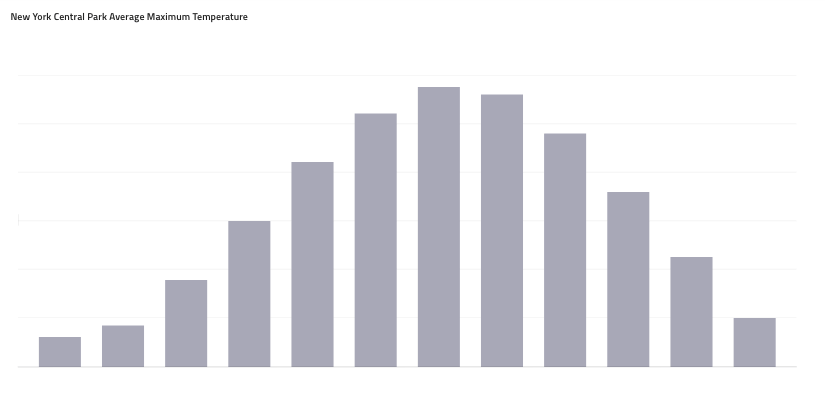

## チャート

Column Chart の他に、Line、Spline、Step Line および Pie Chart の Skeleton バリアントがあります。

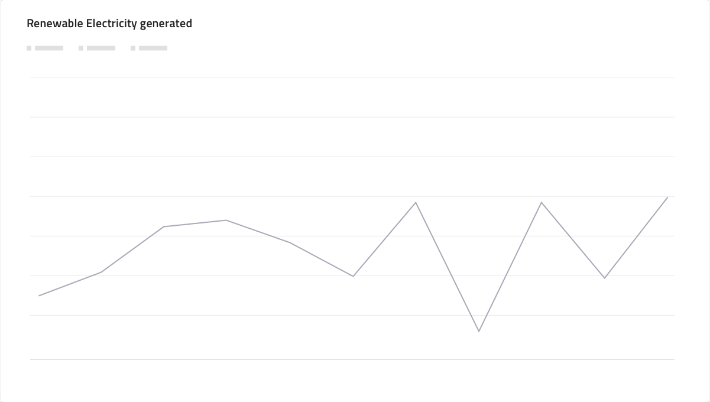
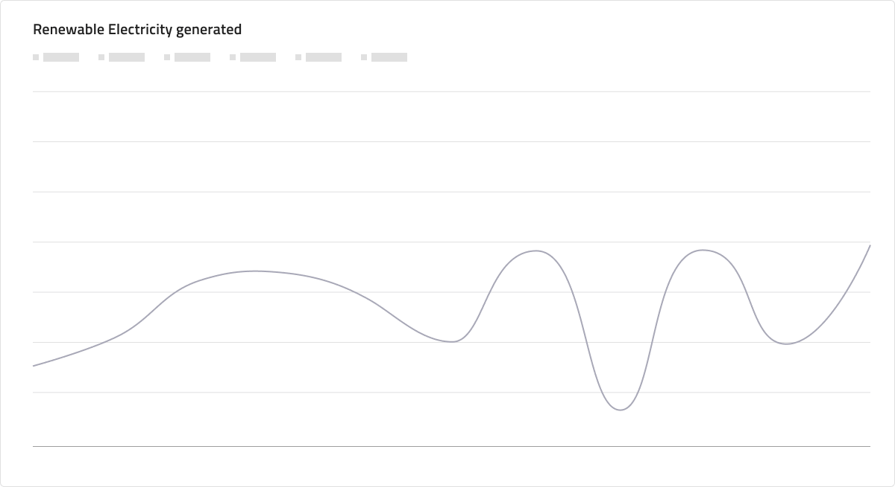
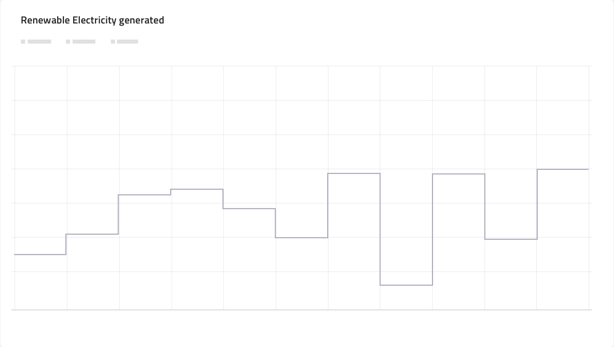
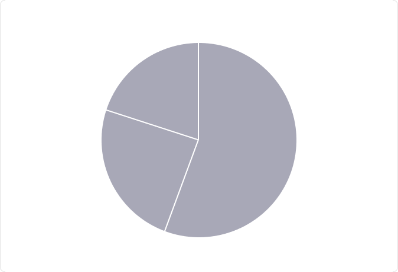

## Title (タイトル)

データとは異なり、いつでもすぐに利用できるはずなので、タイトルが表示され、Skeleton Chart の名前が表示されます。

## Legend (凡例)

Skeleton Charts には、シリーズの量が最初は利用できないため、Skeleton 状態の Legend があります。

## チャート タイプ

Skeleton Line、Spline、および Step チャートには、データバインドのチャートと同様に、折れ線の代わりに領域を表示するオプションがあります。

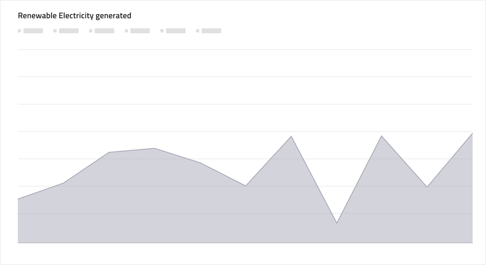
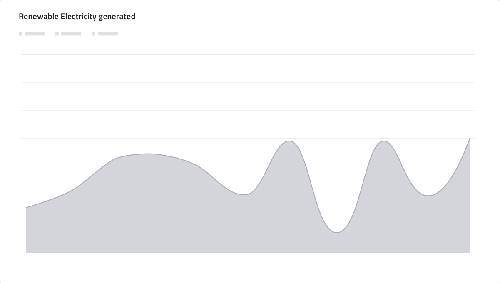
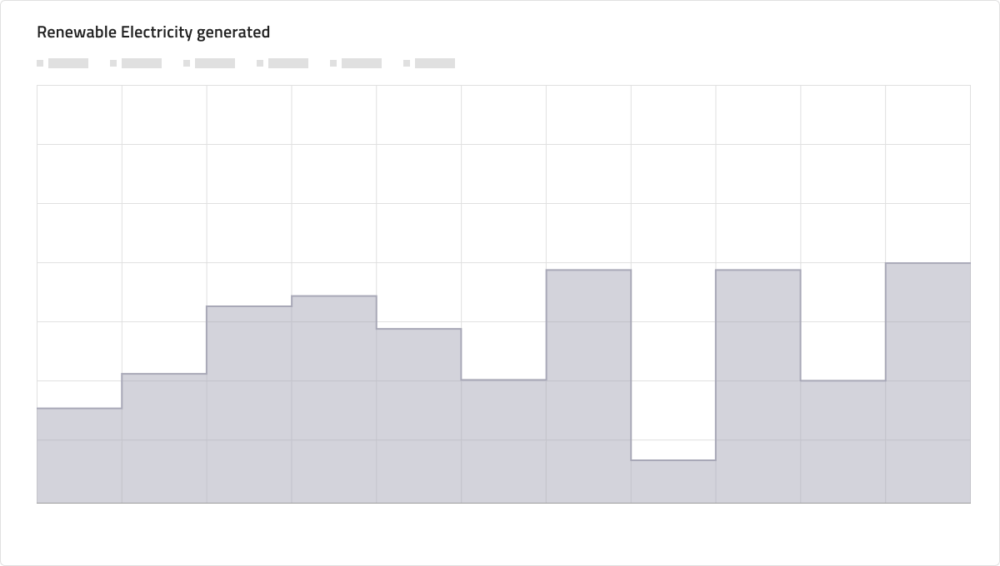

## 使用方法

デザインで Skeleton Charts を使用する場合は、グレースケール以外のシリーズ カラーを割り当てないでください。また、Skeleton Charts をデータバインドされた対応する要素と混合しないでください。

| 良い例                                                                                                | 悪い例                                                                                                 |
| ------------------------------------------------------------------------------------------------- | ----------------------------------------------------------------------------------------------------- |
| 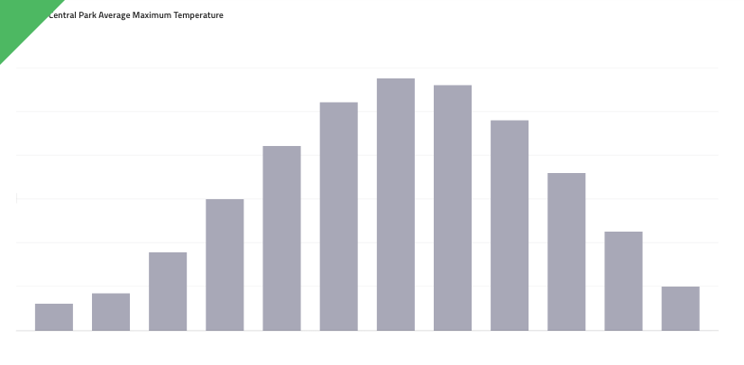 | 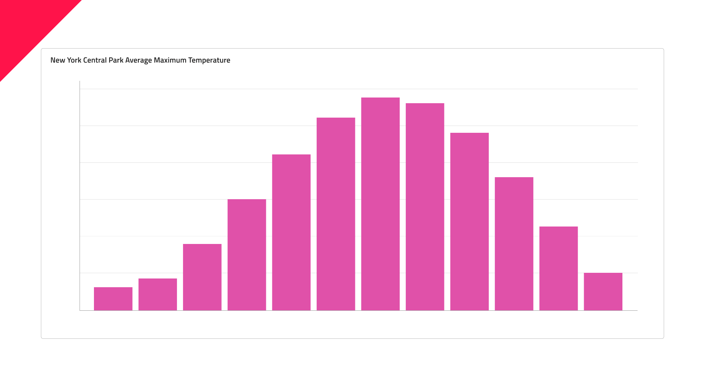 |
|  | 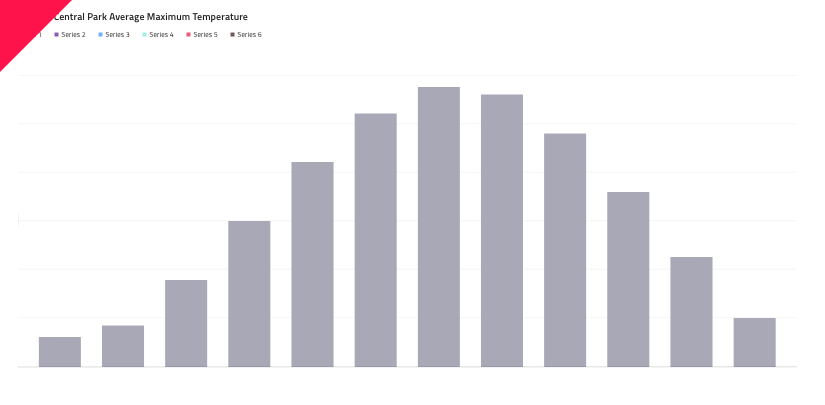 |

## その他のリソース

関連トピック:

- [Line Chart](line-chart.md)
- [Spline Chart](spline-chart.md)
- [Step Line Chart](step-line-chart.md)
- [Column Chart](column-chart.md)
- [Pie Chart](pie-chart.md)
  

コミュニティに参加して新しいアイデアをご提案ください。
