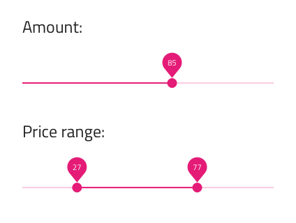
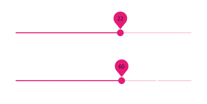
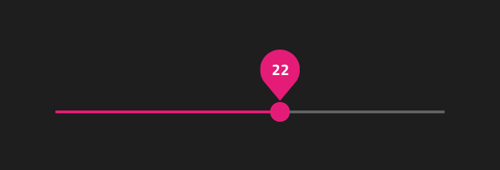
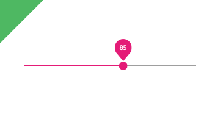
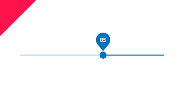
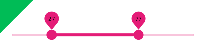
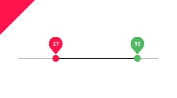

---
title: Slider - デザイン システム コンポーネント
_description: Slider コンポーネント シンボルは、ユーザーの単一の値や範囲の選択をサポートします。
_keywords: デザイン システム, デザイン システム UX, UI キット, Sketch, Ignite UI for Angular, Sketch to Angular, Angular, Angular デザイン システム, Sketch からコードをエクスポート, Angular 用のデザイン キット, Sketch HTML, Sketch to HTML, Sketch UI キット
_language: ja
---

# Slider (スライダー)

Slider コンポーネント シンボルは、単一値の選択や両値の最後を選択して値範囲の指定が可能です。Slider は、[Ignite UI for Angular Slider コンポーネント](https://jp.infragistics.com/products/ignite-ui-angular/angular/components/slider/slider.html)と視覚的に同じものです。

## Slider のデモ

## タイプ

Slider を使用すると、ユーザーは 2 つのタイプ (連続と離散不連続) から選択できます。

## つまみ

Slider は、単一値の選択につまみと範囲を指定するための 2 つのつまみを提供します。

## 状態

Slider は、値の変更が可能かどうかを設定する**有効** / 無効の状態をサポートします。

## テーマ

Slider は、**ダーク** / ライト系のテーマで分かりやすく、背景に明暗のコントラストを付けてスタイル設定できます。

## スタイル設定

Slider は、さまざまなオーバーライドでラベル背景、つまみ、トラック、ベース トラックの色を制御することにより柔軟にスタイル設定できます。

## 使用方法

Slider のトラック カラーは常にトラック ベース カラーより強調されます。単一値と範囲 Slider のスタイルを統一する必要があります (ラベル背景をつまみやトラック カラーとマッチするなど)。

| 良い例                            | 悪い例                           |
| ----------------------------- | ------------------------------- |
|  |  |
|  |  |

コミュニティに参加して新しいアイデアをご提案ください。

