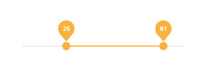

---
title: Slider - デザイン システム コンポーネント
_description: Slider コンポーネント シンボルは、ユーザーの単一の値や範囲の選択をサポートします。
_keywords: デザイン システム, デザイン システム UX, UI キット, Sketch, Ignite UI for Angular, Sketch to Angular, Angular, Angular デザイン システム, Sketch からコードをエクスポート, Angular 用のデザイン キット, Sketch HTML, Sketch to HTML, Sketch UI キット
_language: ja
---

# Slider (スライダー)

Slider コンポーネント シンボルは、単一値の選択や両値の最後を選択して値範囲の指定が可能です。Slider は、[Ignite UI for Angular Slider コンポーネント](https://jp.infragistics.com/products/ignite-ui-angular/angular/components/slider.html)と視覚的に同じものです。

## Slider デモ

## タイプ

Slider は、単一値の選択につまみと範囲を指定するための 2 つのつまみを提供します。

## テーマ

Slider は、ダーク/ライト系のテーマで分かりやすく、背景に明暗のコントラストを付けてスタイル設定できます。

## 状態

Slider は、値の変更が可能かどうかを設定する**有効**/無効の状態をサポートします。

## スタイル設定

Slider は、さまざまなオーバーライドでラベル背景、つまみ、トラック、ベース トラックの色を制御することにより柔軟にスタイル設定できます。

## 使用方法

Slider のトラック カラーは常にトラック ベース カラーより強調されます。単一値と範囲 Slider のスタイルを統一する必要があります (ラベル背景をつまみやトラックカラーとマッチするなど)。

| 良い例                            | 悪い例                           |
| ----------------------------- | ------------------------------- |
|  |  |
|  |  |

## コードの生成
 
Slider の色を指定した場合、Slider HTML 要素は div でラップされます。これはネスト コンポーネント (他のコンポーネント内のコンポーネント) をスタイル設定する際にブラウザーによって要求されます。

> [!WARNING]
> デザインの Slider のインスタンスで `Detach from Symbol` をトリガーすると、ほとんどの場合で Slider のためのコード生成機能が失われます。

### データ プロパティ

`🕹️DataProperty` 値は [Angular Reactive Forms](https://angular.io/guide/reactive-forms) を使用してスライダーの value プロパティへの双方向[データ バインディング](../codegen/data-binding.md)を設定するために使用されます。`🕹️DataProperty` はオプションです。`🕹️DataProperty` はコード生成で提供されるモデル オブジェクト名で指定されたデータ オブジェクトでプロパティ名です。

単一つまみスライダーの場合、`🕹️DataProperty` を数値に設定する必要があります。

2 つまみスライダーの場合、`🕹️DataProperty` を lower および upper プロパティを持つオブジェクトまたはクラスに設定する必要があります。

モデル オブジェクト名および `🕹️DataProperty` が提供される場合、Reactive Forms フォームを作成するためにフォーム ビルダー コードで TypeScript `ngOnInit` メソッドが生成されます。
`🕹️DataProperty` はスライダー コントロールの formControlName プロパティを設定します。

### 状態

State が無効またはスライダー部分が表示されない場合、コントロールは描画されません。

## その他のリソース

関連トピック:

- [データ バインディング](../codegen/data-binding.md)
  

コミュニティに参加して新しいアイデアをご提案ください。

