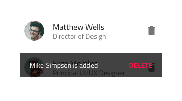
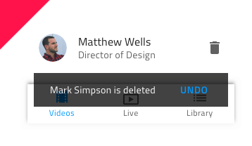
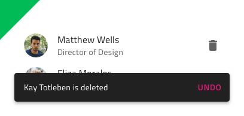
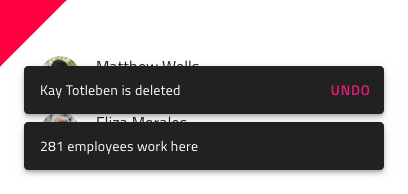

---
title: Snackbar - デザイン システム コンポーネント
_description: Snackbar コンポーネント シンボルは、短い通知やユーザーの最近の操作を示すことができます。
_keywords: デザイン システム, Sketch, Ignite UI for Angular, コンポーネント, UI ライブラリ, ウィジェット
_language: ja
---

## Snackbar

Snackbar コンポーネント シンボルは、短い通知の表示やリストの記録の追加または削除など最近の操作の表示するためのオプションを提供します。オプションは、元に戻すなどのシンプルな追加操作をトリガーします。Snackbar は、[Ignite UI for Angular Snackbar コンポーネント](https://jp.infragistics.com/products/ignite-ui-angular/angular/components/snackbar.html)と視覚的に同じものです。

### Snackbar デモ


### スタイル設定

Snackbar は、スタイル設定に制限があり操作ボタンのテキスト色のみ変更できます。



## 使用方法

Snackbar は、その他のコンテンツの一番上に表示されるため、アプリケーションのメイン ナビゲーション上には配置しないでください。メッセージとコントラストがある操作ボタンを強調するためのスタイルを選択し、最新のボタンのみ表示して列に複数の Snackbars を積み重ねないようにします。

| 良い例                              | 悪い例                             |
| ------------------------------- | --------------------------------- |
|  |  |
|  |  |
|  |  |

## コードの生成

Snackbar の色を指定した場合、Snackbar HTML 要素は div でラップされます。ブラウザーによってネスト コンポーネント (他のコンポーネント内のコンポーネント) のスタイル設定が要求されます。

> [!WARNING]
> デザインの Snackbar のインスタンスで `Detach from Symbol` をトリガーすると、ほとんどの場合で Snackbar のためのコード生成機能が失われます。

### データ バインディング

データ バインディングは波括弧構文によって指定されます。例: {isAdmin}。テキスト フィールド (`🕹️DataProperty` および `🕹️DataSource` 以外) も文字列補間構文をサポートします。例: 管理者: {isAdmin}。データ バインディングはネストまたはネストなしが可能です。ターゲット プロパティがネストされたプロパティの場合、ネストされたプロパティ チェーンを含みますがモデル オブジェクト名は含みません。実例:

#### ネストなし

```typescript
Customer {
  imageName: String;
}
```
DataProperty: `{imageName}`

#### ネストあり

```typescript
Profile {
  imageName: String;
}

Customer {
  profile: Profile;
}
```
DataProperty: `{profile.imageName}`

### Event プロパティ

`🕹️Event` プロパティは、コンポーネント TypeScript のメソッドを作成するために使用し、Snackbar の HTML に onAction シグネチャーを追加します。イベントが波括弧構文 ({onEventName}) を使用して指定する必要があります。

### テキスト

Message と Button に Text プロパティがあります。このプロパティにテキスト、バインディング、または両方を含むことができます。例:

- 設定
- {settingsLabel}
- 重要な {labelText}

## その他のリソース

関連トピック:

コミュニティに参加して新しいアイデアをご提案ください。


